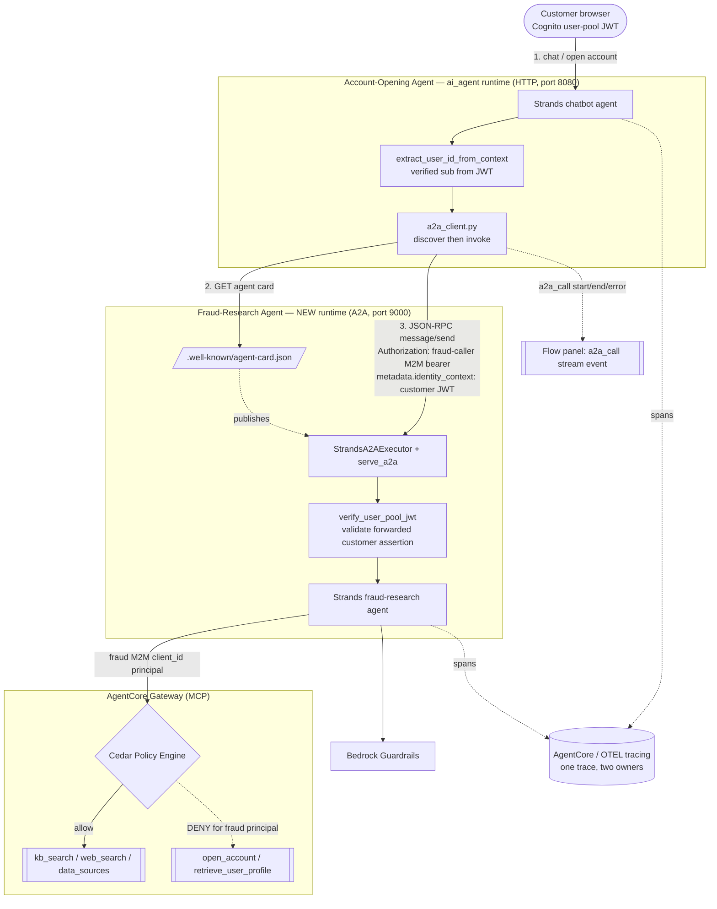

# Design Document

## Overview

This feature makes the Trinity Reserve Bank demo's agent-to-agent (A2A) story real. Today the
orchestrator (`patterns/orchestrator-agent/orchestrator_agent.py`) runs every agent
interaction in one process — the account-opening / Client-Advisor path (the `ai_agent`
profile) calls Gateway tools directly, and the "six researchers" fan-out runs as in-process
Strands sub-agents in a thread pool (`_run_parallel_research`). No runtime speaks the A2A
protocol, no agent card is published, and there is no A2A client.

We add a **dedicated Fraud-Research Agent** deployed as its own AgentCore Runtime configured
with the A2A server protocol, and we make the existing Account-Opening Agent (`ai_agent`)
**discover it via its agent card and call it over A2A** during the KYC/fraud step of account
opening. The requesting customer's verified identity travels across the hop, both agents
authenticate, deterministic Cedar policy and Bedrock Guardrails still apply on the far side,
the whole path lands in one trace attributed to two agent owners, and the flow panel shows the
hop as its own step. As a secondary capability, the parallel section researchers are converted
to run over A2A.

The design is grounded in what AgentCore actually provides. Verified against AWS documentation:

- **AgentCore Runtime A2A protocol** — `protocolConfiguration: "A2A"` runs a transparent proxy
  in front of a container that must serve a stateless streamable HTTP server on `0.0.0.0:9000`
  at root path `/`, with health at `/ping` and the agent card at `/.well-known/agent-card.json`.
  JSON-RPC 2.0 payloads from `InvokeAgentRuntime` are passed to the container **unmodified**,
  and the platform injects `X-Amzn-Bedrock-AgentCore-Runtime-Session-Id` for session isolation.
  Auth is OAuth 2.0 bearer or SigV4. (Sources:
  [Deploy A2A servers in AgentCore Runtime](https://docs.aws.amazon.com/bedrock-agentcore/latest/devguide/runtime-a2a.html),
  [A2A protocol contract](https://docs.aws.amazon.com/bedrock-agentcore/latest/devguide/runtime-a2a-protocol-contract.html).)
- **Agent card path & shape** — `GET /.well-known/agent-card.json` returns `{ name, description,
version, url, protocolVersion, preferredTransport: "JSONRPC", capabilities, defaultInputModes,
defaultOutputModes, skills[] }`. The `url` is the runtime invocation URL. Discovery is fetched
  through the runtime at `…/runtimes/{urlEncodedArn}/invocations/.well-known/agent-card.json`.
- **Strands A2A surface** — the server side uses `strands.multiagent.a2a.executor.StrandsA2AExecutor`
    - `bedrock_agentcore.runtime.serve_a2a(...)` (handles `/ping`, agent-card serving,
      `AGENTCORE_RUNTIME_URL`, header propagation, port 9000). The client side uses the Strands
      `A2AAgent` client (agent-card fetch + JSON-RPC `message/send`). (Source:
      [Strands agent-to-agent guide](https://strandsagents.com/docs/user-guide/concepts/multi-agent/agent-to-agent/index.md).)

Everything stays self-contained (synthetic data, in-account resources only) and deploys/destroys
with standard CDK. A feature flag keeps the proven in-process paths available as a fallback.

## Architecture

### Component overview



### End-to-end identity and trace propagation path

1. The customer authenticates in the browser (Cognito user pool). Every request to the
   `ai_agent` runtime carries the verified user-pool JWT in `Authorization`. AgentCore's JWT
   authorizer validates it before the container runs.
2. The Account-Opening Agent derives the customer identity **server-side** with the existing
   `extract_user_id_from_context` (the `sub` claim), never from model-generated text.
3. At the fraud/research step, the agent calls `a2a_client.consult_fraud_research(...)`. The
   client first **fetches the agent card** (discovery) and only then invokes.
4. The A2A request carries two independent credentials:
    - **`Authorization: Bearer <fraud-caller M2M token>`** — authenticates the _calling agent_
      (Requirement 6). Minted by the existing Cognito client-credentials flow.
    - **`message.metadata.identity_context = <customer's verified user-pool JWT>`** — carries the
      _end customer's_ verified identity across the hop (Requirement 5). The AgentCore A2A proxy
      passes the JSON-RPC body through unmodified, so this survives intact.
5. The Fraud-Research Agent verifies **both**: AgentCore's authorizer validates the machine
   bearer (Req 6.2); the container independently verifies the forwarded customer JWT signature
   against the Cognito user-pool JWKS + issuer + expiry (`verify_user_pool_jwt`) and rejects if
   it is missing or invalid (Req 5.4). It then acts under that customer `sub`.
6. The fraud agent calls Gateway tools as a **distinct Cognito M2M principal** (its own
   `client_id`), so Cedar attributes its decisions to the fraud agent and the
   `deny_account_and_pii_tools` policy denies it the write/PII tools while permitting research
   tools. Its model calls run under the same Bedrock Guardrail.
7. Both runtimes emit OTEL spans. The A2A call is a child span of the customer-interaction
   trace; the fraud agent continues that trace context (propagated via the A2A request), tags
   its spans with the acting-agent id (`fraud_research`) and the customer `sub`, so the trace
   shows one identity across two owners.
8. The caller emits `a2a_call` stream events (`start` / `end` / `error`) that the frontend maps
   to a dedicated flow-panel node.

### Identity propagation mechanism — decision and rationale

**Chosen: a forwarded, signature-verified customer identity assertion carried in the A2A message
metadata, kept separate from the machine caller credential.** Concretely, the caller forwards
the customer's already-verified user-pool JWT as `metadata.identity_context`, and the callee
re-verifies it against Cognito JWKS.

Why this over the alternatives:

- **vs. a plaintext `user_id` claim in the request body** — a bare string is forgeable by
  anything that can reach the runtime, which would fail Requirement 5.4 (reject requests lacking
  a _verified_ identity) and 5.2 (must be verified, not model-supplied). A signed JWT the callee
  validates cryptographically is tamper-evident.
- **vs. a full OAuth 2.0 token-exchange / OBO grant per hop** — Cognito user-pool→user-pool
  delegated token exchange is not cleanly available in this M2M setup, and it would add a Cognito
  domain round-trip on every hop plus new infrastructure. AgentCore's A2A proxy already gives us
  a clean, protocol-preserving pass-through seam (the JSON-RPC body), and the callee already has
  JWKS-verification machinery in `patterns/utils/auth.py`. The forwarded-assertion approach is
  effectively an application-layer on-behalf-of: the **machine token proves "the account-opening
  agent is calling," the customer assertion proves "on behalf of this specific verified
  customer,"** and both are verified independently. This is the least-moving-parts mechanism that
  still satisfies every clause of Requirements 5 and 6.

Trade-off accepted: forwarding the customer token widens its reach to one additional in-account
callee. This is bounded by short token lifetimes, the self-contained/synthetic demo scope, and
the callee's `aud`/`exp`/issuer checks. If this pattern graduated beyond a demo, the assertion
would be re-minted as a narrowly-scoped, audience-restricted delegation token rather than
forwarding the original.

### Reliability trade-off: moving the parallel fan-out to A2A (Requirement 10)

This is the highest-risk part of the feature and is called out explicitly. The in-process
`_run_parallel_research` is proven: sub-agents run in one process with per-worker MCP clients and
memory sessions (no shared mutable state), and a two-tier watchdog (`WORKER_IDLE_TIMEOUT_SEC`
180s idle + `PARALLEL_PHASE_WALL_CLOCK_SEC` 900s wall clock) converts a wedged worker into "drop
the section and synthesize from the rest." A production incident (a 22-minute hang) is already
handled by that watchdog.

Moving each section researcher to an A2A network call adds real failure surface: per-call token
minting, network/timeout/retry handling, researcher-runtime cold starts, session-id management,
partial-failure semantics, and the loss of the shared in-process MCP client (every section
becomes a full runtime invocation). The upside is a genuine protocol demonstration rather than
in-process calls.

Design response:

- The A2A fan-out **preserves the existing watchdog, merge, per-section-failure-continue, and
  telemetry-only tool-event behavior** — the same idle/wall-clock guards wrap the A2A dispatch.
- Per Requirement 10.6, the orchestrator **requires true concurrency**: it dispatches all N
  section A2A invocations before awaiting any, and if the concurrency primitive is unavailable it
  **raises `ConcurrencyUnavailableError` rather than degrading to sequential execution**.
- Both A2A conversions are behind feature flags. The **fraud hop** (`features.a2a`, the headline
  capability) and the **section-researcher conversion** (`features.a2a_parallel_research`,
  default off given the reliability risk) are independent, so the parallel fan-out can stay
  in-process while the fraud story ships. When a flag is off, the corresponding in-process path
  is the fallback and the A2A resources for that path are not exercised.

## Components and Interfaces

### 1. Fraud-Research Agent (new package `patterns/fraud-research-agent/`)

A new Strands agent exposed as an A2A server, deployed as its own AgentCore Runtime.

- `fraud_research_agent.py` — builds a Strands `Agent` (fraud/research assessment over synthetic
  applicant data), wraps it in `StrandsA2AExecutor`, and serves it with
  `bedrock_agentcore.runtime.serve_a2a(...)`. `serve_a2a` provides `/ping`, the agent card at
  `/.well-known/agent-card.json`, `AGENTCORE_RUNTIME_URL`, header propagation, and port 9000.
  On each request it:
    1. reads `message.metadata.identity_context` and calls `verify_user_pool_jwt` — rejects with a
       JSON-RPC authorization error if absent/invalid/expired (Req 5.4, 6.3);
    2. binds the verified customer `sub` into a `UserScopeHook` so Gateway tool calls carry the
       propagated identity (Req 5.3, 7.1);
    3. runs the assessment using research tools only (kb_search / web_search / data_sources) via a
       Gateway MCP client authenticated with the **fraud agent's own M2M client** (Req 7.4);
    4. tags spans with the customer `sub` and acting-agent id `fraud_research` (Req 5.5, 8.4);
    5. returns a fraud/research assessment artifact (Req 1.3).
- `agent_card.py` (or `serve_a2a` config) — declares `name: "Trinity Fraud & Research Agent"`,
  `description`, a single `skill` (`fraud_research_assessment`), endpoint `url`, and the input/
  output modes (Req 2.2, 2.4). Advertising exactly one skill is how unknown-capability requests
  are rejected (Req 6.4).
- `system_prompt.txt` — fraud/research analyst persona, synthetic-data-only, no external calls.
- `Dockerfile` — `LINUX_ARM64`, installs `strands-agents[a2a]` + `bedrock-agentcore`, exposes
  9000, entrypoint `python fraud_research_agent.py`.
- `requirements.txt`.

### 2. Shared A2A utilities (`patterns/utils/`)

- `a2a_client.py` (new) — caller-side discovery + invoke, reused by the fraud hop and the section
  researchers:
    - `fetch_agent_card(runtime_arn, bearer) -> AgentCard` — GET the well-known card through the
      runtime invocation URL (URL-encoded ARN). Raises `A2ADiscoveryError` on failure (Req 3.3).
    - `invoke_a2a(card, message, *, bearer, identity_context, session_id) -> A2AResult` — build the
      Strands `A2AAgent` client from the discovered card, attach the machine bearer + the
      `identity_context` metadata, send JSON-RPC `message/send`. Maps every failure to a typed
      `A2AHopError(step="a2a")` (Req 4.4).
    - `consult_fraud_research(applicant, *, user_id, customer_jwt, session_id)` — discovery →
      invoke, returns the assessment or raises. Discovery is always attempted before invoke
      (Req 3.1); a discovery failure raises before any invoke and halts the decision (Req 3.3, 4.5).
- `auth.py` (extend) — add `verify_user_pool_jwt(token)` (callee-side: fetch JWKS, verify
  signature/issuer/`exp`, return claims — distinct from the existing signature-skipping
  `extract_user_id_from_token`), and `get_agent_access_token(client_id_param, secret_param)`
  generalizing the M2M flow so the fraud agent uses its own client.
- `identity_context.py` (new, small) — `build_identity_context(customer_jwt)` and
  `read_identity_context(message)` so the on-the-wire shape has one owner.

### 3. Account-Opening Agent caller changes (`patterns/orchestrator-agent/orchestrator_agent.py`)

- **Fraud hop** — in the `ai_agent` chatbot path, expose a `consult_fraud_research` Strands
  `@tool` the agent calls at the KYC/fraud step. The customer identity is injected **server-side
  by a hook** (same pattern as `UserScopeHook`), never from tool arguments the model produced
  (Req 5.2). The tool delegates to `a2a_client.consult_fraud_research`, emits `a2a_call` stream
  events, and returns the assessment for the model to incorporate into the account-opening
  decision (Req 4.3). Discovery/invoke/tracing failures surface as an error state that names the
  A2A hop and halt the dependent decision (Req 3.3, 4.4, 4.5, 8.5).
- **Parallel researchers** — add an A2A dispatch branch in `_run_parallel_research` (gated by
  `features.a2a_parallel_research`) that replaces per-worker in-process sub-agents with A2A
  invocations to a section-researcher A2A runtime, preserving the watchdog/merge/telemetry
  behavior and requiring true concurrency (Req 10).
- **Stream events** — emit `{"a2a_call": {"agent": "fraud_research", "phase": "collaboration",
"status": "start|end|error", "identity_forwarded": true}}` alongside the existing
  `agent_phase`/tool telemetry.

### 4. Infrastructure (`lib/stacks/backend/index.ts`, `lib/stacks/auth`, `agentcore-role.ts`)

- **Fraud runtime** — new `DockerImageAsset` (fraud Dockerfile, `LINUX_ARM64`) and a new
  `CfnRuntime` `Runtime_fraud_research` with `protocolConfiguration: "A2A"`,
  `networkConfiguration.networkMode: "PUBLIC"`, `authorizerConfiguration.customJwtAuthorizer`
  (`allowedClients: [fraudMachineClient]`, `discoveryUrl`), and
  `requestHeaderConfiguration.requestHeaderAllowlist: ["Authorization"]`. Env: fraud M2M client
  id/secret params, gateway URL, memory id, stack name, Cognito issuer. Gated by `features.a2a`.
- **Fraud M2M client** — a new Cognito app client (client-credentials) in the Auth stack with its
  own gateway resource-server scopes, added to the **Gateway `allowedClients`** so the fraud
  agent can reach the Gateway as a distinct principal (Req 7.4).
- **Cedar** — scope the existing `deny_account_and_pii_tools` policy (or add a companion) so the
  `forbid` binds `principal == <fraud principal>` for `open_account` / `retrieve_user_profile`,
  and keep the baseline permit for research tools. This makes the deny attributable to the fraud
  agent without denying the AI Agent, which still needs `open_account` (Req 7.2).
- **agentcore-role** — grant the `ai_agent` runtime `bedrock-agentcore:InvokeAgentRuntime` scoped
  to the fraud runtime ARN (least privilege for the A2A call, Req 6.5), and grant the fraud
  runtime the same research-tool/model/guardrail permissions the orchestrator role already has,
  minus anything not needed for assessment.
- **Env wiring / outputs** — SSM param + `CfnOutput` for the fraud runtime ARN; pass
  `FRAUD_AGENT_RUNTIME_ARN` (or card URL) into the `ai_agent` runtime env and the section-
  researcher config; expose `VITE_FRAUD_AGENT_ENABLED` to the frontend so the flow-panel node
  renders only when the feature is deployed.

### 5. Frontend flow panel

- `lib/.../agentcore-client/types.ts` — add an `a2a_call` `StreamEvent`:
  `{ type: "a2a_call"; agent: AgentId; phase: "collaboration"; status: "start" | "end" | "error";
identityForwarded: boolean }`, and add `"fraud_research"` to `AgentId`.
- `parsers/strands.ts` — parse `json.a2a_call` into the event.
- `stores/conciergeFlowStore.ts` — add `a2a` state (`status`, `identityForwarded`) + actions
  `a2aStart/a2aEnd/a2aError`, cleared on `reset`.
- `hooks/useChatEngine.ts` — add a `case "a2a_call"` that drives the store.
- `components/concierge-flow/ConciergeFlowDiagram.tsx` + `flow-types.ts` — add a distinct
  "Fraud Research Agent" node (category `a2a`) with an edge from the runtime labeled
  "A2A collaboration", an identity-carried indicator, and idle/active/completed/failed states
  (Req 9).

## Data Models

### Agent card (published by the fraud runtime at `/.well-known/agent-card.json`)

```json
{
    "name": "Trinity Fraud & Research Agent",
    "description": "Fraud and research assessment for account-opening KYC (synthetic data).",
    "version": "1.0.0",
    "url": "https://bedrock-agentcore.<region>.amazonaws.com/runtimes/<encodedArn>/invocations/",
    "protocolVersion": "0.3.0",
    "preferredTransport": "JSONRPC",
    "capabilities": { "streaming": true },
    "defaultInputModes": ["text"],
    "defaultOutputModes": ["text"],
    "skills": [
        {
            "id": "fraud_research_assessment",
            "name": "Fraud & Research Assessment",
            "description": "Assess a synthetic account-opening applicant for fraud/research signals.",
            "tags": ["fraud", "kyc", "research"]
        }
    ]
}
```

### A2A request (JSON-RPC 2.0, `message/send`)

```json
{
    "jsonrpc": "2.0",
    "id": "req-<uuid>",
    "method": "message/send",
    "params": {
        "message": {
            "role": "user",
            "parts": [{ "kind": "text", "text": "<synthetic applicant details + assessment ask>" }],
            "messageId": "<uuid>",
            "metadata": {
                "identity_context": "<customer verified user-pool JWT>",
                "acting_agent": "ai_agent"
            }
        }
    }
}
```

- Transport headers: `Authorization: Bearer <fraud-caller M2M token>`,
  `X-Amzn-Bedrock-AgentCore-Runtime-Session-Id: <session>` (session injected by the platform).

### Fraud assessment result (A2A artifact text payload)

```json
{
    "assessment": "clear | review | flagged",
    "risk_score": 0,
    "signals": ["synthetic signal 1", "synthetic signal 2"],
    "rationale": "short explanation grounded in research tools",
    "acting_customer_sub": "<propagated customer sub>",
    "acting_agent": "fraud_research"
}
```

### Section-researcher A2A request/result (Requirement 10)

Reuses the same JSON-RPC envelope; `params.message.parts[0].text` carries one section's
sub-questions and search budget, `metadata.identity_context` carries the same customer assertion.
The result matches the existing per-worker researcher JSON shape (`questions_researched`,
`meta_analysis`, `citations`, `images`, …) so the existing merge logic is unchanged.

### `A2AHopError` (caller-side typed error)

```
A2AHopError {
  step: "a2a"                       # always identifies the hop (Req 4.4)
  kind: "discovery" | "invoke" | "timeout" | "network" | "auth" | "tracing"
  detail: str
  halts_decision: bool              # true for the fraud hop (Req 3.3, 4.5, 8.5)
}
```

### Feature flags (extends `FeatureFlags` in `lib/common/feature-flags.ts`)

```
a2a: boolean                       # default true — deploy fraud runtime + wire the fraud hop
a2a_parallel_research: boolean     # default false — convert section researchers to A2A
```

## Correctness Properties

_A property is a characteristic or behavior that should hold true across all valid executions of
a system — essentially, a formal statement about what the system should do. Properties serve as
the bridge between human-readable specifications and machine-verifiable correctness guarantees._

This feature is suitable for property-based testing at its pure logic seams: the identity-context
build/verify functions, the A2A request builder, the discovery-before-invoke ordering, the
error-to-hop mapper, the section-researcher merge, the concurrency dispatcher, and the frontend
SSE parser + flow store. PBT does **not** apply to the infrastructure, the AgentCore JWT
authorizer, Cedar enforcement, guardrail application, or trace capture — those are covered by
integration and smoke tests (see Testing Strategy). The properties below were derived from the
prework analysis after consolidating redundant criteria.

### Property 1: Agent card is well-formed and discoverable

_For any_ valid fraud-agent card configuration, serializing the published agent card and parsing
it back yields an equivalent document that contains a non-empty `name`, a non-empty `url`, and at
least one `skill`, and the caller's endpoint extraction returns that same `url` for use as the
invocation endpoint.

**Validates: Requirements 2.2, 2.3, 2.4, 3.2**

### Property 2: Discovery precedes invocation

_For any_ fraud consultation, the A2A client fetches the agent card strictly before it issues any
`message/send` invocation, and the endpoint it invokes is the one taken from the retrieved card
(never a static/hardcoded value).

**Validates: Requirements 3.1, 3.2**

### Property 3: An unrecoverable A2A precondition or failure halts the dependent decision and names the hop

_For any_ A2A failure or blocking precondition — agent-card discovery failure, invocation
failure, timeout, network unavailability, a system/configuration error at invoke, or a tracing
capture failure that blocks the hop — the account-opening flow returns an `A2AHopError` whose
`step == "a2a"` and whose `kind` identifies the failure, sets `halts_decision == true`, produces
no success result, and (for discovery/precondition failures) issues zero invocations —
regardless of whether the error report itself is produced successfully.

**Validates: Requirements 3.3, 4.4, 4.5, 8.5**

### Property 4: The A2A request carries the applicant details and a bearer credential

_For any_ synthetic applicant, the built A2A request message contains the applicant fields
required for the assessment and the request headers include a non-empty `Authorization` bearer
credential.

**Validates: Requirements 4.2, 6.1**

### Property 5: Identity context is bound from the verified JWT, never from model input

_For any_ verified customer identity (JWT `sub`) and _any_ model-supplied `user_id` argument
(including a forged or mismatched one), the built A2A request carries a `metadata.identity_context`
that decodes to the verified `sub`, and the model-supplied value never overrides it.

**Validates: Requirements 5.1, 5.2**

### Property 6: The callee propagates one identity and both owners across the hop

_For any_ A2A request carrying a valid customer identity assertion, the fraud agent binds the
verified `sub` as the injected `user_id` for its Gateway tool calls, and the emitted span/record
attributes for both the caller step and the callee step carry that same customer `sub` while
attributing the caller step to owner `ai_agent` and the callee step to owner `fraud_research`.

**Validates: Requirements 5.3, 5.5, 8.2, 8.3**

### Property 7: The callee rejects requests lacking a verified identity

_For any_ A2A request whose `identity_context` is missing, malformed, expired, or carries an
invalid signature, the fraud agent returns an authorization error and does not run the
assessment.

**Validates: Requirements 5.4**

### Property 8: The callee rejects unauthorized capabilities

_For any_ A2A request naming a method or skill other than the advertised
`fraud_research_assessment`, the fraud agent returns an authorization/validation error and does
not run the assessment.

**Validates: Requirements 6.4**

### Property 9: The fraud agent calls the Gateway as a distinct principal

_For any_ Gateway access-token request made by the fraud agent, the OAuth client used is the
fraud agent's own client, distinct from the account-opening / shared machine client.

**Validates: Requirements 7.4**

### Property 10: A model call is blocked when its guardrail cannot be applied

_For any_ fraud-agent model invocation where the guardrail cannot be applied, the model call is
not issued and an error is returned instead.

**Validates: Requirements 7.5**

### Property 11: The assessment result is well-formed

_For any_ valid A2A request over synthetic applicant data (with model and Gateway tools mocked),
the fraud agent returns a schema-valid assessment: `assessment` is one of `clear|review|flagged`,
`risk_score` is an integer, and the acting customer `sub` and acting-agent id are present.

**Validates: Requirements 1.3**

### Property 12: Concurrent users never cross identities

_For any_ two concurrently processed A2A requests carrying distinct customer `sub` values, each
request's injected Gateway `user_id` equals its own assertion's `sub` — no identity from one
request bleeds into the other.

**Validates: Requirements 11.5**

### Property 13: Each section researcher is invoked exactly once, concurrently

_For any_ set of N ≥ 2 research shards, the orchestrator issues exactly N A2A invocations (one per
shard), and all N invocations start before any of them completes (true concurrency overlap).

**Validates: Requirements 10.2, 10.3**

### Property 14: The fan-out merges successes and reports failures

_For any_ mix of successful and failed section A2A invocations, the merged research result set is
exactly the union of the successful sections' entries, every failed section is reported, and no
single failure aborts the merge of the rest.

**Validates: Requirements 10.4, 10.5**

### Property 15: Missing concurrency fails rather than degrading to sequential

_For any_ fan-out dispatch where the concurrency primitive is unavailable, the orchestrator
raises `ConcurrencyUnavailableError` and never falls back to invoking the section researchers
one at a time.

**Validates: Requirements 10.6**

### Property 16: The flow panel parser and store reflect the A2A step state

_For any_ `a2a_call` SSE payload, the parser emits a well-formed `a2a_call` event with `agent`,
`phase`, and `status`; feeding a `start → end` sequence drives the flow store to a `completed`
state, an `error` status drives it to a `failed` state, and an event with `identity_forwarded`
true sets the store's identity-carried indicator (the store MAY remain in the in-progress state
until the terminal event arrives).

**Validates: Requirements 9.1, 9.2, 9.3, 9.4**

## Error Handling

Every IF/THEN error condition in the requirements maps to an explicit handler. The unifying rule
for the fraud hop: any failure that prevents a trustworthy assessment **halts the dependent
account-opening decision** and returns an `A2AHopError` that names the hop — a silent or fabricated
result is worse than a visible failure.

| Condition                                                                 | Requirement | Handling                                                                                                                                                                                                                                                                                                                                     |
| ------------------------------------------------------------------------- | ----------- | -------------------------------------------------------------------------------------------------------------------------------------------------------------------------------------------------------------------------------------------------------------------------------------------------------------------------------------------- |
| Agent card cannot be retrieved                                            | 3.3         | `a2a_client.fetch_agent_card` raises `A2ADiscoveryError`; `consult_fraud_research` maps it to `A2AHopError(kind="discovery", halts_decision=true)`, issues **zero** invocations, and the dependent decision is not made. The error report path is best-effort; the halt holds even if the report fails.                                      |
| A2A invocation failure / timeout / network unavailable                    | 4.4         | `invoke_a2a` wraps the Strands `A2AAgent` call; JSON-RPC errors and transport failures map to `A2AHopError(step="a2a", kind∈{invoke,timeout,network})`. Per the protocol contract, non-2xx responses are parsed for the JSON-RPC `error` body; `-32054 RetryableConflictException` is retried with short exponential backoff before failing. |
| Invocation cannot occur (system/config error, e.g. missing runtime ARN)   | 4.5         | Precondition checks raise before invoke; mapped to `A2AHopError(kind="invoke", halts_decision=true)`; account opening halts with an error.                                                                                                                                                                                                   |
| A2A request lacks a verified customer Identity_Context                    | 5.4         | Callee `verify_user_pool_jwt` fails (absent/invalid/expired/bad-signature) → JSON-RPC authorization error; assessment never runs.                                                                                                                                                                                                            |
| Machine credential missing / invalid / expired                            | 6.3         | AgentCore JWT authorizer rejects at the runtime boundary (401/403) before the container runs; the caller maps the 401/403 to `A2AHopError(kind="auth")`.                                                                                                                                                                                     |
| Caller/capability not authorized                                          | 6.4         | Callee rejects any method/skill other than `fraud_research_assessment` with an authorization/validation error; `allowedClients` restricts which clients reach the runtime at all.                                                                                                                                                            |
| Fraud agent attempts a denied tool (open_account / retrieve_user_profile) | 7.2         | Cedar (ENFORCE) denies for the fraud principal; the tool call returns a deny and the agent surfaces it rather than retrying. In LOG_ONLY the deny is recorded as a would-deny trace.                                                                                                                                                         |
| Guardrail cannot be applied to a model call                               | 7.5         | The model-call wrapper checks guardrail availability first; if unavailable it raises and blocks the invocation (no ungoverned model call).                                                                                                                                                                                                   |
| Tracing backend fails to capture the A2A step                             | 8.5         | The caller opens the A2A child span before invoking; if the span/trace context cannot be established it raises `A2AHopError(kind="tracing", halts_decision=true)` and does not invoke.                                                                                                                                                       |
| A section-researcher A2A call fails (10)                                  | 10.5        | The fan-out records the section failure and continues; `merge` returns the union of successful sections. The existing idle (180s) + wall-clock (900s) watchdog still fires for wedged section calls, converting a hang into a dropped section.                                                                                               |
| Concurrency unavailable (10)                                              | 10.6        | The dispatcher asserts a usable concurrency primitive (executor/event loop with capacity ≥ 2); if absent it raises `ConcurrencyUnavailableError` — it never runs sections sequentially.                                                                                                                                                      |
| A2A step fails (frontend, 9.4)                                            | 9.4         | The caller emits `a2a_call status="error"`; the parser and store transition the flow-panel node to `failed`.                                                                                                                                                                                                                                 |

## Testing Strategy

### Dual approach

- **Property-based tests** verify the universal properties above across generated inputs. Use
  **Hypothesis** for the Python logic (identity build/verify, request builder, discovery
  ordering, error mapper, merge, concurrency dispatcher, assessment schema) and **fast-check**
  for the TypeScript SSE parser + flow store. Each property test runs **≥ 100 iterations** and is
  tagged with a comment referencing its design property, using the format
  **Feature: a2a-agent-collaboration, Property {number}: {property_text}**.
- **Example / edge unit tests** cover the concrete flow-control points that are not universal:
  the KYC step triggers exactly one A2A invoke (4.1), the returned assessment is placed in the
  decision context (4.3), and specific boundary inputs (empty applicant, oversized payload,
  clock-skewed token).
- **Integration & smoke tests** cover everything PBT cannot: the AgentCore JWT authorizer
  (6.2, 6.3), Cedar enforcement (7.1, 7.2), guardrail application (7.3), agent-card serving over
  the wire (2.1), trace capture in one trace across two owners (8.1, 8.4), least-privilege IAM
  (6.5), and CDK deploy/destroy lifecycle (1.5, 11.2, 11.3).

### Testing without a live deploy (the bulk of coverage)

All 16 properties are exercised with the network and platform mocked, so no deploy is required:

- **Mock the A2A client / agent card** — a fake `A2AAgent` and a fake agent-card fetcher that
  record call order and timestamps. This drives discovery-before-invoke (P2), the exactly-once +
  concurrency-overlap fan-out (P13), merge with injected failures (P14), concurrency-unavailable
  (P15), and error-to-hop mapping (P3) by injecting each failure mode.
- **Mock the model and Gateway MCP client** in the fraud handler so the assessment schema (P11),
  identity binding/propagation (P6), identity rejection (P7), capability rejection (P8), and
  no-identity-bleed (P12) run as pure-logic tests.
- **Sign test JWTs with a local key / JWKS fixture** so `verify_user_pool_jwt` can be tested for
  valid, expired, wrong-signature, and missing cases without Cognito.
- **Frontend** — feed synthetic `a2a_call` SSE strings through `parseStrandsChunk` and assert the
  emitted events and the resulting `conciergeFlowStore` transitions (P16); snapshot-test the new
  `ConciergeFlowDiagram` node.

### What can only be verified on deploy

- The runtime actually speaks A2A on port 9000 and serves `/.well-known/agent-card.json` and
  `/ping` (1.2, 2.1).
- The JWT authorizer rejects missing/invalid/expired machine bearers (6.2, 6.3).
- Cedar denies the fraud principal the write/PII tools while allowing research tools under
  ENFORCE, and records would-deny traces under LOG_ONLY (7.1, 7.2).
- The guardrail is applied to the fraud agent's model calls (7.3).
- Both agents' spans land in one trace attributed to two owners with one identity (8.1, 8.4).
- CDK `deploy`/`destroy` complete cleanly with no orphaned resources (1.5, 11.2, 11.3).

These are covered by a small set of post-deploy integration/smoke checks (1–3 examples each), run
against a CI/dev account — never as property tests, because their behavior does not vary
meaningfully with input and repeated iterations add no coverage.

### Migration / rollout note

- **Feature flags.** `features.a2a` (default **true**) gates the fraud runtime + fraud M2M client
    - fraud Cedar policy + the caller's A2A fraud step. `features.a2a_parallel_research` (default
      **false**) independently gates the section-researcher conversion, which carries the higher
      reliability risk. When a flag is off, the corresponding in-process path is the fallback and its
      A2A resources are not deployed, so the demo still deploys and destroys cleanly and cheaply.
- **Rollout order.** (1) Ship the fraud runtime + agent card and validate discovery/invoke with
  Cedar in LOG_ONLY and the parallel fan-out still in-process. (2) Validate the LOG_ONLY deny
  traces for the fraud principal, then flip the fraud policy to ENFORCE. (3) Only after the fraud
  hop is proven, opt into `a2a_parallel_research` in a non-demo environment, watching the watchdog
  and partial-failure behavior before enabling it for the demo.
- **Rollback.** Flipping either flag off returns to the proven in-process path without code
  changes; the fraud runtime and its policy are additive and destroy cleanly.
