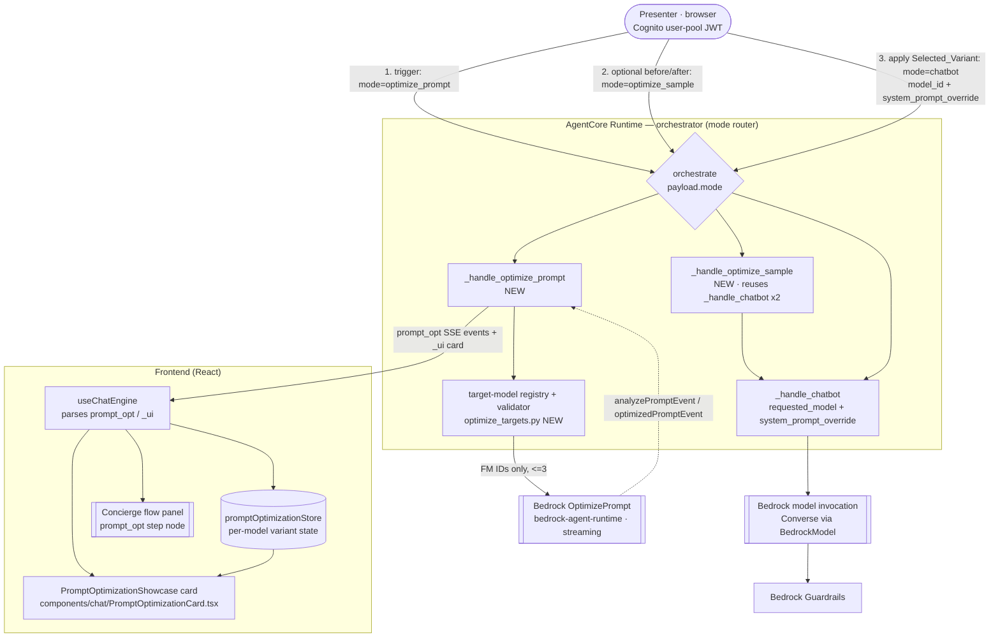

# Design Document

## Overview

This feature adds a **live Bedrock Prompt Optimization showcase** for the customer-facing AI
Agent (the "AI Client Advisor"). Today that agent runs through the orchestrator's `mode="chatbot"`
path (`_handle_chatbot` in `patterns/orchestrator-agent/orchestrator_agent.py`) on a fixed system
prompt (`CHATBOT_PROMPT`) and a fixed default model (`us.anthropic.claude-sonnet-4-6`, an
inference profile). Two per-request seams already exist and are the only seams this feature uses
to change the live agent: `_handle_chatbot(requested_model=..., system_prompt_override=...)`.

A Presenter triggers the showcase. The backend takes the AI Agent's Current_System_Prompt and,
for each of at most three verified target foundation models, streams the Bedrock `OptimizePrompt`
events — the `analyzePromptEvent` (analysis) followed by the `optimizedPromptEvent` (the
model-tailored optimized prompt) — into a visible Showcase_Card and a distinct flow-panel step.
The Presenter (human-in-the-loop) reviews each Candidate_Variant side-by-side with the
Baseline_Variant, optionally runs one synthetic Sample_Question through the baseline and a chosen
candidate to compare real answers, then applies a chosen `(model, prompt)` pairing to the live AI
Agent for the rest of the session via the existing `requested_model` + `system_prompt_override`
seams.

The design is grounded in verified behavior of the Bedrock `OptimizePrompt` streaming API and the
existing orchestrator/frontend seams:

- **`OptimizePrompt` streaming API** — boto3 `bedrock-agent-runtime`:
  `optimize_prompt(input={"textPrompt": {"text": <prompt>}}, targetModelId=<foundation-model-id>)`.
  The response exposes an event stream on `response["optimizedPrompt"]`; each event is either an
  `analyzePromptEvent` (carrying the analysis message) or an `optimizedPromptEvent` (carrying the
  rewritten, model-tailored prompt). It returns **analysis + an optimized prompt only** — no
  evaluation scores, latency, or cost.
- **Foundation-model IDs only** — `OptimizePrompt` accepts foundation-model IDs, not
  inference-profile IDs. The verified-supported targets (confirmed working in the target account,
  `us-east-1`) are exactly `anthropic.claude-sonnet-4-5-20250929-v1:0`,
  `anthropic.claude-haiku-4-5-20251001-v1:0`, and `anthropic.claude-3-haiku-20240307-v1:0`. The AI
  Agent's Current_Model (`us.anthropic.claude-sonnet-4-6`) is an inference profile and is
  therefore **never** submitted as an optimize target.
- **Per-model prompts** — the optimized prompt is produced _per target model_; there is no single
  model-agnostic prompt. The meaningful comparisons are Baseline (Current_Model +
  Current_System_Prompt) versus a Candidate (a Target_Model + the prompt optimized for that same
  Target_Model). Any other pairing shown must carry a Provenance_Label stating the mismatch.
- **Existing SSE + generative-UI pipeline** — the orchestrator streams typed events and
  `{"_ui": {...}}` generative-UI events over SSE; `parsers/strands.ts` parses them into a
  `StreamEvent` union that `useChatEngine.ts` dispatches into stores and chat segments. The
  A2A hop (`a2a_call` event → `conciergeFlowStore` → flow node) is the precedent this feature
  mirrors for its new `prompt_opt` event and flow node.

Consistent with the repo steering (`.kiro/steering/guidelines.md`), the feature is self-contained
(no external endpoints), uses synthetic bank data only (including the Sample_Question), is gated by
a feature flag, and deploys and destroys with standard CDK commands.

### Model-invocation decision (verified constraint)

`OptimizePrompt` requires the **foundation-model ID** as its `targetModelId`. But on-demand model
_invocation_ (the before/after sample runs and applying a Candidate_Variant) differs by model: the
newer Claude 4.5 models are invocable on-demand only through a **regional inference profile**,
while the older `anthropic.claude-3-haiku-20240307-v1:0` is invocable directly as a
foundation-model ID. The two IDs therefore diverge for the 4.5 targets.

**Decision:** keep both IDs explicitly in one Target*Model registry. Each entry records
`optimize_target_id` (the foundation-model ID, the \_only* thing ever sent to `OptimizePrompt`) and
`invoke_id` (the invocable form used when building the `BedrockModel` for a sample run or an
applied Candidate_Variant). The registry is the single place the invocable form is confirmed per
deploy account. This cleanly satisfies Requirement 2 (never send an inference-profile ID to
`OptimizePrompt`) while still letting the before/after runner and the apply step invoke the
candidate model. Rationale for keeping the map rather than deriving it: the FM→profile mapping is
not a pure string transform (the `us.`-prefix convention does not universally hold and 3 Haiku has
no profile), so a lookup table that is verified once is safer than a guessed transform.

## Architecture

### Component and flow overview



### End-to-end sequence

1. **Trigger.** The Presenter clicks "Optimize this agent's prompt" on the Showcase_Card entry
   point. The frontend invokes the orchestrator with `mode="optimize_prompt"` (no `prompt`
   content needed beyond a marker; the prompt text being optimized is the server-side
   Current_System_Prompt, never sent from the client). `_handle_optimize_prompt` emits a `_ui`
   `PromptOptimizationShowcase` segment (so the card renders) and a `prompt_opt` step-start event
   for the flow panel.
2. **Validate targets.** `_handle_optimize_prompt` reads the fixed Supported_Target_Models from
   the registry and passes them through the validator, which drops any non-supported or
   inference-profile identifier and emits an `invalid_target` `prompt_opt` event for each dropped
   id. At most three targets survive.
3. **Stream per model.** For each surviving Target_Model, the handler calls
   `optimize_prompt(input={"textPrompt": {"text": CHATBOT_PROMPT}}, targetModelId=<FM id>)` and
   iterates `response["optimizedPrompt"]`. Each `analyzePromptEvent` becomes a `prompt_opt`
   event (`kind="analysis"`), each `optimizedPromptEvent` becomes a `prompt_opt` event
   (`kind="optimized"`), both tagged with the Target_Model id. A per-model `try/except` isolates
   failures: a failure emits a `prompt_opt` `kind="error"` (or `invalid_target` when Bedrock
   rejects the target) and the loop continues to the next model (Req 10).
4. **Compare.** The Showcase_Card renders the Baseline_Variant (Current_Model +
   Current_System_Prompt) beside each Candidate_Variant, each with a Provenance_Label. In-progress,
   succeeded, failed, and invalid-target states are distinguished per model (Req 3, 4, 10.5).
5. **Optional before/after.** The Presenter picks a candidate and requests a Before_After_Comparison.
   The frontend invokes `mode="optimize_sample"` with the synthetic Sample_Question, the chosen
   candidate's `invoke_id`, and its Optimized_Prompt. `_handle_optimize_sample` runs `_handle_chatbot`
   twice — once as Baseline (Current_Model, no override), once as the Candidate (candidate
   `invoke_id` + Optimized_Prompt as `system_prompt_override`) — tagging each streamed answer with
   its variant label, and isolating a per-side failure (Req 7).
6. **Select + apply.** The Presenter selects a Variant on the card. The frontend records it as the
   Selected_Variant in a per-session client store and, for every subsequent `mode="chatbot"`
   request in that session, attaches `model_id = candidate.invoke_id` and
   `system_prompt_override = candidate.optimized_prompt` (Baseline → Current_Model, no override).
   The flow-panel step moves to completed; the card shows which Variant is applied (Req 6, 8, 9.3).

### Why a new mode + a client-held Selected_Variant

- **A new `optimize_prompt` mode (not a tool on the chatbot).** Optimization is a presenter-driven
  meta-operation on the agent's own configuration, not a turn in the customer conversation. A
  dedicated mode keeps it off the customer transcript, gives it its own flow-panel step
  (Requirement 9), and avoids polluting `_handle_chatbot` — which stays exactly the seam that
  applies a variant. This mirrors how `research`, `menu`, and `archive_chat` are separate modes on
  the same router.
- **Per-session application held client-side, pushed through existing seams.** Requirement 13.2/13.3
  forbid a separate model-invocation path and forbid persistence. Since `requested_model` and
  `system_prompt_override` are already per-request parameters of `_handle_chatbot`, the cleanest
  "per-session" application is for the frontend to hold the Selected_Variant for the session and
  attach it to each subsequent chatbot request. No server state, no persistence, no new invocation
  path, and it naturally isolates one Presenter's session from another's (Requirement 8.4, 12.6) —
  each browser session carries its own `model_id`/override. The orchestrator's chatbot branch is
  extended to read `system_prompt_override` from the payload and pass it through (it already passes
  `model_id` → `requested_model`).
- **Before/after as a mode that reuses `_handle_chatbot` twice.** This honors Requirement 13.2 (only
  the existing seams) and Requirement 7.4 (live invocations, not stored answers), keeps both answers
  in one SSE turn so the card can pair them, and lets one side fail without aborting the other
  (Requirement 7.6).

### Feature-flag gating

A new `prompt_optimization` flag (default off) in `lib/common/feature-flags.ts` + `cdk.json` gates
the whole feature. When off: the orchestrator does not accept the `optimize_prompt` /
`optimize_sample` modes (they fall through to a no-op error event), the IAM grant for
`bedrock:OptimizePrompt` is not added, and the frontend hides the Showcase_Card entry point and the
flow node (`VITE_PROMPT_OPTIMIZATION_ENABLED`). The AI Agent operates exactly as it does today
(Req 1.5, 12.1, 12.2). Because the flag only adds an IAM action and in-process handlers (no new
runtime, table, or bucket), deploy/destroy remain the standard CDK commands (Req 12.5).

## Components and Interfaces

### 1. Target-model registry + validator (`patterns/orchestrator-agent/optimize_targets.py`, NEW)

The single source of truth for which models may be optimized and how each is invoked.

```python
# Pure module — no AWS calls, no I/O — so it is fully unit/property testable.

class TargetModel(NamedTuple):
    optimize_target_id: str  # foundation-model ID — the ONLY id sent to OptimizePrompt
    invoke_id: str           # invocable id (inference profile where required) for sample/apply
    label: str               # human label for the Provenance_Label

SUPPORTED_TARGET_MODELS: tuple[TargetModel, ...] = (
    TargetModel("anthropic.claude-sonnet-4-5-20250929-v1:0",
                "us.anthropic.claude-sonnet-4-5-20250929-v1:0", "Claude Sonnet 4.5"),
    TargetModel("anthropic.claude-haiku-4-5-20251001-v1:0",
                "us.anthropic.claude-haiku-4-5-20251001-v1:0", "Claude Haiku 4.5"),
    TargetModel("anthropic.claude-3-haiku-20240307-v1:0",
                "anthropic.claude-3-haiku-20240307-v1:0", "Claude 3 Haiku"),
)

def is_inference_profile_id(model_id: str) -> bool:
    """True for inference-profile-form ids (e.g. 'us.'/'eu.'/'apac.' prefixed) that
    OptimizePrompt rejects as targets."""

def validate_optimize_targets(requested: Iterable[str]) -> ValidationResult:
    """Partition requested ids into `submit` (⊆ SUPPORTED_TARGET_MODELS, foundation-model
    form, de-duplicated, capped at 3) and `invalid` (inference-profile ids or unsupported
    ids, each with a reason). Never returns an inference-profile id in `submit`."""
```

`ValidationResult` = `{ submit: list[TargetModel], invalid: list[InvalidTarget] }` where
`InvalidTarget = { id: str, reason: "inference_profile" | "unsupported" }`.

### 2. Optimize handler (`_handle_optimize_prompt`, NEW in `orchestrator_agent.py`)

Async generator, same shape as `_handle_chatbot` (yields SSE-ready dicts).

```python
async def _handle_optimize_prompt(user_id, session_id, prompt_text: str | None = None):
    # prompt_text defaults to CHATBOT_PROMPT (the Current_System_Prompt); the client
    # never supplies prompt content (Req 1.1, 13.1).
```

Responsibilities:

- Emit `{"_ui": {"component": "PromptOptimizationShowcase", "props": {...baseline...}}}` once so the
  card mounts with the Baseline_Variant prompt (Req 4.1).
- Emit a `prompt_opt` step-start event for the flow panel (Req 9.1, 9.2).
- Run `validate_optimize_targets(SUPPORTED_TARGET_MODELS)`; emit `invalid_target` events for any
  dropped id (Req 2.2, 10.3).
- For each surviving `TargetModel`, create a `boto3.client("bedrock-agent-runtime")` and call
  `optimize_prompt(input={"textPrompt": {"text": prompt_text}}, targetModelId=tm.optimize_target_id)`,
  iterating `response["optimizedPrompt"]`. Map events:
    - `event["analyzePromptEvent"]["message"]` → `prompt_opt` `kind="analysis"` (Req 3.1).
    - `event["optimizedPromptEvent"]["optimizedPrompt"]` → `prompt_opt` `kind="optimized"` (Req 3.2).
- Wrap each model in `try/except`: a `ValidationException` naming an invalid target → `invalid_target`
  event; any other error → `error` event; either way, continue to the next model (Req 10.1, 10.2,
  10.4). Emit a terminal step-complete or step-failed (all models failed) flow event (Req 9.3, 9.4).

The handler uses the shared AgentCore execution role (Req 11.2) and calls only in-account Bedrock
(Req 12.3).

### 3. Before/after runner (`_handle_optimize_sample`, NEW in `orchestrator_agent.py`)

```python
async def _handle_optimize_sample(
    sample_question, user_id, session_id,
    candidate_invoke_id: str, candidate_prompt: str, candidate_label: str,
):
    # Runs the Sample_Question through Baseline then Candidate, each via _handle_chatbot,
    # tagging streamed answers with the producing variant (Req 7).
```

- Runs `_handle_chatbot(sample_question, user_id, session_id, requested_model="", mode="chatbot")`
  for the Baseline (Current_Model, no override), tagging its `data`/`message` events with
  `variant="baseline"` and the Baseline Provenance_Label (Req 7.1, 7.5).
- Runs `_handle_chatbot(sample_question, user_id, session_id, requested_model=candidate_invoke_id,
system_prompt_override=candidate_prompt, mode="chatbot")` for the Candidate, tagging events with
  `variant="candidate"` and the Candidate Provenance_Label (Req 7.2, 7.5).
- Each run is wrapped so a failure emits a `prompt_opt` `kind="sample_error"` for that variant and
  the other variant still streams (Req 7.6).
- Uses a fresh throwaway `session_id` suffix for the sample runs so the comparison does not pollute
  the live conversation memory. Sample_Question is synthetic (Req 12.4).

### 4. Router change (`orchestrate` in `orchestrator_agent.py`)

Two new branches plus one existing-branch extension, all gated by the `prompt_optimization` flag
(read from an `ENABLE_PROMPT_OPTIMIZATION` env var set by CDK, mirroring `_ENABLE_A2A`):

```python
# Extend the existing chatbot branch to honor a per-request system prompt override
if mode == "chatbot":
    system_prompt_override = payload.get("system_prompt_override") or None  # NEW passthrough
    async for event in _handle_chatbot(
        query, user_id, session_id, requested_model,
        system_prompt_override=system_prompt_override,  # applies a Candidate_Variant (Req 8.1, 8.2)
        mode="chatbot", customer_jwt=customer_jwt,
    ):
        yield event
    return

if _ENABLE_PROMPT_OPTIMIZATION and mode == "optimize_prompt":
    async for event in _handle_optimize_prompt(user_id, session_id):
        yield event
    return

if _ENABLE_PROMPT_OPTIMIZATION and mode == "optimize_sample":
    async for event in _handle_optimize_sample(
        query, user_id, session_id,
        candidate_invoke_id=payload.get("candidate_model_id", ""),
        candidate_prompt=payload.get("candidate_prompt", ""),
        candidate_label=payload.get("candidate_label", ""),
    ):
        yield event
    return
```

When the flag is off, `optimize_prompt`/`optimize_sample` fall through to the existing default
handling, which yields a benign error event — the frontend never sends them because the entry point
is hidden (Req 1.5, 12.2).

### 5. New stream event `prompt_opt` (frontend)

- `types.ts` — add to the `StreamEvent` union:
    ```typescript
    | {
          type: "prompt_opt";
          targetModelId: string;         // "" for step-level / baseline events
          modelLabel: string;
          kind: "step_start" | "analysis" | "optimized" | "in_progress"
              | "error" | "invalid_target" | "step_complete" | "step_failed"
              | "sample" | "sample_error";
          text: string;                  // analysis message, optimized prompt, or sample answer chunk
          variant?: "baseline" | "candidate";
          optimizedForModelId?: string;  // provenance: which model this prompt was optimized for
      }
    ```
- `parsers/strands.ts` — add a `json.prompt_opt` branch (mirroring the `a2a_call` branch) that
  maps snake_case backend fields to the typed event.
- `useChatEngine.ts` — add `case "prompt_opt"` that drives `usePromptOptimizationStore` (per-model
  state) and the concierge flow store's new `promptOpt` lifecycle, mirroring the `a2a_call` case.

### 6. Showcase_Card (`components/chat/PromptOptimizationCard.tsx`, NEW)

Registered in `components/chat/ui-components.ts` as `PromptOptimizationShowcase`, analogous to
`ServicesCatalogCard`. It renders from `usePromptOptimizationStore` (fed by `prompt_opt` events),
not from static props, so it updates live as events stream. It:

- Shows the Baseline_Variant prompt with a Provenance_Label "Current configuration" (Req 4.1, 4.4).
- Shows, per Target_Model, the streaming Analysis_Message then the Optimized_Prompt, each under the
  model, with per-model in-progress / succeeded / failed / invalid-target states distinguished
  (Req 3.3, 3.4, 3.5, 10.2, 10.3, 10.5).
- Labels each Candidate_Variant with a Provenance_Label naming the model the prompt was optimized
  for; if the card ever pairs a prompt with a different model, it renders a mismatch label
  (Req 4.3, 4.5, 4.6).
- Never presents any number as a Bedrock-returned score/latency/cost; any heuristic indicator is
  labeled "heuristic", and before/after results are attributed to "this demo's own sample run"
  (Req 5).
- Presents Baseline + each successful Candidate as selectable options; on select, records the
  Selected_Variant via `usePromptOptimizationStore.select(...)` and shows an "Apply" affordance;
  offers a "Run sample question" affordance that triggers `mode="optimize_sample"` (Req 6.1, 6.3,
  7). Applying is inert until a selection is made (Req 6.2).
- After apply, shows which Variant is currently applied to the session (Req 8.5).

### 7. Apply mechanism (`usePromptOptimizationStore` + `useChatEngine`)

A new zustand store holds per-session selection:

```typescript
interface PromptOptimizationState {
    models: Record<string, ModelPanel>; // targetModelId → { status, analysis, optimizedPrompt, label }
    baselinePrompt: string;
    selected: SelectedVariant | null; // { kind: "baseline" } | { kind: "candidate", modelId, invokeId, prompt, label }
    sample: {
        baseline?: string;
        candidate?: string;
        baselineFailed?: boolean;
        candidateFailed?: boolean;
    };
    // actions: applyEvent(prompt_opt), select(variant), clear()
}
```

`useChatEngine.sendMessage` reads `selected` and, for `mode="chatbot"`, attaches
`{ modelId: selected.invokeId, system_prompt_override: selected.prompt }` for a candidate, or
nothing for baseline. The selection lives only in this store for the browser session; a page
reload or `startNewChat` clears it (Req 8.3, 8.4, 13.3). `AVAILABLE_MODELS`/`useModelSelector` is
untouched — the applied model rides on the request, it does not change the global selector.

### 8. Flow-panel step (`conciergeFlowStore` + `ConciergeFlowDiagram` + `flow-types`)

Mirror the `a2a` node exactly:

- `conciergeFlowStore.ts` — add `promptOpt: { status: "idle"|"active"|"completed"|"failed" }` with
  actions `promptOptStart / promptOptComplete / promptOptFail`, cleared on `reset`.
- `flow-types.ts` — add category `"prompt_opt"` (reusing the `failed`-capable `NodeActivity`) and a
  `CORE_NODE_META.prompt_optimization` entry.
- `ConciergeFlowDiagram.tsx` — render a "Prompt Optimization" node (gated on
  `VITE_PROMPT_OPTIMIZATION_ENABLED`) driven by `promptOpt.status`: active while requests stream,
  completed when a Variant is applied, failed when all targets fail (Req 9).

### 9. Infrastructure

- `lib/stacks/backend/agentcore-role.ts` — add `bedrock:OptimizePrompt` to the existing Bedrock
  `PolicyStatement` (or a companion statement), conditional on the `prompt_optimization` flag, so
  the shared AgentCore_Role can call the API with least privilege (Req 11.1, 11.3). No new role.
- The orchestrator runtime env gets `ENABLE_PROMPT_OPTIMIZATION` from `features.prompt_optimization`
  (mirroring `ENABLE_A2A`), and the frontend build gets `VITE_PROMPT_OPTIMIZATION_ENABLED`.
- `lib/common/feature-flags.ts` + `cdk.json` — add `prompt_optimization: boolean` (default false).

## Data Models

### Target model registry entry (backend, `optimize_targets.py`)

```
TargetModel {
  optimize_target_id: str   # foundation-model ID (sent to OptimizePrompt) — never a profile id
  invoke_id: str            # invocable id (inference profile where required)
  label: str
}
```

### OptimizePrompt request / streamed response (verified Bedrock shapes)

```python
# Request
client.optimize_prompt(
    input={"textPrompt": {"text": "<Current_System_Prompt>"}},
    targetModelId="anthropic.claude-haiku-4-5-20251001-v1:0",  # foundation-model ID only
)

# Response event stream: iterate response["optimizedPrompt"]; each item is ONE of:
{"analyzePromptEvent":   {"message": "<analysis text>"}}
{"optimizedPromptEvent": {"optimizedPrompt": {"textPrompt": {"text": "<optimized prompt>"}}}}
```

Only `analysis` and an `optimized` prompt are ever produced — no scores, latency, or cost.

### `prompt_opt` stream event (backend → SSE JSON, snake_case)

```json
{
    "prompt_opt": {
        "target_model_id": "anthropic.claude-haiku-4-5-20251001-v1:0",
        "model_label": "Claude Haiku 4.5",
        "kind": "analysis",
        "text": "…analysis or optimized prompt or sample-answer chunk…",
        "variant": "candidate",
        "optimized_for_model_id": "anthropic.claude-haiku-4-5-20251001-v1:0"
    }
}
```

`kind` ∈ `step_start | analysis | optimized | in_progress | error | invalid_target | step_complete
| step_failed | sample | sample_error`. `target_model_id` is `""` for step-level and baseline
events. The frontend `StreamEvent` (`type: "prompt_opt"`) is the camelCase mirror (see Components §5).

### Variant (frontend `usePromptOptimizationStore`)

```
Variant (Baseline)  = { kind: "baseline", prompt: Current_System_Prompt, label: "Current configuration",
                        model: Current_Model }
Variant (Candidate) = { kind: "candidate", modelId, invokeId, prompt: Optimized_Prompt,
                        label, optimizedForModelId }
ModelPanel          = { status: "in_progress"|"succeeded"|"failed"|"invalid_target",
                        analysis?: str, optimizedPrompt?: str, label: str }
SelectedVariant     = Variant   # what applies to subsequent chatbot requests this session
```

Provenance_Label rule: a Candidate is "consistent" when the model it is applied to equals
`optimizedForModelId`; otherwise the card renders a mismatch label. Baseline is always labeled the
current configuration.

### Apply payload (frontend → orchestrator, `mode="chatbot"`)

```json
{
    "mode": "chatbot",
    "prompt": "<user turn>",
    "model_id": "<candidate.invokeId>",
    "system_prompt_override": "<candidate.optimizedPrompt>"
}
```

Baseline applied ⇒ neither `model_id` (candidate) nor `system_prompt_override` is attached.

### Feature flag (extends `FeatureFlags` in `lib/common/feature-flags.ts`)

```
prompt_optimization: boolean   # default false — gate the OptimizePrompt showcase end to end
```

## Correctness Properties

_A property is a characteristic or behavior that should hold true across all valid executions of a
system — essentially, a formal statement about what the system should do. Properties serve as the
bridge between human-readable specifications and machine-verifiable correctness guarantees._

This feature is suitable for property-based testing at its **pure logic seams**: the target-model
validator, the OptimizePrompt request/dispatch planner, the Bedrock-event → `prompt_opt` mapper,
the per-model store fold, the provenance/attribution labeler, the selection → applied-config
mapper, the per-session isolation of applied config, the before/after pairing, and the flow-node
status fold. PBT does **not** apply to the IAM grant, the feature-flag gating, the live
`OptimizePrompt` stream, the guardrail, or the deploy/destroy lifecycle — those are covered by
smoke and integration tests (see Testing Strategy). The properties below were derived from the
prework analysis after consolidating redundant per-model and rendering criteria.

### Property 1: Optimization submits only supported foundation-model targets, never a profile id

_For any_ list of requested model identifiers (mixing supported foundation-model ids,
inference-profile ids — including the Current_Model profile — unsupported ids, and duplicates), the
validator's `submit` set contains only supported foundation-model-form ids, contains no
inference-profile id, is de-duplicated, and has at most three entries; and every excluded
inference-profile id is surfaced as an invalid-target with reason `inference_profile`.

**Validates: Requirements 1.2, 1.3, 2.1, 2.2, 2.3, 2.4**

### Property 2: The OptimizePrompt request carries the current prompt text and a foundation-model target

_For any_ prompt text and _any_ supported Target_Model, the built OptimizePrompt request has
`input.textPrompt.text` equal to that exact prompt text and `targetModelId` equal to that target's
foundation-model id (never its invocable/profile id), and exactly one request is planned per
submitted target.

**Validates: Requirements 1.1, 1.4**

### Property 3: Bedrock optimize events map to typed events preserving kind, model, and text

_For any_ sequence of Bedrock stream items (each an `analyzePromptEvent` or an
`optimizedPromptEvent` with arbitrary text, for an arbitrary Target_Model), the mapper emits, in
order, a `prompt_opt` event per item whose `kind` is `analysis` or `optimized` respectively, whose
`target_model_id` equals the source model id, and whose `text` equals the source message/optimized
prompt.

**Validates: Requirements 3.1, 3.2**

### Property 4: The per-model fold reflects each model's own outcome independently

_For any_ sequence of `prompt_opt` events over any set of Target_Models with any mix of outcomes
(analysis+optimized, error, invalid_target, or still pending), the folded store gives each model a
panel that reflects only that model's own events: a model with an optimized event is `succeeded`
and carries its analysis and optimized prompt, a model with an error event is `failed`, a model
with an invalid-target event is `invalid_target`, and a model with no terminal event remains
`in_progress`; the set of selectable Candidate_Variants equals exactly the set of `succeeded`
models, and no model's outcome alters any other model's panel.

**Validates: Requirements 3.3, 3.4, 3.5, 10.1, 10.2, 10.3, 10.4, 10.5**

### Property 5: Provenance and attribution labels are correct and never claim Bedrock scores

_For any_ Variant and _any_ model it is paired with, the derived label identifies the
Baseline*Variant as the current configuration, identifies a Candidate_Variant by the model its
prompt was optimized for, and — when a candidate prompt is paired with a model other than its
`optimizedForModelId` — produces a mismatch label naming both the optimized-for model and the
paired model; and \_for any* store state, the card's derived view exposes no indicator attributed
to the Bedrock `OptimizePrompt` API as a score, latency, or cost, labels any non-before/after
comparison indicator as a heuristic, and attributes any before/after result to the feature's own
sample generation.

**Validates: Requirements 4.3, 4.4, 4.5, 4.6, 5.1, 5.2, 5.3**

### Property 6: Selection maps to the correct applied per-request configuration

_For any_ selection state, the applied chatbot request configuration is: no candidate model and no
`system_prompt_override` when nothing is selected or the Baseline_Variant is selected (so the AI
Agent keeps the Current_Model and Current_System_Prompt); and the selected candidate's `invoke_id`
as `model_id` together with that candidate's Optimized_Prompt as `system_prompt_override` when a
Candidate_Variant is selected.

**Validates: Requirements 6.1, 6.2, 6.3, 6.4, 8.1, 8.2, 8.3**

### Property 7: Applied configuration is isolated per session

_For any_ two independent session stores holding distinct selections, the applied request
configuration derived from one store never depends on or changes the other store's selection —
each session's applied `(model, prompt-override)` is a function of its own selection alone.

**Validates: Requirements 8.4, 12.6**

### Property 8: Before/after pairs answers with provenance and isolates a per-variant failure

_For any_ pair of before/after outcomes — each of the Baseline and the chosen Candidate either
producing an answer or failing — the paired view labels each present answer with the
Provenance_Label of the Variant that produced it, shows a failure state for a failed side, and
still shows the other side's answer whenever that side succeeded.

**Validates: Requirements 7.3, 7.5, 7.6**

### Property 9: The flow-panel step folds to the correct lifecycle state

_For any_ sequence of prompt-optimization lifecycle events, the flow node status folds correctly: a
step-start drives it to `active`, applying a Selected_Variant drives it to `completed`, and a
terminal state in which every Target_Model failed drives it to `failed`; the node MAY remain
`active` until such a terminal event arrives.

**Validates: Requirements 9.1, 9.2, 9.3, 9.4**

## Error Handling

Every IF/THEN condition in the requirements maps to an explicit handler. The unifying rule: a
failure for one Target_Model or one before/after side is **isolated** — it degrades that one panel
or answer and never aborts the rest of the showcase (Req 10, 7.6).

| Condition                                                                           | Requirement      | Handling                                                                                                                                                                                                                                                          |
| ----------------------------------------------------------------------------------- | ---------------- | ----------------------------------------------------------------------------------------------------------------------------------------------------------------------------------------------------------------------------------------------------------------- |
| Requested id is an inference-profile id (incl. Current_Model) or unsupported        | 2.2, 2.4, 10.3   | `validate_optimize_targets` drops it from `submit` and returns it in `invalid`; `_handle_optimize_prompt` emits a `prompt_opt` `kind="invalid_target"`; the card renders an invalid-target state for it. It is never sent to Bedrock.                             |
| Bedrock `OptimizePrompt` rejects a target (`ValidationException`)                   | 10.3             | Per-model `try/except` maps it to a `prompt_opt` `kind="invalid_target"`; the loop continues to the next model.                                                                                                                                                   |
| `OptimizePrompt` request for one model fails (throttling, transport, service error) | 10.1, 10.2       | Per-model `try/except` emits `prompt_opt` `kind="error"` for that model and continues with the remaining models; successful candidates stay selectable (10.4).                                                                                                    |
| All Target_Models fail                                                              | 9.4              | After the loop, if no model reached `optimized`, emit a `step_failed` flow event; the flow node shows `failed`.                                                                                                                                                   |
| Before/after generation fails for one Variant                                       | 7.6              | `_handle_optimize_sample` wraps each `_handle_chatbot` run; a failing run emits `prompt_opt` `kind="sample_error"` with its `variant`, and the other run still streams; the card shows a failure state for the failed side and the answer for the succeeded side. |
| Presenter applies before any selection                                              | 6.2              | The apply affordance is inert until `usePromptOptimizationStore.selected` is set; no `model_id`/override is attached to chatbot requests.                                                                                                                         |
| Feature flag off but an `optimize_*` mode arrives                                   | 1.5, 12.2        | The router does not match the gated branches; the request falls through to default handling which yields a benign error event. The frontend hides the entry point so this is not reached in practice.                                                             |
| `bedrock:OptimizePrompt` not granted (misconfig)                                    | 11.1             | The boto3 call raises `AccessDeniedException`; handled by the same per-model `error` path (visible failure, no silent success). The CDK grant (flag on) prevents this in a correct deploy.                                                                        |
| Guardrail cannot be applied on a sample run                                         | (self-contained) | `_handle_chatbot` already builds the model with guardrail params; a guardrail/setup failure surfaces as that run's `sample_error`, isolated per Req 7.6.                                                                                                          |

## Testing Strategy

**Dual approach.** Property-based tests cover the pure seams (universal correctness across
generated inputs); example, integration, and smoke tests cover the concrete wiring, live Bedrock
behavior, infrastructure, and deployment.

**Property-based tests** (Python: Hypothesis for backend seams; TypeScript: fast-check for
frontend seams). Each property test runs a **minimum of 100 iterations** and is tagged with a
comment referencing its design property, in the form
`Feature: prompt-optimization-showcase, Property N: <property text>`.

- **Backend (Hypothesis, `patterns/orchestrator-agent/tests/`)**
    - Property 1 — `validate_optimize_targets` over generated id lists (mixing supported FM ids,
      `us./eu./apac.`-prefixed profile ids, unsupported ids, duplicates): assert `submit` has no
      inference-profile id, `submit ⊆` supported FM ids, `len ≤ 3`, and each dropped profile id is in
      `invalid` with reason `inference_profile`.
    - Property 2 — request builder over generated prompt text × supported target: assert
      `input.textPrompt.text` and foundation-model `targetModelId`, one request per target.
    - Property 3 — event mapper over generated analyze/optimized item sequences: assert kind, model
      id, and text are preserved in order. (Bedrock client mocked; the mapper is pure.)
- **Frontend (fast-check, `lib/stacks/frontend/app/src/**/**tests**/`)\*\*
    - Property 4 — per-model store fold over generated `prompt_opt` sequences.
    - Property 5 — provenance/attribution labeler over generated variants × paired models and
      generated store states.
    - Property 6 — selection → applied-config mapper over generated selections (none/baseline/candidate).
    - Property 7 — two independent store instances with distinct selections; assert no cross-influence.
    - Property 8 — before/after pairing over the outcome combinations (success/fail × 2) with random
      answer text.
    - Property 9 — flow-node status fold over generated lifecycle sequences.

**Example / unit tests.** Card renders baseline + candidate blocks when data is present (4.1, 4.2);
`_handle_optimize_prompt` submits only `CHATBOT_PROMPT` text and never another agent phase's prompt
(13.1); the apply path routes only through `mode="chatbot"` with `model_id`/`system_prompt_override`
and introduces no other invocation path (13.2); `startNewChat`/reload clears the Selected_Variant
(13.3).

**Integration tests** (mock-first, live opt-in). `_handle_optimize_sample` invokes `_handle_chatbot`
once per side with the correct `requested_model`/`system_prompt_override` (model mocked) — 1–2
examples (7.1, 7.2, 7.4).

**Skipped-by-default smoke checks** (live AWS; run only when explicitly enabled, e.g. a
`RUN_LIVE_OPTIMIZE=1` env guard so CI stays hermetic and self-contained):

- Live `OptimizePrompt` against each of the three verified foundation-model ids in `us-east-1`,
  asserting the stream yields an `analyzePromptEvent` then an `optimizedPromptEvent` and that an
  inference-profile id is rejected (confirms the Req 2 constraint against the real API).
- IAM: with the flag on, a CDK assertion (or a live `sts`/dry-run) that the AgentCore_Role policy
  includes `bedrock:OptimizePrompt`, and is absent with the flag off (11.1, 11.3).
- Guardrail: a live sample run still has the guardrail applied (self-contained safety check).
- Deploy/destroy: `cdk synth` with the flag on and off produces a clean template with no external
  endpoints, confirming self-contained deploy/destroy (12.1, 12.2, 12.3, 12.5).
