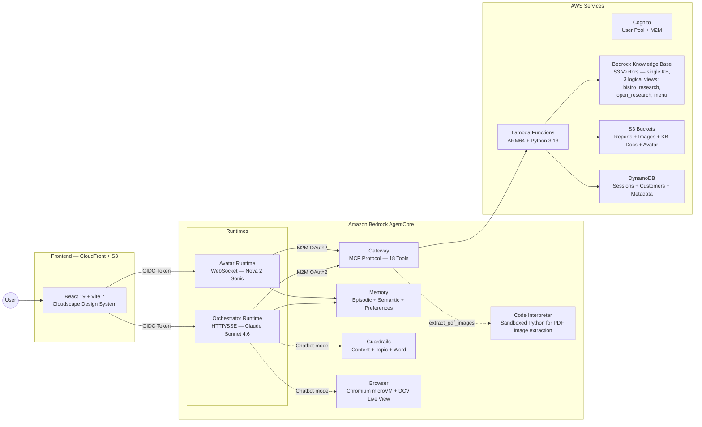
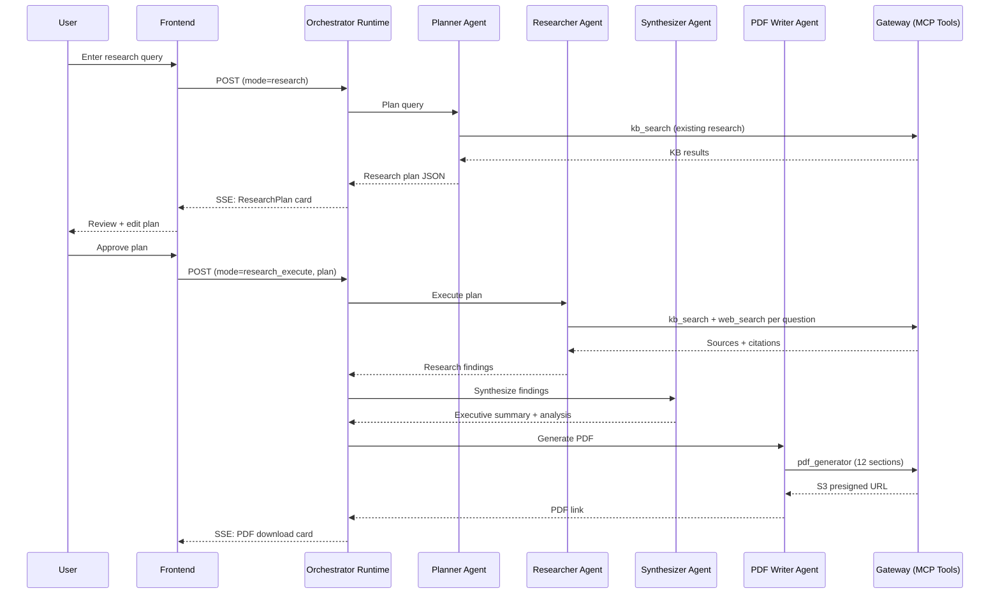
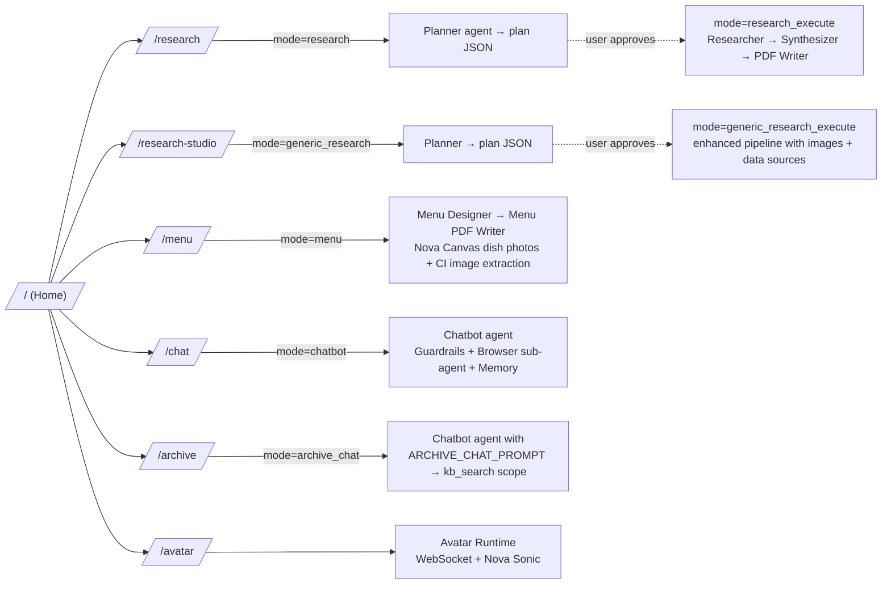
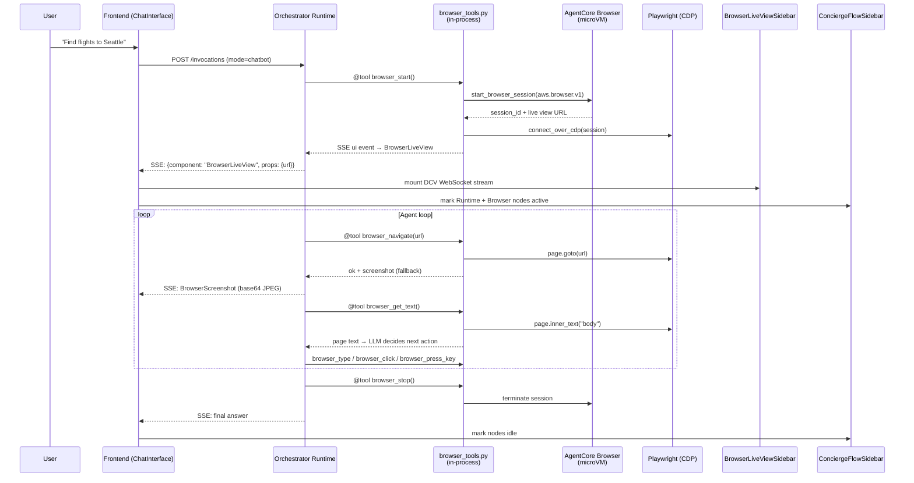
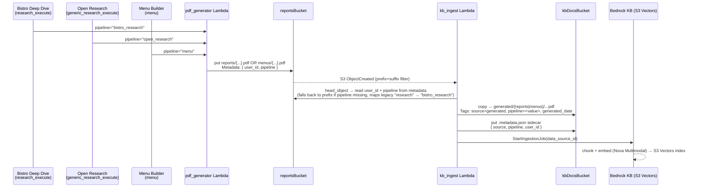
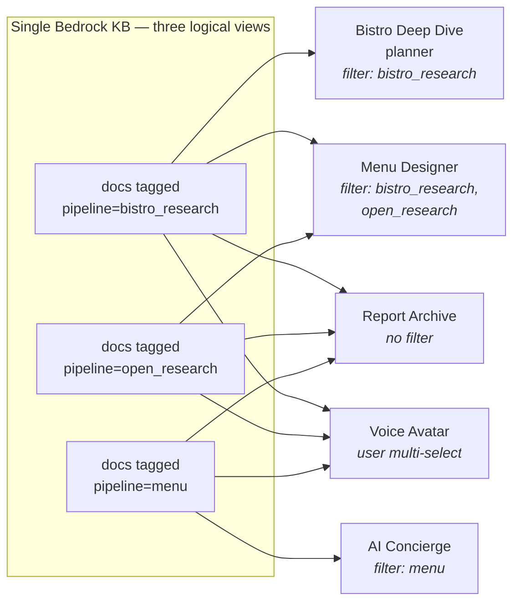

# Gartner AppDev Research Agent

A multi-agent research platform built on **Amazon Bedrock AgentCore** that produces comprehensive PDF research reports through a human-in-the-loop pipeline. Two AgentCore Runtimes, 17 Gateway tools, five CDK stacks (Frontend, Auth, Shared, Backend, FrontendDeployment), zero cost when idle.

**Demo flow**: Home &rarr; Research &rarr; Menu &rarr; Chat &rarr; Avatar

Users plan a research topic (with editable objectives, methodology, and questions), approve the plan, and receive a 12-section PDF report. Alternatively, they create AI-generated menus with Nova Canvas dish photography and Code Interpreter-extracted dish photos, chat with a guardrailed concierge that can drive an AgentCore Browser session live on screen, or speak to a real-time voice avatar powered by Nova Sonic.

---

## Architecture Overview



---

## Features

| Feature                    | Description                                                                                                                                               |
| -------------------------- | --------------------------------------------------------------------------------------------------------------------------------------------------------- |
| **Multi-Agent Research**   | Planner &rarr; Researcher &rarr; Synthesizer &rarr; PDF Writer pipeline with human-in-the-loop plan approval                                              |
| **12-Section PDF Reports** | Cover page, TOC, executive summary, methodology, key findings, evidence, data analysis, conclusions, recommendations, limitations, appendices, references |
| **AI Menu Creation**       | Menu Designer + Menu PDF Writer with Nova Canvas-generated dish photography, plus AgentCore Code Interpreter for extracting dish images out of the PDF    |
| **Website Generation**     | `website_generator` tool produces single-page HTML menus that the Avatar can modify live through Nova Sonic voice commands                                |
| **Guardrailed Chat**       | Restaurant concierge with Bedrock Guardrails (content, topic, and word policies)                                                                          |
| **Browser Sub-agent**      | Concierge can spawn an AgentCore Browser microVM, drive it via Playwright/CDP, and stream it into the chat via DCV live view with screenshot fallback     |
| **Concierge Flow Diagram** | Live ReactFlow sidebar visualizes AgentCore components (Runtime, Gateway, Memory, Browser, Code Interpreter) activating in real time during chat turns    |
| **Voice Avatar**           | Real-time speech-to-speech via Nova 2 Sonic with 5 selectable personas                                                                                    |
| **Knowledge Base**         | S3 Vectors + Nova Multimodal Embeddings. Auto-ingests generated PDFs via an S3-triggered Lambda for cross-experience queries                              |
| **AgentCore Memory**       | Episodic (session-scoped with reflection), semantic (cross-session facts), and user preference strategies                                                 |
| **18 MCP Gateway Tools**   | KB search, web search, PDF generation, Nova Canvas/Reel, memory, user profiles, orders, website generator, PDF image extraction                           |
| **M2M OAuth2**             | Agent-to-Gateway auth via Cognito client credentials. Token cached with 60s safety margin                                                                 |
| **Generative UI**          | SSE-streamed agent phases, research plan approval cards, tool activity indicators, browser live view                                                      |

---

## Multi-Agent Pipeline



All four agents run **in-process** within the orchestrator runtime — no HTTP between agents, no cold starts, shared MCP client. A heartbeat thread fires every 10 seconds to keep the SSE connection alive through AgentCore's ~80s proxy timeout.

---

## User Journey & Mode Routing

The React frontend maps each page to an orchestrator mode. All modes are served by the single orchestrator runtime, which branches on `payload.mode` to dispatch the right in-process pipeline or agent.



---

## Concierge Chat Turn — Browser Sub-agent & Live View

When the user asks the concierge to do something on a website, the Strands agent loop picks `browser_start` as its first tool. `browser_tools.py` runs **in-process** inside the orchestrator runtime, spawns an AgentCore Browser microVM over the bedrock-agentcore control plane, attaches Playwright via CDP, and immediately emits a `BrowserLiveView` UI event into the SSE stream. The frontend opens a sidebar and streams the DCV WebSocket, with a screenshot fallback on each navigation.



The `ConciergeFlowSidebar` (ReactFlow) subscribes to SSE events and highlights AgentCore components as they activate — Runtime, Gateway, Memory, Browser, Code Interpreter — so users see the architecture work in real time.

---

## Knowledge Base — Single Store, Three Logical Views

The platform uses a **single physical Bedrock Knowledge Base** (S3 Vectors backend), but every ingested document is tagged with a logical `pipeline` attribute that carves the KB into three views:

| Pipeline tag      | Source                                          | What's in it                                         |
| ----------------- | ----------------------------------------------- | ---------------------------------------------------- |
| `bistro_research` | Bistro Deep Dive (`mode=research_execute`)      | 12-section PDF research reports                      |
| `open_research`   | Open Research (`mode=generic_research_execute`) | Enhanced research reports with images + data sources |
| `menu`            | Menu Builder (`mode=menu`)                      | Restaurant menu PDFs with dish photography           |

Every experience that reads from the KB does so with a server-enforced filter. The filter is injected by a `PipelineScopeHook` (`patterns/utils/pipeline_scope.py`) so the LLM cannot accidentally cross boundaries.

| Mode                                            | Writes pipeline   | Reads pipelines                                                                                         |
| ----------------------------------------------- | ----------------- | ------------------------------------------------------------------------------------------------------- |
| `research` / `research_execute`                 | `bistro_research` | `bistro_research`                                                                                       |
| `generic_research` / `generic_research_execute` | `open_research`   | `open_research`                                                                                         |
| `menu`                                          | `menu`            | `bistro_research`, `open_research` (for cuisine/market intel — menus are NOT read to avoid circularity) |
| `chatbot` (AI Concierge)                        | —                 | `menu` (answers menu/dining questions)                                                                  |
| `archive_chat` (Report Archive)                 | —                 | _(no filter — reads every view)_                                                                        |
| Voice Avatar                                    | —                 | _(user-controlled chip multi-select — defaults to all)_                                                 |

### Ingestion flow

Every PDF produced by the research or menu pipelines is automatically discoverable in future sessions. The `kb_ingest` Lambda is **not** a Gateway tool — it is an S3-triggered Lambda wired up in the Shared stack that reacts to `ObjectCreated` events on `reports/*.pdf` and `menus/*.pdf`.



### Read paths



The `.metadata.json` sidecar stores both `user_id` (tenant isolation) and `pipeline` (logical view). The `kb_search` tool composes Bedrock filter clauses with `andAll` — users only ever see their own documents, scoped to whichever pipelines the current experience allows.

> **Isolation model:** see [docs/kb-isolation.md](docs/kb-isolation.md) for the full threat model, enforcement points, and a runbook for cleaning up legacy untagged docs.

---

## Gateway Tools

```
gateway/tools/
├── kb_search/              # Bedrock Knowledge Base hybrid search
├── web_search/             # Nova Pro with web grounding
├── pdf_generator/          # ReportLab PDF generation → S3 presigned URL
├── nova_canvas_generate/   # Image generation via Nova Canvas
├── nova_canvas_edit/       # Image editing (inpainting, outpainting)
├── nova_canvas_history/    # Session image history
├── nova_reel_generate/     # Video generation via Nova Reel
├── nova_reel_status/       # Async video job status
├── nova_reel_history/      # Session video history
├── save_memory/            # Persist to AgentCore Memory
├── recall_memories/        # Retrieve from Memory
├── analyze_patterns/       # Conversation pattern analysis
├── retrieve_user_profile/  # DynamoDB customer lookup
├── place_order/            # Order placement
├── data_sources/           # Data source listings
├── website_generator/      # Single-page HTML menu generation
├── extract_pdf_images/     # PDF image extraction via AgentCore Code Interpreter
├── sample_tool/            # Minimal reference implementation
├── research_orchestrator/  # Lambda Durable Functions stub (feature-gated)
└── kb_ingest/              # Not a Gateway tool — S3-triggered Lambda that auto-ingests generated PDFs into the KB
```

17 tools register with the Gateway by default (everything above except `sample_tool`, gated behind `features.sample_tool` and off by default; `research_orchestrator`, gated behind `features.durable_functions`; and `kb_ingest`, wired as an S3 event handler rather than an MCP tool). Each tool is a self-contained directory with `handler.py` and `tool_spec.json`. The Gateway authenticates via Cognito JWT and routes MCP tool calls to the corresponding Lambda function.

---

## Tech Stack

| Layer                  | Technology                                    | Version                                    |
| ---------------------- | --------------------------------------------- | ------------------------------------------ |
| **Infrastructure**     | AWS CDK                                       | 2.1121.0 (pinned)                          |
| **CDK Constructs**     | `@aws-cdk/aws-bedrock-agentcore-alpha`        | 2.253.1-alpha.0+                           |
| **Agent Framework**    | Strands Agents SDK (Python)                   | `>=1.33.0,<2.0.0`                          |
| **Orchestrator Model** | Claude Sonnet 4.6                             | `us.anthropic.claude-sonnet-4-6`           |
| **Voice Model**        | Nova 2 Sonic                                  | `amazon.nova-2-sonic-v1:0`                 |
| **Tool Selector**      | Nova 2 Lite                                   | `amazon.nova-2-lite-v1:0`                  |
| **KB Embeddings**      | Nova Multimodal Embeddings                    | `amazon.nova-2-multimodal-embeddings-v1:0` |
| **KB Storage**         | S3 Vectors                                    | 1024-dim, FLOAT32, cosine                  |
| **Frontend**           | React 19 + Vite 7 + TypeScript                |                                            |
| **Design System**      | AWS Cloudscape                                | 3.0+                                       |
| **Styling**            | Tailwind CSS v4 + Framer Motion               |                                            |
| **Auth**               | Cognito (OIDC + M2M) via `react-oidc-context` |                                            |
| **3D Avatar**          | Three.js                                      | 0.172+                                     |
| **Flow Visualization** | ReactFlow                                     | 12.10+                                     |
| **Lambda Runtime**     | Python 3.13, ARM64                            |                                            |
| **Node.js**            | 22.8.0 (Volta-managed)                        |                                            |

> **Alpha-channel note:** Amazon Bedrock AgentCore is GA as a service, but the CDK L2 construct (`@aws-cdk/aws-bedrock-agentcore-alpha`) is still shipped in the `-alpha.0` channel as of `2.253.1-alpha.0`. Minor-version bumps can still include breaking API changes — review the construct release notes when upgrading.

---

## Getting Started

### Prerequisites

- **Node.js 22.8.0** (managed by Volta)
- **Python 3.11+** (for agent runtimes and Lambda tools)
- **AWS CLI** configured with appropriate credentials
- **Docker** (ARM64 support required for container builds)

### Install

```bash
npm install    # Installs CDK deps, frontend workspace, Python venv via uv, ruff
```

### Configure

Edit `cdk.json` to set your project configuration:

```json
{
    "context": {
        "projectId": "gartner-appdev",
        "stackNameBase": "gartner-appdev-2026",
        "accounts": {
            "dev": { "id": "YOUR_ACCOUNT_ID", "region": "us-east-1" }
        },
        "features": {
            "avatar": true,
            "knowledge_base": true,
            "guardrails": true,
            "browser": true,
            "neptune": false
        }
    }
}
```

### Deploy

```bash
# Interactive CLI (recommended)
npm run kit

# Headless deploy all stacks
npm run kit -- deploy dev --all

# Direct CDK
npm run cdk -- deploy "*/**" -c stage=dev
```

### Verify

```bash
# Check orchestrator runtime logs
aws logs tail "/aws/bedrock-agentcore/runtimes/gartner_appdev_2026_orchestrator-*-DEFAULT" \
  --since 5m --format short

# Check a Gateway tool Lambda
aws logs tail "/aws/lambda/gartner-appdev-2026-tool-kb_search" \
  --since 5m --format short
```

---

## Development

### Frontend

```bash
npm run -w frontend dev          # Vite dev server on :3000
npm run kit -- refresh-frontend dev  # Generate .env from deployed stack outputs
```

### Code Quality

```bash
npm run build    # TypeScript compilation
npm run lint     # ESLint + ruff check
npm run format   # Prettier + ruff format
npm run test     # Jest CDK tests
```

### Commit

```bash
npm run commit   # Interactive conventional commit (commitizen)
```

---

## Project Structure

```
gartner-app-dev-research-agent/
├── bin/app.ts                       # CDK entrypoint + property injectors
├── lib/
│   ├── stage.ts                     # 4-stack orchestration + env var wiring
│   ├── common/
│   │   ├── feature-flags.ts         # Feature flags + model config
│   │   ├── constructs/stack.ts      # Custom Stack base (auto projectId prefix)
│   │   └── constructs/federate/     # Midway-aware Cognito constructs
│   └── stacks/
│       ├── shared.ts                # DynamoDB, S3, KB (S3 Vectors), Neptune
│       ├── auth.ts                  # Cognito, M2M client, WAF, Identity Pool
│       ├── backend/index.ts         # Gateway, Runtimes, Memory, Guardrails, API
│       └── frontend/                # S3 + CloudFront + CodeBuild deployment
├── patterns/                        # AgentCore Runtime agents (Python)
│   ├── orchestrator-agent/          # 6-mode in-process pipeline + chatbot
│   │   ├── orchestrator_agent.py    # Entry point + mode routing
│   │   └── browser_tools.py         # In-process Strands @tools driving AgentCore Browser via Playwright/CDP
│   ├── planner-agent/               # Research plan decomposition
│   ├── researcher-agent/            # KB + web search with citations
│   ├── synthesizer-agent/           # Cross-reference → executive summary
│   ├── pdf-writer-agent/            # 12-section PDF generation
│   ├── avatar-agent/                # BidiAgent WebSocket (Nova 2 Sonic)
│   └── utils/                       # auth.py, ssm.py, heartbeat.py, tool_guard.py, pipeline_scope.py
├── gateway/tools/                   # 17 Lambda-backed MCP tools + kb_ingest S3 trigger
├── lib/stacks/frontend/app/
│   ├── scripts/sync-dcv-sdk.mjs     # Sync NICE DCV Web Client SDK into public/ for browser live view
│   └── src/components/
│       ├── chat/BrowserLiveViewSidebar.tsx   # Renders DCV WebSocket stream of the browser session
│       └── concierge-flow/          # ReactFlow diagram + timeline for live AgentCore component activity
├── tools/
│   ├── kit.ts                       # Interactive CLI
│   └── export.ts                    # @export directive processor
├── test/                            # Jest CDK tests
├── cdk.json                         # Project config + feature flags
└── ruff.toml                        # Python linting config
```

---

## Cost Profile

| Component                    | Running Cost            | Idle Cost         |
| ---------------------------- | ----------------------- | ----------------- |
| AgentCore Runtimes (2)       | Per-invocation          | $0                |
| AgentCore Gateway            | Per-tool-call           | $0                |
| AgentCore Memory             | Per-event               | $0                |
| AgentCore Browser            | Per microVM-minute      | $0                |
| AgentCore Code Interpreter   | Per sandbox session     | $0                |
| Lambda Functions (17+)       | Per-invocation          | $0                |
| Cognito                      | Free tier (50 users)    | $0                |
| DynamoDB (3 tables)          | On-demand billing       | $0                |
| S3 (4 buckets)               | Storage only            | ~$0.02/GB/mo      |
| Knowledge Base (S3 Vectors)  | Per-query               | ~$0.01/mo storage |
| CloudFront + S3 hosting      | Per-request + bandwidth | $0 (no traffic)   |
| Bedrock Models               | Per-token               | $0                |
| Bedrock Guardrails           | Per-assessment          | $0                |
| Neptune Analytics (optional) | Always-on               | ~$8/hr (32GB min) |

**Total idle cost: ~$0/month** (with Neptune disabled). The architecture is fully pay-per-use.

---

## License

[Apache License Version 2.0](LICENSE)
