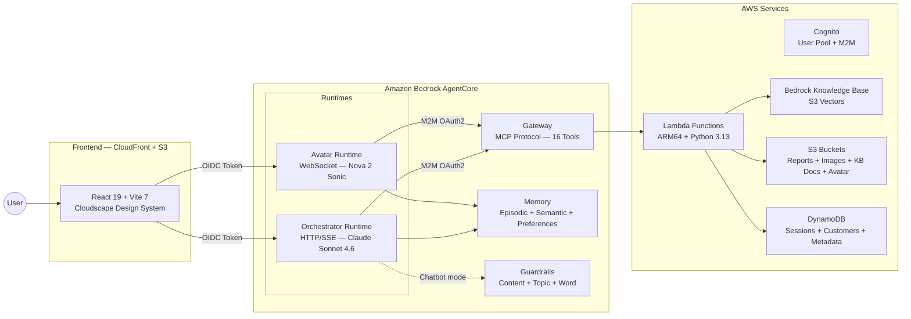
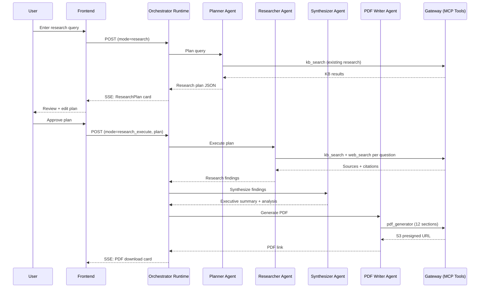

# Gartner AppDev Research Agent

A multi-agent research platform built on **Amazon Bedrock AgentCore** that produces comprehensive PDF research reports through a human-in-the-loop pipeline. Two AgentCore Runtimes, 16 Gateway tools, four CDK stacks, zero cost when idle.

**Demo flow**: Home &rarr; Research &rarr; Menu &rarr; Chat &rarr; Avatar

Users plan a research topic (with editable objectives, methodology, and questions), approve the plan, and receive a 12-section PDF report. Alternatively, they create AI-generated menus with Nova Canvas dish photography, chat with a guardrailed concierge, or speak to a real-time voice avatar powered by Nova Sonic.

---

## Architecture Overview



---

## Features

| Feature                    | Description                                                                                                                                               |
| -------------------------- | --------------------------------------------------------------------------------------------------------------------------------------------------------- |
| **Multi-Agent Research**   | Planner &rarr; Researcher &rarr; Synthesizer &rarr; PDF Writer pipeline with human-in-the-loop plan approval                                              |
| **12-Section PDF Reports** | Cover page, TOC, executive summary, methodology, key findings, evidence, data analysis, conclusions, recommendations, limitations, appendices, references |
| **AI Menu Creation**       | Menu Designer + Menu PDF Writer with Nova Canvas-generated dish photography                                                                               |
| **Guardrailed Chat**       | Restaurant concierge with Bedrock Guardrails (content, topic, and word policies)                                                                          |
| **Voice Avatar**           | Real-time speech-to-speech via Nova 2 Sonic with 5 selectable personas                                                                                    |
| **Knowledge Base**         | S3 Vectors + Nova Multimodal Embeddings. Auto-ingests generated PDFs for cross-experience queries                                                         |
| **AgentCore Memory**       | Episodic (session-scoped with reflection), semantic (cross-session facts), and user preference strategies                                                 |
| **16 MCP Gateway Tools**   | KB search, web search, PDF generation, Nova Canvas/Reel, memory, user profiles, orders                                                                    |
| **M2M OAuth2**             | Agent-to-Gateway auth via Cognito client credentials. Token cached with 60s safety margin                                                                 |
| **Generative UI**          | SSE-streamed agent phases, research plan approval cards, tool activity indicators                                                                         |

---

## Multi-Agent Pipeline



All four agents run **in-process** within the orchestrator runtime — no HTTP between agents, no cold starts, shared MCP client. A heartbeat thread fires every 10 seconds to keep the SSE connection alive through AgentCore's ~80s proxy timeout.

---

## Gateway Tools

```
gateway/tools/
├── kb_search/              # Bedrock Knowledge Base hybrid search
├── web_search/             # Nova Pro with web grounding
├── pdf_generator/          # ReportLab PDF generation → S3 presigned URL
├── nova_canvas_generate/   # Image generation via Nova Canvas
├── nova_canvas_edit/       # Image editing (inpainting, outpainting)
├── nova_canvas_history/    # Session image history
├── nova_reel_generate/     # Video generation via Nova Reel
├── nova_reel_status/       # Async video job status
├── nova_reel_history/      # Session video history
├── save_memory/            # Persist to AgentCore Memory
├── recall_memories/        # Retrieve from Memory
├── analyze_patterns/       # Conversation pattern analysis
├── retrieve_user_profile/  # DynamoDB customer lookup
├── place_order/            # Order placement
├── data_sources/           # Data source listings
├── sample_tool/            # Minimal reference implementation
└── research_orchestrator/  # Lambda Durable Functions stub (feature-gated)
```

Each tool is a self-contained directory with `handler.py` and `tool_spec.json`. The Gateway authenticates via Cognito JWT and routes MCP tool calls to the corresponding Lambda function.

---

## Tech Stack

| Layer                  | Technology                                    | Version                                    |
| ---------------------- | --------------------------------------------- | ------------------------------------------ |
| **Infrastructure**     | AWS CDK                                       | 2.1108.0 (pinned)                          |
| **CDK Constructs**     | `@aws-cdk/aws-bedrock-agentcore-alpha`        | 2.240.0+                                   |
| **Agent Framework**    | Strands Agents SDK                            | 0.4.0+                                     |
| **Orchestrator Model** | Claude Sonnet 4.6                             | `us.anthropic.claude-sonnet-4-6`           |
| **Voice Model**        | Nova 2 Sonic                                  | `amazon.nova-2-sonic-v1:0`                 |
| **Tool Selector**      | Nova 2 Lite                                   | `amazon.nova-2-lite-v1:0`                  |
| **KB Embeddings**      | Nova Multimodal Embeddings                    | `amazon.nova-2-multimodal-embeddings-v1:0` |
| **KB Storage**         | S3 Vectors                                    | 1024-dim, FLOAT32, cosine                  |
| **Frontend**           | React 19 + Vite 7 + TypeScript                |                                            |
| **Design System**      | AWS Cloudscape                                | 3.0+                                       |
| **Styling**            | Tailwind CSS v4 + Framer Motion               |                                            |
| **Auth**               | Cognito (OIDC + M2M) via `react-oidc-context` |                                            |
| **3D Avatar**          | Three.js                                      | 0.172+                                     |
| **Flow Visualization** | ReactFlow                                     | 12.10+                                     |
| **Lambda Runtime**     | Python 3.13, ARM64                            |                                            |
| **Node.js**            | 22.8.0 (Volta-managed)                        |                                            |

---

## Getting Started

### Prerequisites

- **Node.js 22.8.0** (managed by Volta)
- **Python 3.11+** (for agent runtimes and Lambda tools)
- **AWS CLI** configured with appropriate credentials
- **Docker** (ARM64 support required for container builds)

### Install

```bash
npm install    # Installs CDK deps, frontend workspace, Python venv via uv, ruff
```

### Configure

Edit `cdk.json` to set your project configuration:

```json
{
    "context": {
        "projectId": "gartner-appdev",
        "stackNameBase": "gartner-appdev-2026",
        "accounts": {
            "dev": { "id": "YOUR_ACCOUNT_ID", "region": "us-east-1" }
        },
        "features": {
            "avatar": true,
            "knowledge_base": true,
            "guardrails": true,
            "neptune": false
        }
    }
}
```

### Deploy

```bash
# Interactive CLI (recommended)
npm run kit

# Headless deploy all stacks
npm run kit -- deploy dev --all

# Direct CDK
npm run cdk -- deploy "*/**" -c stage=dev
```

### Verify

```bash
# Check orchestrator runtime logs
aws logs tail "/aws/bedrock-agentcore/runtimes/gartner_appdev_2026_orchestrator-*-DEFAULT" \
  --since 5m --format short

# Check a Gateway tool Lambda
aws logs tail "/aws/lambda/gartner-appdev-2026-tool-kb_search" \
  --since 5m --format short
```

---

## Development

### Frontend

```bash
npm run -w frontend dev          # Vite dev server on :3000
npm run kit -- refresh-frontend dev  # Generate .env from deployed stack outputs
```

### Code Quality

```bash
npm run build    # TypeScript compilation
npm run lint     # ESLint + ruff check
npm run format   # Prettier + ruff format
npm run test     # Jest CDK tests
```

### Commit

```bash
npm run commit   # Interactive conventional commit (commitizen)
```

---

## Project Structure

```
gartner-app-dev-research-agent/
├── bin/app.ts                       # CDK entrypoint + property injectors
├── lib/
│   ├── stage.ts                     # 4-stack orchestration + env var wiring
│   ├── common/
│   │   ├── feature-flags.ts         # Feature flags + model config
│   │   ├── constructs/stack.ts      # Custom Stack base (auto projectId prefix)
│   │   └── constructs/federate/     # Midway-aware Cognito constructs
│   └── stacks/
│       ├── shared.ts                # DynamoDB, S3, KB (S3 Vectors), Neptune
│       ├── auth.ts                  # Cognito, M2M client, WAF, Identity Pool
│       ├── backend/index.ts         # Gateway, Runtimes, Memory, Guardrails, API
│       └── frontend/                # S3 + CloudFront + CodeBuild deployment
├── patterns/                        # AgentCore Runtime agents (Python)
│   ├── orchestrator-agent/          # 6-mode in-process pipeline + chatbot
│   ├── planner-agent/               # Research plan decomposition
│   ├── researcher-agent/            # KB + web search with citations
│   ├── synthesizer-agent/           # Cross-reference → executive summary
│   ├── pdf-writer-agent/            # 12-section PDF generation
│   ├── avatar-agent/                # BidiAgent WebSocket (Nova 2 Sonic)
│   └── utils/                       # auth.py, ssm.py, heartbeat.py
├── gateway/tools/                   # 16 Lambda-backed MCP tools
├── tools/
│   ├── kit.ts                       # Interactive CLI
│   └── export.ts                    # @export directive processor
├── test/                            # Jest CDK tests
├── cdk.json                         # Project config + feature flags
└── ruff.toml                        # Python linting config
```

---

## Cost Profile

| Component                    | Running Cost            | Idle Cost         |
| ---------------------------- | ----------------------- | ----------------- |
| AgentCore Runtimes (2)       | Per-invocation          | $0                |
| AgentCore Gateway            | Per-tool-call           | $0                |
| AgentCore Memory             | Per-event               | $0                |
| Lambda Functions (16+)       | Per-invocation          | $0                |
| Cognito                      | Free tier (50 users)    | $0                |
| DynamoDB (3 tables)          | On-demand billing       | $0                |
| S3 (4 buckets)               | Storage only            | ~$0.02/GB/mo      |
| Knowledge Base (S3 Vectors)  | Per-query               | ~$0.01/mo storage |
| CloudFront + S3 hosting      | Per-request + bandwidth | $0 (no traffic)   |
| Bedrock Models               | Per-token               | $0                |
| Bedrock Guardrails           | Per-assessment          | $0                |
| Neptune Analytics (optional) | Always-on               | ~$8/hr (32GB min) |

**Total idle cost: ~$0/month** (with Neptune disabled). The architecture is fully pay-per-use.

---

## License

[Apache License Version 2.0](LICENSE)
