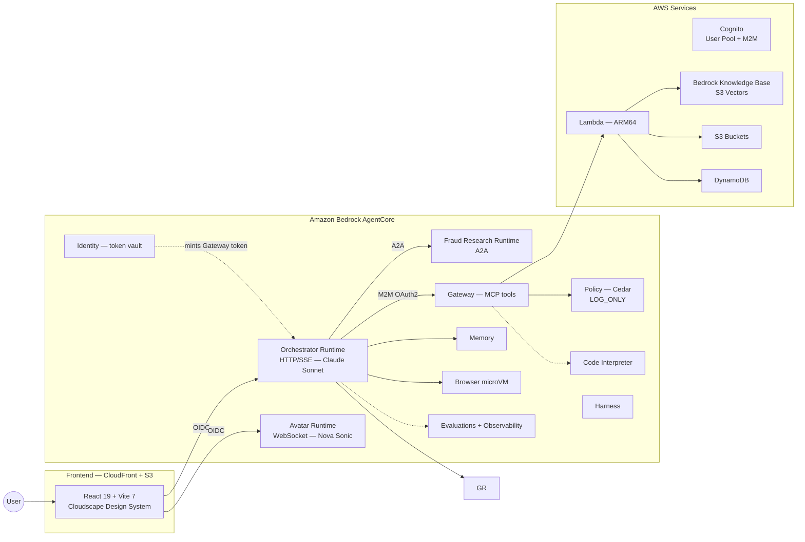

# AppDev Research Agent — MVP

A multi-agent research platform built on **Amazon Bedrock AgentCore** that produces
comprehensive PDF research reports through a human-in-the-loop pipeline, plus an
AI menu/catalog designer, a guardrailed concierge chat with a live browser
sub-agent, and a real-time voice avatar. It deploys entirely with the AWS CDK and
costs ~$0 when idle (fully pay-per-use).

This is the **customer MVP build**: a trimmed, self-contained version of the
internal demo that a team outside AWS can deploy into their own account with
plain CDK. Third-party voice paths, preview-only services, and internal Amazon
tooling have been removed or disabled (see [What's in this MVP](#whats-in-this-mvp)).

---

## What's in this MVP

**Application experiences:**

- **Multi-agent research pipeline** — Planner → Researcher → Synthesizer → PDF
  Writer, with human-in-the-loop plan approval, producing a 12-section PDF report.
- **AI menu/catalog designer** with Nova Canvas dish imagery and PDF export.
- **Guardrailed concierge chat** with an in-process AgentCore Browser sub-agent
  (live view) and AgentCore Code Interpreter.
- **Voice avatar** — real-time speech-to-speech via Amazon Nova Sonic (AWS-native,
  no third party required).
- **"Realistic" video avatar (Tavus)** — optional; **requires a purchased Tavus
  key** (see [Optional: enable the Tavus video avatar](#optional-enable-the-tavus-video-avatar)).

**AgentCore services exercised by this build** (all generally available):

| Service              | How the demo uses it                                                              |
| -------------------- | --------------------------------------------------------------------------------- |
| **Runtime**          | Orchestrator (HTTP/SSE), Avatar (WebSocket), and A2A fraud-research runtimes      |
| **Gateway**          | MCP protocol fronting the Lambda-backed tools                                     |
| **Memory**           | Episodic, semantic, and user-preference strategies                                |
| **Identity**         | Gateway tokens minted via the Identity token vault (falls back to direct Cognito) |
| **Browser**          | Chromium microVM driven by Playwright/CDP with live view in chat                  |
| **Code Interpreter** | Sandboxed Python for PDF image extraction                                         |
| **Observability**    | OpenTelemetry traces and logs to CloudWatch                                       |
| **Policy**           | Cedar policy engine on the Gateway, in `LOG_ONLY` mode                            |
| **Evaluations**      | Custom LLM-as-a-judge evaluator + online evaluation config                        |
| **Harness**          | Config-only managed agent loop ("Quick Assistant")                                |

Alongside these: **Bedrock Knowledge Base** on S3 Vectors, **Bedrock Guardrails**,
**Bedrock model evaluation**, **Bedrock prompt optimization**, and an **A2A**
agent-to-agent fraud/KYC hop.

> **Policy is intentionally `LOG_ONLY`.** It records allow/deny decisions on real
> traffic without blocking, which is the recommended way to validate Cedar
> policies first. Cedar is default-deny, so do not switch `policyMode` to
> `ENFORCE` until you have a complete permit set for every tool.

**Removed or left off for the MVP** (relative to the internal demo):

| Item                                                  | Status  | Why                                                                                                                                 |
| ----------------------------------------------------- | ------- | ----------------------------------------------------------------------------------------------------------------------------------- |
| LiveKit voice path                                    | Removed | Third-party + always-on Fargate cost; the native Nova Sonic avatar covers voice.                                                    |
| SageMaker custom model                                | Off     | Requires a customer-supplied inference endpoint.                                                                                    |
| Neptune Analytics                                     | Off     | Always-on (~$8/hr).                                                                                                                 |
| AgentCore Payments                                    | Off     | GA, but needs a funded (testnet) wallet you must supply.                                                                            |
| AWS Agent Registry                                    | Off     | Not available in every AgentCore region and access is gated; would deploy an empty registry.                                        |
| Managed Web Search connector                          | Off     | The custom Nova-grounded `web_search` tool is used instead; switching changes the registered tool name the agent prompts reference. |
| Parallel A2A research fan-out                         | Off     | The proven in-process fan-out is more reliable (no per-call token minting or partial-failure handling).                             |
| Durable functions, multimodal KB parsing, sample tool | Off     | Not needed for the MVP path.                                                                                                        |

Everything above is a feature flag in [`cdk.json`](cdk.json); items that are off
create no resources. Turn any of them on there.

---

## Architecture



The application deploys as CDK stacks (stack names are prefixed with the
`projectId` from `cdk.json`, e.g. `dev/appdev-demo-Backend`):

| Stack                  | Contents                                                                                                                                                           |
| ---------------------- | ------------------------------------------------------------------------------------------------------------------------------------------------------------------ |
| **Frontend**           | S3 + CloudFront (OAC) + WAF (CloudFront scope)                                                                                                                     |
| **Auth**               | Cognito User Pool / Client / Identity Pool + M2M OAuth2 + WAF (Regional)                                                                                           |
| **Shared**             | DynamoDB (3 tables) + S3 (4 buckets) + Knowledge Base (S3 Vectors)                                                                                                 |
| **Backend**            | AgentCore Gateway (MCP tools) + Orchestrator, Avatar & A2A fraud Runtimes + Memory + Identity + Policy (Cedar) + Evaluations + Harness + Guardrails + Feedback API |
| **TavusAvatar**        | ECS Fargate Pipecat worker + Cognito-authorized offer API (optional — needs a Tavus key)                                                                           |
| **FrontendDeployment** | CodeBuild builds the React app in-cloud and deploys it to S3                                                                                                       |

---

## Prerequisites

- **Node.js 22.8.0** (a `.nvmrc`/Volta pin is provided; any 22.x works)
- **Python 3.11+** and [**uv**](https://docs.astral.sh/uv/getting-started/installation/)
  (the install step creates a virtualenv and installs the agent/Lambda deps)
- **Docker** with **ARM64 (linux/arm64) build support** — CDK builds the Lambda
  bundles and the AgentCore runtime / Fargate container images locally at deploy
  time. On Apple Silicon this works out of the box; on x86 hosts enable
  `binfmt`/buildx emulation.
- **AWS CLI v2** configured with credentials for the target account
  (`aws configure` or `AWS_PROFILE`)
- **Region:** `us-east-1` — Amazon Nova Sonic (the voice avatar) is only
  available there.
- Access to the required Bedrock models must be **enabled in the account**
  (Bedrock console → Model access): Claude Sonnet, Nova Sonic, Nova Lite, Nova
  Canvas, and Nova Multimodal Embeddings.
- **For AgentCore Evaluations:** enable **CloudWatch Transaction Search** in the
  deploy account. Online evaluation scores the runtime's OpenTelemetry spans, so
  without it the evaluator deploys but has no spans to score. The rest of the
  application is unaffected.

---

## Deploy

```bash
# 1. Install dependencies (CDK + frontend workspace + Python venv via uv)
npm install

# 2. One-time per account/region: bootstrap CDK
npm run cdk -- bootstrap

# 3. Deploy everything
npm run cdk -- deploy "*/**" -c stage=dev
```

That's it — no config file editing is required. By default the account and region
come from your active AWS credentials (`CDK_DEFAULT_ACCOUNT` / `CDK_DEFAULT_REGION`,
falling back to `us-east-1`). To pin a specific account/region instead, set them
in [`cdk.json`](cdk.json) under `context.accounts.dev`.

**How the "runtime executable" is packaged:** this is a serverless application, so
there are no Helm charts or standalone container images to ship separately. `cdk
deploy` compiles the source and packages every runtime component into its
deployable form automatically — Python Lambda tools are bundled to zip artifacts,
and the AgentCore runtimes and the Tavus Fargate worker are built as **Docker
images pushed to Amazon ECR**. The build (deliverable "compile source → executable")
and the deploy are the single `cdk deploy` step above.

### Access the app

1. When the deploy finishes, open the **CloudFront URL** — find it in the
   `FrontendDeployment` (or `Frontend`) stack outputs, or in the CloudFormation
   console.
2. **Create Account** on the login screen and verify your email (self sign-up is
   enabled).
3. Sign in and use the app: Home → Research → Menu → Chat → Avatar.

---

## Optional: enable the Tavus video avatar

The **"Realistic"** photoreal avatar option is rendered by [Tavus](https://tavus.io)
(which uses [Daily](https://daily.co) for WebRTC transport). Both are third-party
services billed **outside AWS, per minute of avatar usage** — you must **purchase a
Tavus plan and obtain API keys** to use this option.

> The rest of the application — including the AWS-native Nova Sonic voice avatar —
> works without Tavus. If you do not provide keys, the Tavus worker simply idles
> and the "Realistic" picker entry stays inactive; nothing else is affected.

The Tavus/Daily credentials live only in **AWS Secrets Manager** and never reach
the browser. The stack **imports** the secret by name rather than creating it, so
create and populate it (in the deploy region) either before or after deploy:

```bash
aws secretsmanager create-secret \
  --name /appdev-demo-2026/tavus \
  --region us-east-1 \
  --secret-string '{
    "TAVUS_API_KEY":"<your-tavus-api-key>",
    "TAVUS_REPLICA_ID":"<your-tavus-replica-id>",
    "TAVUS_PERSONA_ID":"pipecat-stream",
    "DAILY_API_KEY":"<your-daily-api-key>"
  }'
```

If the secret already exists, update it with `aws secretsmanager put-secret-value
--secret-id /appdev-demo-2026/tavus --secret-string '{...}'`. The worker reads it
at startup, so restart the `appdev-demo-2026-tavus-worker` ECS service (or redeploy)
after populating it. The secret name uses the `stackNameBase` from `cdk.json`
(`appdev-demo-2026` by default).

To skip Tavus entirely, set `"tavus_avatar": false` in `cdk.json` before deploying;
the native Nova Sonic avatar remains available.

---

## Cost profile

Fully pay-per-use — **~$0/month at idle**. You pay per Bedrock token, per
AgentCore invocation/microVM-minute, per Lambda invocation, and for S3 storage +
CloudFront traffic. Notable line items:

| Component                                                          | Cost                                                             |
| ------------------------------------------------------------------ | ---------------------------------------------------------------- |
| AgentCore Runtimes / Gateway / Memory / Browser / Code Interpreter | Per-use; $0 idle                                                 |
| AgentCore Identity                                                 | Per token/API-key request (no charge via Runtime or Gateway)     |
| AgentCore Policy / Harness                                         | No separate charge; you pay the underlying Gateway + Runtime use |
| AgentCore Evaluations                                              | Per evaluation (LLM-as-a-judge model usage)                      |
| Lambda (ARM64 tool functions)                                      | Per-invocation; $0 idle                                          |
| Cognito                                                            | Free tier (50 users)                                             |
| DynamoDB (on-demand), S3, Knowledge Base (S3 Vectors)              | Storage + per-request                                            |
| CloudFront + S3 hosting                                            | Per-request + bandwidth                                          |
| Bedrock models + Guardrails                                        | Per-token / per-assessment                                       |
| **Tavus Fargate worker** (only if `tavus_avatar` on)               | One always-on ARM64 task                                         |
| **Tavus + Daily** (third-party)                                    | Per-minute, billed outside AWS                                   |

See the [AWS Pricing Calculator](https://calculator.aws/#/) for estimates.

---

## Clean-up

```bash
npm run cdk -- destroy "*/**" -c stage=dev
```

A few resources may need manual deletion afterward (they are retained or not
owned by the stacks): the WAF web ACLs, any S3 buckets that still contain
objects, and — if you created it — the `/appdev-demo-2026/tavus` Secrets Manager
secret.

---

## Configuration reference

All configuration lives in [`cdk.json`](cdk.json) `context`:

- `projectId` — resource-name prefix (< 15 chars).
- `stackNameBase` — AgentCore naming prefix (< 35 chars); also the Secrets
  Manager/SSM path prefix.
- `accounts.{stage}` — `{ id, region }`; leave `id: null` to use the deployer's
  default account.
- `features` — feature flags (see [What's in this MVP](#whats-in-this-mvp)).
- `models` — Bedrock model ID overrides.

## Development

```bash
npm run build    # TypeScript compile (tsc)
npm run lint     # ESLint + ruff
npm run format   # Prettier + ruff format
npm run test     # Jest CDK tests
```

For local frontend work, run `npm run -w frontend dev` (Vite on :3000) after
creating a `.env` in the frontend workspace from the deployed stack outputs
(`VITE_*` values). The deployed app is built and hosted in-cloud by the
`FrontendDeployment` stack, so this is only needed for UI development.

## License

[Apache License Version 2.0](LICENSE)
