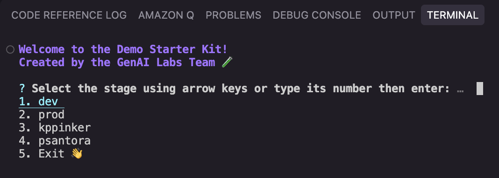

<!-- @export {"deleteFile": true} -->

# GenAI Labs Demo Starter Kit

This starter kit includes ready-to-deploy, compliant and secure CDK and React app components with Federate/Midway integration. It also includes customizable CLI tooling for easier demo configuration and management. While we offer this set of components and tools, you retain the freedom to customize any and all aspects of the starter kit to fit your use case (even if it has nothing to do with GenAI).

Let's get started...

[TOC]

## Developer Machine Setup

To ensure your Mac, Windows, or Cloud Desktop machine is properly set up for use with the starter kit, start [here](./docs/kit/machine-setup.md).

## Demo Creation

If your demo has already been created and you are looking to set up the project, skip to the [next section](#demo-setup).

If your developer machine has been properly set up and you are creating a brand new demo, start [here](./docs/kit/demo-creation.md).

- This is a one-time process when creating a brand new demo.

## Demo Setup

If your developer machine has been properly set up, your demo has already been created, and you are looking to set up the project, start [here](./docs/kit/demo-setup.md).

## Documentation

See the [design documentation](./docs/kit/design.md) to learn more about the Demo Starter Kit.

## License

[Apache License Version 2.0](/LICENSE)
