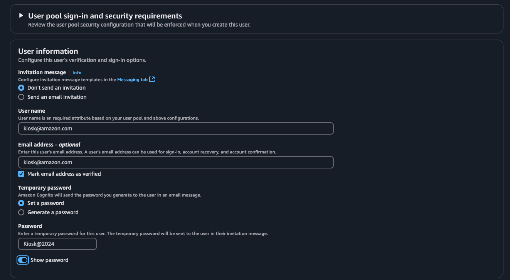
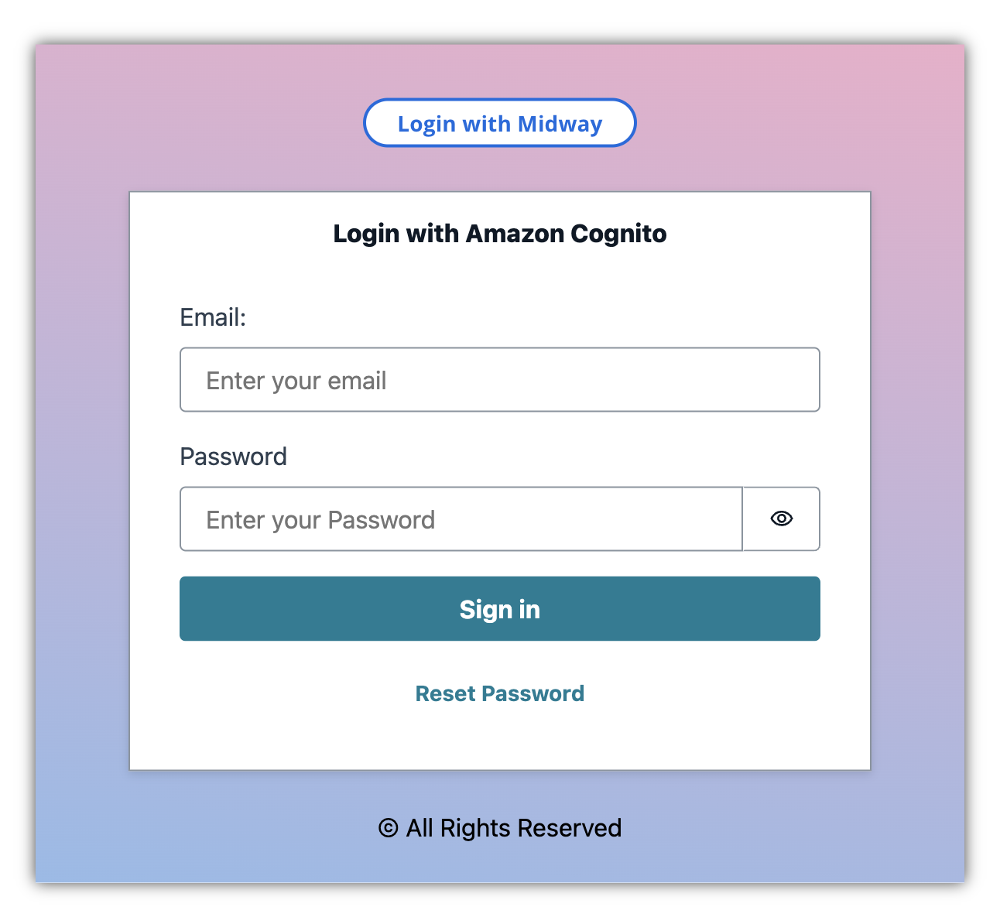

# Frontend

[TOC]

## Overview

The frontend application is designed using [Vite React](https://vite.dev/guide/) [CloudScape design system](https://cloudscape.design/) for the UI.

The AWS CDK-created resources are linked to the frontend using Amplify Libraries (not the Amplify CLI) via [Amplify.configure](../src/frontend/src/App.tsx).

Many of the properties for this configuration are pulled from environment variables (which must be prefixed with `VITE_`). In the cloud, these environment variables are provided through the [frontend build stack](../src/backend/lib/stacks/frontend.ts). For local development, the development CLI can pull down the outputs from that same frontend build stack to create a local .env file. See [here](./design.md#refresh-local-environment) for more details.

## User Creation

Sometimes we need to show demos on non-AWS employee machines, such as re:Invent kiosks. To accommodate this, we have enabled a login system that takes a user email and password to authenticate users.

Follow the steps below to create a an Amazon Cognito user pools user for dev, prod or sandbox accounts.

1. Access the [Amazon Cognito console](https://console.aws.amazon.com/cognito/v2/idp/user-pools?) of the account then click on the **User pool name**.
2. In the menu, click **Users** then click **Create user**.
3. Create a user as shown below:

    

    - Ensure you adhere to the policy standard

4. Now in your frontend, enter the same email and password then follow the on-screen instructions.

    

5. Change the password as instructed then you should have access to the app going forward without needing to log in via Midway.
6. You can also use the **Reset Password** option to set a new password for the user.

## Frontend Demos

The starter kit comes pre-built with very basic demos to demonstrate integration with services like Amazon API Gateway, AWS AppSync (GraphQL), and Amazon S3. These demos are for educational purposes and can be easily replaced/removed.

### Chat

The chat demo simplify posts a message using the [AWS Amplify POST request](https://docs.amplify.aws/react/build-a-backend/add-aws-services/rest-api/post-data/), which is processed by the [Lambda proxy](../src/backend/lib/stacks/backend/rest-api/proxy-function/index.py) in the [REST API stack](../src/backend/lib/stacks/backend/rest-api/index.ts) and returned in kind.

### Gallery

The gallery demo gets the URLs if the images in the [storage bucket](../src/backend/lib/stacks/backend/storage.ts) using [Amplify Storage](https://docs.amplify.aws/react/build-a-backend/storage/) then displays them with Cloudscape.

## Expanding the ESLint configuration

If you are developing a production application, we recommend updating the configuration to enable type aware lint rules:

- Configure the top-level `parserOptions` property like this:

```js
export default tseslint.config({
    languageOptions: {
        // other options...
        parserOptions: {
            project: ["./tsconfig.node.json", "./tsconfig.app.json"],
            tsconfigRootDir: import.meta.dirname,
        },
    },
});
```

- Replace `tseslint.configs.recommended` to `tseslint.configs.recommendedTypeChecked` or `tseslint.configs.strictTypeChecked`
- Optionally add `...tseslint.configs.stylisticTypeChecked`
- Install [eslint-plugin-react](https://github.com/jsx-eslint/eslint-plugin-react) and update the config:

```js
// eslint.config.js
import react from "eslint-plugin-react";

export default tseslint.config({
    // Set the react version
    settings: { react: { version: "18.3" } },
    plugins: {
        // Add the react plugin
        react,
    },
    rules: {
        // other rules...
        // Enable its recommended rules
        ...react.configs.recommended.rules,
        ...react.configs["jsx-runtime"].rules,
    },
});
```
