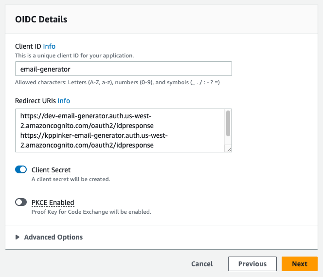
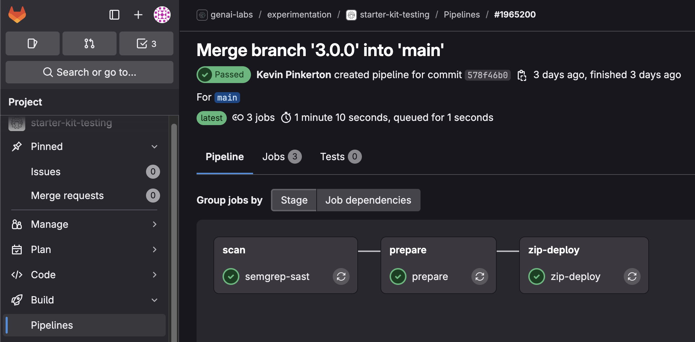
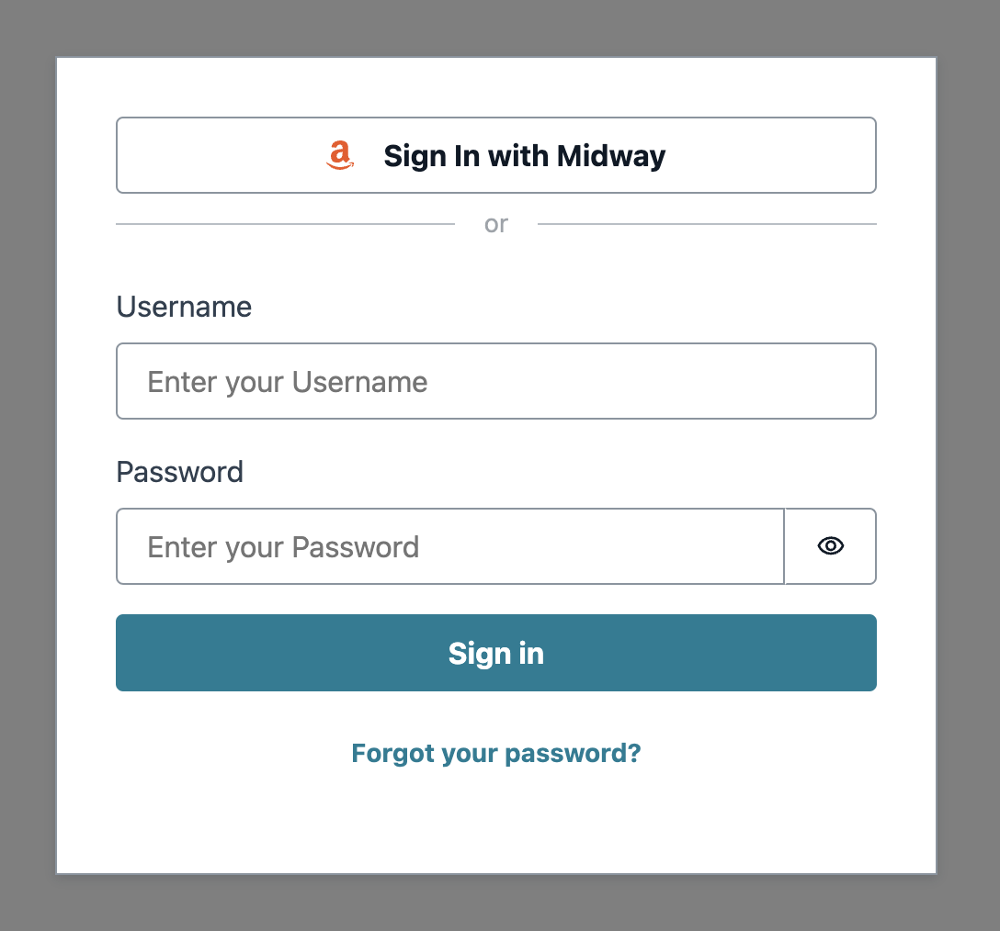

<!-- @export {"deleteFile": true} -->

# Demo Creation

These instructions will walk you through creating a brand new demo. This is a one-time process for each demo.

[TOC]

## AWS Account(s)

You are required to have at least one dev account to use the starter kit. A single prod account and one sandbox account per builder are optional, but encouraged\*.

You can use existing Isengard accounts provided you have access to an **Admin** console role for each account.

- Follow steps 11-18 [here](./account-creation.md#dev-account) to add an admin role.

<br>\* GenAI Labs builders are required to create new dev and prod accounts for each demo using these [instructions](./account-creation.md)<br />

## GitLab Repository

### Fork It

1. Navigate to the Demo Starter Kit [GitLab page](https://gitlab.aws.dev/genai-labs/templates/demo-starter-kit) then click **Fork**.

    

2. Enter a **Project name** using the following format `[DEMO_NAME]` and ensure the **Project slug** updates accordingly.
    - Ex: `marketing-email-generator`
3. Under **Project URL**, **select a namespace**.
    - If you are on the core GenAI Labs team, select `genai-labs/demo-assets`. Otherwise, you may use your alias or another namespace.
    - This is a **_very important step and non-reversible_**.
4. Enter a **Project description**.
5. Under **Branches to include**, select **Only the default branch `main`**.
6. Under **Visibility level**, select the **Internal** option.
    - This is a **_very important step_** so AWS employees outside your team can view the project.

    

7. Click **Fork project**.
8. From your demo's new GitLab page, click **Settings** then **Merge requests**.
9. Under **Target project**, select **This project**, then click **Save changes**.

### Clone It

10. From your demo's new GitLab page, click the **Code** dropdown and click the copy icon to copy the SSH URL.

    

11. Open a terminal then navigate to the directory where you want to clone the files by running the command `cd [new directory]`.
12. To clone the files, run the command `git clone [copied URL]`.
    - Git automatically creates a folder with the repository name and downloads the files there.

## Configuration Files

The starter kit uses `cdk.json` to centrally track and manage CDK configurations.

- See the [design documentation](./design.md#configuration-file) for more details.

13. Open the project folder in your IDE of choice then open [`cdk.json`](../../cdk.json).
14. Update **projectId** with a unique identifier less than 15 characters that best reflects your project name.
    - Use a shorthand name separated by a `-`. Do not use any other special characters such as `! , & * @ # < > ?`.
    - Ex: `email-generator`
15. Update **gitlab** **group** if you created your GitLab project under a different group\*.
16. Update **gitlab** **project** with your GitLab project's name\*.
    - This should be the same name you provided for [step 2](#fork-it).
    - Ex: `retail-marketing-email-generator`
17. Set **pipeline** to `true` to trigger a pipeline with GitLab commits\*\*.
    - We **_strongly recommend_** setting this property to `true`, even if there is no prod account configured. If you set this property to `false`, you must manually deploy the app using the CLI.
18. Set **midway** to `true` to enable [Federate/Midway authentication](https://integ.ep.federate.a2z.com/help), allowing Amazon employees to access to your demo\*\*.
    - We **_strongly recommend_** setting this property to `true`, even if your demo may not initially need Midway.
19. Update the account configuration with at least one **dev** account, including the account **number** and **region** for each account.
    - Accounts with user aliases are automatically considered sandbox accounts and can be added or removed anytime.
    - We **_strongly recommend_** using `us-west-2` for GenAI demos given service availability.
20. **Save** `cdk.json`.
21. Open [`package.json`](../../package.json) then edit the following:

    **name**: Enter the project identifier you provided in step 14.

    **description**: Enter the description you provided in [step 4](#fork-it).

22. **Save** `package.json`.

<br>\* This property is optional if **pipeline** is false.<br />
\*\* This property can be toggled later, even after setting up the demo.

## Federate Profile(s)

[Federate](https://ep.federate.a2z.com/help/FAQ#what-is-amazon-federate) has an [Integration](https://integ.ep.federate.a2z.com/profiles) and [Production](https://ep.federate.a2z.com/profiles) environment where service profiles are managed separately. If your demo has both dev and prod stages, you must create two separate profiles in those respective environments. Sandbox accounts will use the dev/Integration profile for providing access to the demo.

### Dev Profile

23. Navigate to <https://integ.ep.federate.a2z.com/profiles>.

If you are not on the core GenAI Labs team, follow these [instructions](./federate-profile-creation.md) to create a dev Integration profile then skip to [Prod Profile](#prod-profile). Otherwise, you can continue and clone our team's profile.

24. Search for then select the profile named `demo-starter-tester`.
25. After selecting the profile, click the **Actions** dropdown then click **Clone Service Profile**.

    

26. Enter a **Service Name** using the following format `genai-labs-[PROJECT_IDENTIFIER]`.
    - The project identifier should exactly match the **projectId** in your [`cdk.json` file](../../cdk.json).
    - Ex: `genai-labs-email-generator`
27. Check the box titled **Unfabric guidelines**.
28. Check the box titled **Integ Environment restrictions**.
29. Leave all other options to their defaults and click **Next**.
30. Enter a **Client ID** that exactly matches the **projectId** in your [`cdk.json` file](../../cdk.json).
    - This is **_extremely important_** as the Client ID **_cannot be edited_** after the profile has been created.
    - Ex: `email-generator`
31. Enter **Redirect URIs** using the following format `https://[STAGE]-[PROJECT_IDENTIFIER].auth.[ACCOUNT_REGION].amazoncognito.com/oauth2/idpresponse`.
    - The project identifier, account numbers, and regions should reflect your [`cdk.json` file](../../cdk.json).
    - If you are configuring sandbox account(s), then you need to add URI(s) on a new line.
    - Ex:

    ```
    https://dev-email-generator.auth.us-west-2.amazoncognito.com/oauth2/idpresponse
    https://kppinker-email-generator.auth.us-west-2.amazoncognito.com/oauth2/idpresponse
    ```

32. Turn the **Client Secret** switch on.

    

33. Click **Next**.
34. Skip over the **Discovery and Permissions Configuration** and **Claim Configuration** by clicking **Next** twice.
35. On the **Service Profile Overview** page, click **Submit**.
36. Copy the generated client secret key. **_Keep it safe_**.
    > [I forgot to copy the Federate client secret key. Now what?](./faq.md#i-forgot-to-copy-the-federate-client-secret-key-now-what)
37. The Integration profile expires after 30 days. Set a recurring calendar invite to renew it.
    - Follow these [instructions](./federate-profile-renewal.md) to renew it.

### Prod Profile

If you created a prod account in the [`cdk.json` file](../../cdk.json), please continue. Otherwise you may skip to the [next section](#configuration-scripts).

38. Navigate to the [Production](https://ep.federate.a2z.com/drafts) drafts.
39. Click **Import from Integ**.
40. Enter the **client ID** you provided in [step 30](#dev-profile).
41. Verify the **Service Name** matches the one you provided in [step 26](#dev-profile).
42. Check the box titled **Unfabric guidelines** then click **Next**.
43. Verify the **Client ID** is matches the one you previously provided.
44. Update the **Redirect URI** for the prod account using the following format `https://[PROD_STAGE]-[PROJECT_IDENTIFIER].auth.[PROD_ACCOUNT_REGION].amazoncognito.com/oauth2/idpresponse`.
    - The project identifier, account number, and region should reflect the prod account in your [`cdk.json` file](../../cdk.json).
    - Ex:

    ```
    https://prod-email-generator.auth.us-west-2.amazoncognito.com/oauth2/idpresponse
    ```

45. Turn the **Client Secret** switch on then click **Next**.
46. Skip over the **Discovery and Permissions Configuration** and **Claim Configuration** by clicking **Next** twice.
47. On the **Service Profile Overview** page, click **Submit** then copy the generated client secret key. **_Keep it safe_**.
    > [I forgot to copy the Federate client secret key. Now what?](./faq.md#i-forgot-to-copy-the-federate-client-secret-key-now-what)

## Configuration Commands

48. To install the starter kit/project dependencies, open a terminal at the root directory then run the command `npm install`.
    - It may take a couple minutes to complete. Great time for a ☕!
49. To configure the demo, we will use the [kit CLI](./design.md#kit-cli). Run the command `npm run kit`.
50. First, select **dev**, then **AWS Developer Account**.
51. Second, select **Configure Secret**, then enter `federateSecret` followed by the Federate client secret key from the [previous section](#federate-profiles).
52. Third, select **Bootstrap Account**.
53. Select **Back**, then repeat steps 50-52 for **prod** and your sandbox account(s) if applicable.
54. Finally, select **Back**, **dev**, **Deploy CDK Stack(s)**, then **no**, wait for the stacks to list, then select the stack ending in **pipeline** by pressing the spacebar followed by **Enter**.
    - This deploys the pipeline to the dev account.

- See the [design documentation](./design.md#kit-cli) to learn more about the Demo Starter Kit CLI.

## Code Check-In

The starter kit comes pre-built with a commit CLI to improve the quality of Git commits.

55. From the root directory, run the command `git add -A && npm run commit`.
56. For **Select the type of change that you're committing**, select **chore**.
57. For **What is the scope of this change**, enter `app`.
58. For **Write a short, imperative tense description of the change**, enter `initial code commit`.
59. For **Provide a longer description of the change**, press **Enter** to skip.
60. For **Are there any breaking changes?** press **Enter** to indicate **N**.

61. If the commit hooks powered by Husky fail, you will need to repeat steps 55-60.
    - See the [design documentation](./design.md#commit) to learn more about the commit hooks.
62. If the commit hooks succeed, you can push the committed files to your repository with the command `git push origin main`.
    - Pushing to main will trigger a pipeline execution.

From now on, **_do not_** work and push changes on the `main` branch. Always work on a feature branch then submit a merge request via GitLab to merge changes to `main`.

63. From the root directory, run `git checkout -B feat/[ALIAS]` to create a new dev branch for yourself with your alias.
    - Ex: `git checkout -B feat/tamjay`

## Verify Pipelines

64. Navigate back to your demo's GitLab page.
65. Check the status of your GitLab pipeline by by clicking **Build** then **Pipelines** from the side menu.

    
    - There are three stages of the GitLab pipeline:
        1. Scan: this stage will publish your code's SAST scan reports to the [Probe dashboard](https://probe.aws.dev/).
            - Find your project here and notice how the static code analysis has been automated using the GitLab runner.
        2. Prepare: this stage will create environment variables using your [`cdk.json` file](../../cdk.json).
        3. Deploy: this stage will compress the code base into a zip format, get cross-account credentials via AWS Credential Vendor, then upload the zip file to Amazon S3, kicking of the CodePipeline.

66. Once the **zip-deploy** stage succeeds, navigate to the dev account's [AWS Management Console](https://console.aws.amazon.com/codesuite/codepipeline/pipelines/) to verify that the pipeline is in-progress.
67. Once the pipeline completes, open the [CloudFormation console](https://console.aws.amazon.com/cloudformation/home?#/stacks/) then click the stack ending in **frontend**.
68. Click the **Outputs** tab then the CloudFront **url** to visit your new frontend React app.

    

🎉 Congratulations! You have successfully created your brand new demo! Now let's [set up your local development environment](./demo-development.md).
