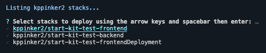
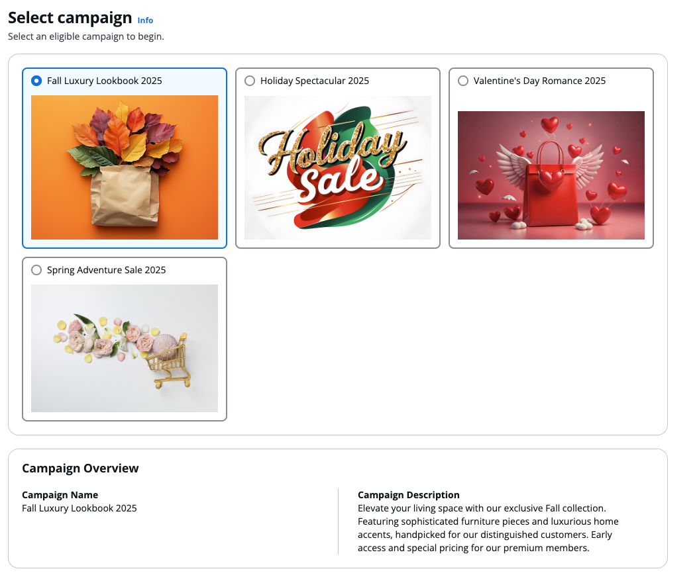
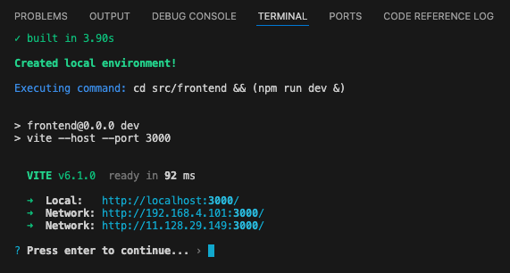
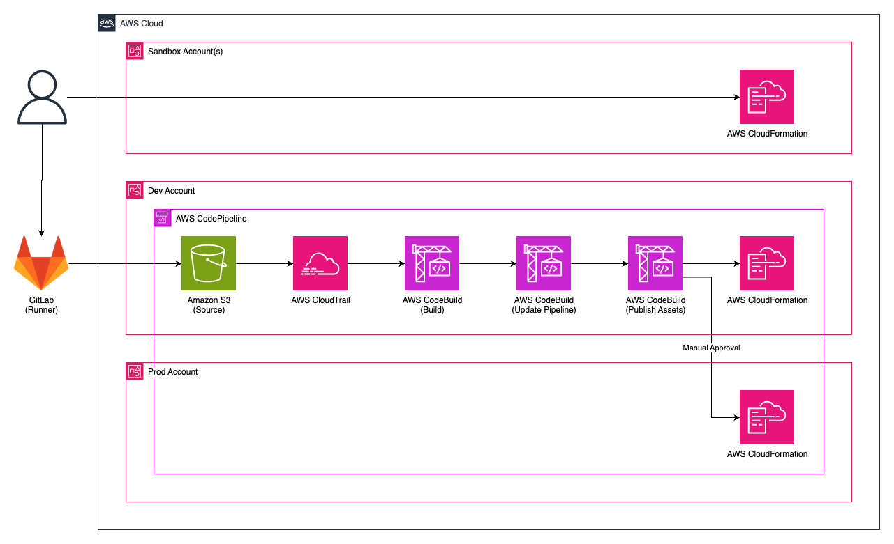

# Design

This documentation will walk you through how the Demo Starter Kit works in depth so you can better leverage and/or customize its functionality.

[TOC]

## Configuration File

The starter kit uses [`cdk.json`](../../cdk.json) to centrally track and manage CDK configurations.

```json
{
    "projectId": "PROJECT-IDENTIFIER",
    "accounts": {
        "dev": {
            "number": "AWS_ACCOUNT_ID",
            "region": "AWS_REGION"
        },
        "prod": {
            "number": "AWS_ACCOUNT_ID",
            "region": "AWS_REGION"
        },
        "ALIAS_1": {
            "number": "AWS_ACCOUNT_ID",
            "region": "AWS_REGION"
        },
        "ALIAS_2": {
            "number": "AWS_ACCOUNT_ID",
            "region": "AWS_REGION"
        }
        // more aliases if needed
    },
    "pipeline": true,
    "gitlab": {
        "group": "genai-labs/demo-assets",
        "project": "GITLAB-PROJECT-NAME"
    },
    "midway": true
}
```

### Project Identifier

The **projectId** property must be less than 15 characters long and not use any special characters other than `-`. It serves as a unique project identifier for:

- Creating a prefix for stack names and generated resource names, supporting multiple demo deployments in the same account.
- Tagging all CDK resources in the project.
    - See the [stack construct](../../lib/common/constructs/stack.ts) for more context.

<!-- @export {"deleteLines": 15} -->

- Linking Federate profiles to the Amazon Cognito domain URL.
    - See the [Cognito construct](#cognito-construct) for more context.

### GitLab Group / Project

If **pipeline** is `false`, the **gitlab** **group** and **gitlab** **project** properties are optional. These properties are used to give the GitLab runner the necessary permissions to write to Amazon S3, which triggers the pipeline. See the [pipeline stack](#pipeline-stack) for more details.

### Pipeline

When **pipeline** is set to `true`, the CLI will allow for the deployment of a [self-mutating pipeline](https://docs.aws.amazon.com/cdk/v2/guide/cdk_pipeline.html) to the account labeled "dev" in the CDK configuration file. See the [pipeline stack](#pipeline-stack) and [kit CLI](#kit-cli) for more details.

### Midway

Seting **midway** to `true` enables [Federate/Midway authentication](https://integ.ep.federate.a2z.com/help), allowing Amazon employees to access to your demo. You can also use Federate to limit access to your demo to particular teams and/or users.

## Kit CLI

The starter kit comes packaged with a CLI that can be found in `tools`.

Here are some basic guidelines for the CLI:

- Commands must be run from the project's root directory.
- Run the command `npm install` from the root directory beforehand.
- Commands are run as standard "npm" scripts so we must append `npm run [command]`
- Press the escape button to cancel an operation or go back to the main menu from any sub menu.
- To exit the CLI press control + "C" as needed or select **Exit**.
- Feel free to change/alter tool behavior for project specific needs.

```bash
npm run kit
```

The kit CLI provides a set of options to help facilitate local development.


The kit CLI can be also used in headless mode by directly providing the operation, stage, and, if applicable, option(s) as command line arguments.

```bash
npm run kit -- deploy dev --all
```

See [kit.ts](../../tools/cli.ts) for more context.

### Configure Credentials

```bash
npm run kit -- configure-credentials [stage] [option]
```

- This operation will configure credentials using AWS Developer Account (ADA), IAM Identity Center, or short-term credentials.

### Configure Secret

```bash
npm run kit -- configure-secret [stage] [options]
```

- This operation will help you configure an [AWS Secrets Manager](https://docs.aws.amazon.com/secretsmanager/latest/userguide/intro.html) secret in the target account.
    - The secret name you provide is prefixed with the **projectId** in the CDK configuration file.
    - If the secret is available in the dev account, it will be copied to sandbox accounts.

### Bootstrap Account

```bash
npm run kit -- bootstrap [stage]
```

- This operation will bookstrap the target account in the region configured and `us-east-1`, including setting trust relationships with dev and termination protection for prod accounts.

### Synthesize CDK Stacks

```bash
npm run kit -- synth [stage]
```

- This operation will validate your CDK code and check for [CDK NAG](https://github.com/cdklabs/cdk-nag) errors/warnings.
- The CLI will transparently output the stack building process, Docker invocations, etc. to keep you informed.

### Deploy CDK Stack(s)

```bash
npm run kit -- deploy [stage] [option]
```

- If you elect to not just deploy all stacks, the operation will allow you to select exactly which stacks you would like to deploy to the target account.
    - It will first use `cdk list` to list all available stacks for that target account.
        - Note that stacks in the dev account will be prefixed with the pipeline stack name.
            - Ex: `start-kit-test-pipeline/dev/start-kit-test-frontend`
            - See [pipeline stack](#pipeline-stack) for more details.

    
    - Using the arrow keys and spacebar, you select each and every stack you want to deploy then hit enter to confirm.

- Stack dependencies will also be deployed alongside the selected stacks to ensure functionality.
- The operation uses the `--concurrency` flag to deploy stacks in parallel for faster deployment.

### Hotswap CDK Stack(s)

```bash
npm run kit -- hotswap [stage] [option]
```

- This operation is similar to the [previous operation](#deploy-cdk-stacks), but it performs a faster, hotswap deployment if possible. See the [documentation](https://docs.aws.amazon.com/cdk/v2/guide/ref-cli-cmd-deploy.html#ref-cli-cmd-deploy-options) for more details.

Many demos use synethetic data, such as as flat files (text/JSON/XML), images, and videos that need to be used in your application.



- This operation can be used to speed up asset changes of Amazon S3 bucket deployments like that in the [storage construct](../../lib/stacks/backend/storage/index.ts).
    - When you push data to the S3 bucket, folders in `lib/stacks/backend/storage/assets` become prefixes that can be referenced after authenticating with Cognito.

#### Static Files vs Hydration

Sometimes, we just need static file serving through which files (images, icons, simple HTML/JS scripts, etc.) can be accessed globally with just a simple URL. There is an `assets` folder for this purpose.

- Ex: `https://d1ohf10999rv0h.cloudfront.net/assets/arch-DS8hMkeH.png`
    - Note the `assets` prefix. If you have nested folders, then they must be included in the URL path as well.
        - Ex: `cloudfront.net/assets/folder/filename.png`.

Keep in mind that `static` files/folders can simply be accessed without any authorization tokens by directly referencing their URL path. Only use small files that can be accessed without any protections such as icons, fonts, brand logos, etc.

### Deploy Frontend

```bash
npm run kit -- deploy-frontend [stage]
```

- This operation deploys the [frontend deployment stack](../../lib/stacks/frontend/index.ts) by itself using the `-e` flag for quicker deployment.
- It first builds the frontend to ensure there are no errors.

### Refresh Local Environment

```bash
npm run kit -- refresh-frontend [stage]
```

- This operation is invoked by the [next operation](#test-frontend-locally-) automatically, but it can also be run by itself if you just want to:
    - Pull down the CfnOutputs from the [frontend deployment stack](../../lib/stacks/frontend/index.ts).
    - Update the .env file in the frontend source folder with those outputs.
    - If a Graph API ID is present, generate GraphQL files.

### Test Frontend Locally

- This operation will [refresh the local environment](#refresh-local-environment-) then output a link to a [local server](http://localhost:3000/) for testing changes to your frontend React app.

    
    - Assuming there are no breaking changes, you should be able to see your changes reflected in the terminal and browser immediately.

- After you **press enter to continue**, the operation will kill the local server so future changes don't clutter the terminal.

### Manage Cognito User

- This operation will get the user pool ID from the CfnOutputs then give you the option to create or delete a Cognito user in that user pool.
    - When creating a user, you will be asked to enter an email address. A temporary password will be emailed to this address, enabling you to log in to the frontend application.

        

    - You can use the **Reset Password** option to set a new password for the user if needed.
    - Note that you cannot delete Amazon Federate users.

### Destroy CDK Stack(s)

- This operation will first use `cdk list` to list all available stacks for that target account.
    - Note that stacks in the dev account will be prefixed with the pipeline stack name.
        - Ex: `start-kit-test-pipeline/dev/start-kit-test-frontend`
        - See [pipeline stack](#pipeline-stack) for more details.


- Using the arrow keys and spacebar, you select each and every stack you want to destroy then hit enter to confirm.

- Use this operation with **_extreme caution_** as the CDK stacks destroyed with this operation cannot be recovered and may leave your application broken when using dependent stacks.
- There are certain limitations with this operation due to how CDK is designed:
    - Stacks that are destroyed are still listed because the CDK uses the local `cdk.out` manifest, unlike [Terraform](https://www.hashicorp.com/products/terraform) and [Pulumi](https://github.com/pulumi/pulumi) which retain a cloud referenced stack list.
    - We recommend that you delete the stacks in accordance with their dependencies in [stage.ts](../../lib/stage.ts).
    - This operation may not destroy certain cloud resource such as AWS WAF (Global & Regional), AWS Buckets, VPC configurations, Secrets Manager, etc. Manually delete these resources in the AWS Management Console.

<!-- @export {"deleteLines": 46} -->

## Export CLI

```bash
npm run export
```

Creates a ZIP archive `export.zip` by processing `@export` directives in your files to remove sensitive/internal code.

### Directives

- Typescript

    ```typescript
    // @export {"deleteLines": 0}
    ```

- Markdown

    ```markdown
    <!-- @export { "replace": "sensitive-value", "with": "placeholder" } -->
    ```

- JSON

    ```json
    {
        "@export": { "deleteLines": 0 }
    }
    ```

- YAML

    ```yaml
    # @export {"deleteLines": 0}
    ```

### Options

- `deleteFile: true` - Remove entire file.
- `deleteLines: number` - Remove directive and the following number of lines.
- `replace/with` - Remove directive and replace text.

### Defaults

The tool automatically removes:

- The export ZIP file
- The export script `tools/export.ts`
- `docs/kit/images/`
- Any files matching patterns in `.gitignore`

See [export.ts](../../tools/export.ts) for more context.

## Commit CLI

```bash
npm run commit
```

The commit CLI is provided by [Commitizen](https://commitizen-tools.github.io/commitizen/). See their [documentation](https://commitizen-tools.github.io/commitizen/tutorials/writing_commits/) for more details.

### Hooks

Commit hooks, powered by [Husky](https://typicode.github.io/husky/), will run automatically after the commit CLI:

- The pre-commit hook will run code formatting and quality checks, stopping you from committing bad code that might block the pipeline.
    - [lint-staged](https://github.com/lint-staged/lint-staged) will format and lint staged files.
        - Formatting and linting will be handled by [Prettier](https://prettier.io/) and [ESLint](https://eslint.org/) for TypeScript and [Ruff](https://docs.astral.sh/ruff/) for Python.
    - See [pre-commit](../../.husky/pre-commit), [package.json](../../package.json), [eslint.config.ts](../../eslint.config.ts), and [.prettierrc](../../.prettierrc) for more context.

## CDK Constructs

<!-- @export {"deleteLines": 3} -->

Some aspects of the starter kit infrastructure are specific to internal Amazon authentication/security requirements. Remove the [pipeline](#pipeline-stack) stack as well as the [Cognito](#cognito-construct) and [CodeBuild](#codebuild-construct) constructs before sharing publicly.

### App

`bin/demo.ts` is the CDK entrypoint as configured in [cdk.json](../../cdk.json).

The stack prefix and stage for the app are determined by a context variable passed by the [kit CLI](#kit-cli). The account details are determined by the `cdk.json` file itself.

See [bin/demo.ts](../../bin/demo.ts) for more context.

<!-- @export {"deleteLines": 32} -->

### Pipeline Stack



This stack is only deployed to the `dev` account via the CLI when the **pipeline** property is set to `true` in the CDK configuration file.

It sets up all the necessary resources and permissions for the GitLab runner to upload zipped code from commits to Amazon S3, kicking off the CodePipeline.

- An Amazon S3 source bucket to which the GitLab runner will upload the zipped code.
- An Amazon CloudTrail trial that tracks write events in the source bucket to trigger the pipleine.
- An AWS IAM role that will be assumed by the [GitCI Credential vendor](https://gitlab.pages.aws.dev/docs/Platform/aws-credential-vendor.html), allowing it access to the source bucket.
- An AWS pipeline construct for synthesizing the infrastructure then deploying it to each stage.
    - A dev stage that deploys the [application stage](../../lib/stage.ts) to the dev account in the [`cdk.json` file](../../cdk.json).
    - If configured, a prod stage that deploys the application stage to the prod account in the CDK configuration file.

See [pipeline.ts](../../lib/stacks/pipeline.ts) and [.gitlab-ci.yml](../../.gitlab-ci.yml) for more context.

> [Can I just use the GitLab runner?](./faq.md#can-i-just-use-the-gitlab-runner)

### Cognito Construct

This custom construct sets the necessary properties for creating a Federate-compatible User Pool and User Pool Client.

- It imports a Federate secret from AWS Secrets Manager. The stage, whether prod or not, determines which secret is used.
- It uses the project identifier as the **clientId** and in the User Pool Domain URL to align with the [redirect URIs we set up in Federate](./demo-creation.md#federate-profiles).
- It also adds a **callbackUrls** property for referencing the CloudFront distribution URL and `http://localhost:3000` for local development.

You can simply replace the standard `UserPool` construct with `FederateUserPool` and the standard `UserPoolClient` construct with `FederateUserPoolClient` to add Midway authorization.

See [cognito.ts](../../lib/common/constructs/cognito.ts) for more context.
