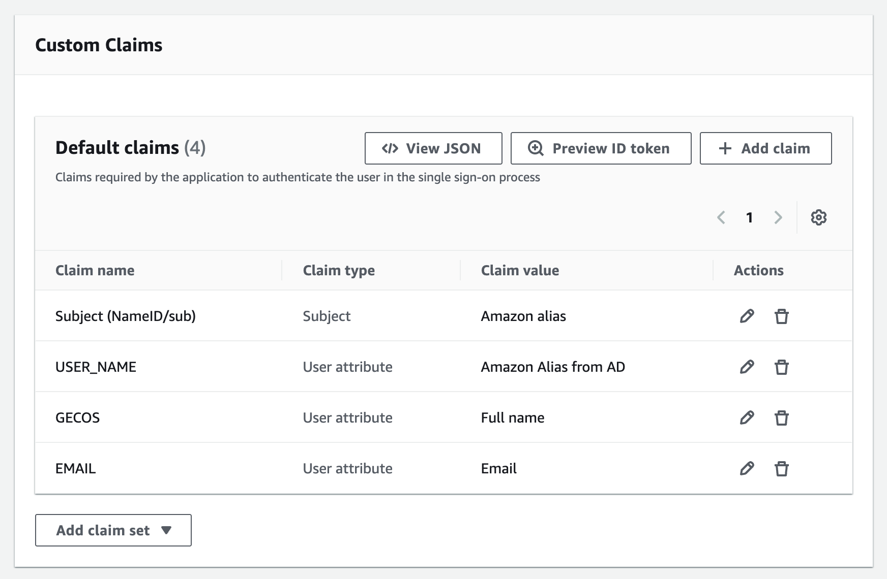

# Federate Profile Creation

1. Click **Create Service Profile**.
2. Skip over the **Questionnaire Based Onboarding** by clicking **Submit**.
3. Select **OIDC** then click **Next**.
4. Enter a **Service Name** using the following format `genai-labs-[PROJECT-IDENTIFIER]`.
    - The project identifier should exactly match the **projectId** in your [project configuration file](../../config/project-config.json).
    - Ex: `genai-labs-email-generator`
5. Select **Pre-Approved Use Cases** then **Federate-Cognito Integration**.
6. Check both boxes titled **I acknowledge** then click **Ok**.
7. Check the boxes titled **Unfabric guidelines** and **Integ Environment restrictions**.
8. Under **Ownership Configuration**, select your team's POSIX group and CTI properties.
    - If needed, create a new team using these [instructions](https://permissions.amazon.com/a/team/new).
9. Click **Next**.
10. Enter a **Client ID** that exactly matches the **projectId** in your [project configuration file](../../config/project-config.json).
    - This is **_extremely important_** as the Client ID **_cannot be edited_** after the profile has been created.
    - Ex: `email-generator`
11. Enter **Redirect URIs** using the following format `https://[PROJECT-IDENTIFIER]-[ACCOUNT_NUMBER].auth.[ACCOUNT_REGION].amazoncognito.com/oauth2/idpresponse`.

    - The project identifier, account numbers, and regions should reflect your [project configuration file](../../config/project-config.json).
    - If you are configuring sandbox account(s), then you need to add URI(s) on a new line.
    - Ex:

    ```
    https://email-generator-043309355269.auth.us-west-2.amazoncognito.com/oauth2/idpresponse
    https://email-generator-294075526655.auth.us-west-2.amazoncognito.com/oauth2/idpresponse
    https://email-generator-212075525600.auth.us-east-1.amazoncognito.com/oauth2/idpresponse
    ```

12. Turn the **Client Secret** switch on.

    

13. Click **Next**.
14. Under **Permissions**, add an allowed group by clicking **Add group**.
15. For **Group type**, select **POSIX Groups**.
16. For **Group name**, search for then select `all-aws-employees`.
17. Click **Next**.
18. Click **Add claim** then select **User attribute**.
19. Select **Email** for **Directory attribute** then enter `Email` for **Claim name** then click **Apply**.
20. Repeat steps 18-19, modifying the specific attributes, to make **Default claims** look like the following:

    

21. Click **Next** then **Submit**.
22. Copy the generated Midway client secret key. **_Keep it safe_**.
    > [I forgot to copy the Midway client secret key. Now what?](./faq.md#i-forgot-to-copy-the-midway-client-secret-key-now-what)
23. The Integration profile expires after 30 days. Set a recurring calendar invite to renew it.
    - Follow these [instructions](./federate-profile-renewal.md) to renew it.
