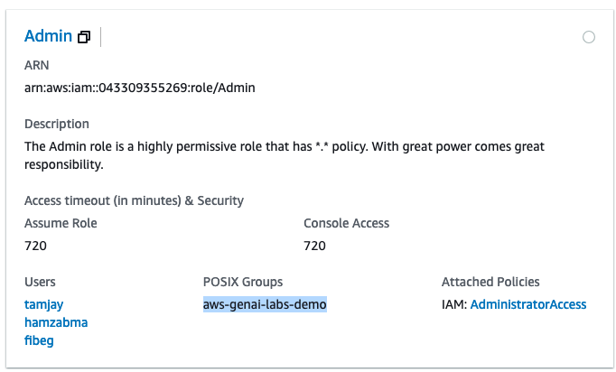
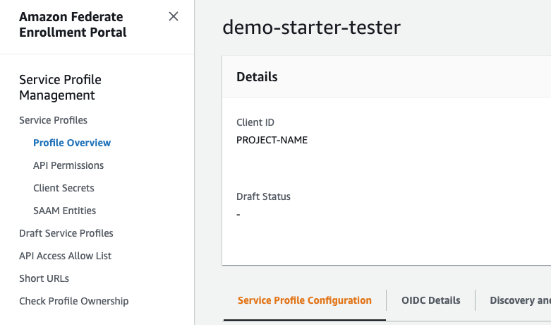

# Frequently asked Questions

A collection of FAQ that addresses questions on design, technology, software & other setup procedures.

## Why do I need two accounts for one demo?

* **Dev Account** - acts as a developer integration environment which is like a primary AWS account where you and your team collaboratively build the demo, set up a CI/CD pipeline (optional) & perform several integration tasks.
* **Prod Account** - acts as a production deployment account which will be linked with the demo portal for customers to access your demo. This account will host the version of the demo that is well tested, stable & usually updated by the CI/CD setup from the Dev account via Amazon CodePipeline.

Optionally, you can have several **Sandbox accounts** per builder in your demo pod to setup a local versions of the demo where you build features or address PRs/fixes before merging the changes back to GitLab which will get deployed to the Dev account via CI/CD.

Once all the stakeholders have acceptance, the changes can then be promoted to production through the CI/CD pipeline setup from the dev account.

## Can I use an existing Isengard Account?

Yes, you can use an existing Isengard account and you may skip creating a dev account provided they meet **ALL** the following criteria.

1. you have access to the `Admin` console role of the Isengard account with
2. the `admin` console role must have IAM role `AdministratorAccess` access policies attached  
3. the `admin` console role must have the POSIX group `aws-genai-labs-demo` attached to it
4. add non Gen-AI labs team builder's aliases under `User` access

> 🚨 Please ensure the sandbox accounts you are adding in project config follows these rules above. Otherwise project configuration via the CLI tool will fail.



## I Cant see this Bindle?

If you don't see the [Gen-AI labs team](https://bindles.amazon.com/software_app/AWS-GenAI-Labs-Demo) listed with bindle ID, please reach out to your manager to add you to the [aws-genai-labs-demo team](https://permissions.amazon.com/a/team/amzn1.abacus.team.qbcf3u7wr4w6jmaqtaka) and try again. Sometimes it might take up to 24 hours for the systems to propagate this change.

Alternatively, you may ask a colleague, who is already part of the Gen-AI labs demo team to create the Isengard account(s) & then add your alias to the `Admin` console role access users list.

## Why use ADA and not Isengard CLI?

> This topic is highly opinionated. Discussions are welcome :)

ADA CLI is preferred here simply because it always updates the `default` AWS profile with correct account credentials when a profile name is not supplied. This can be very helpful in executing certain CLI commands (esp. Amplify commands) which cannot take a `--profile` flag.

Also, [Isengard-CLI](https://w.amazon.com/bin/view/Isengard-cli) is mostly a CLI version of the Isengard UI and is slightly clunky/older than ADA. However, Isengard CLI can be slightly advantageous when using Peru/Brazil/Apollo based dev environments and we do not use them in our team.

## Issue with CodeArtifact Onboarding?

We are currently facing an issue with the onboarding of new accounts and are actively working to resolve this. Please skip this step as of now as we have a workaround!

```txt
Source: Error: Not all members in account XXXXXXXXXXXX are in source-code.
```

## Why are we not cloning the Starter kit repo & downloading a ZIP file?

If we clone the starter kit project inside the demo repository, we will be left with two `.git` folders, one for the demo project that we just initialized & cloned from Git & the other is the starter kit. This will lead to creation of a [Git Submodule](https://git-scm.com/book/en/v2/Git-Tools-Submodules). A common issue arises in these scenarios where you want to be able to treat the two projects as separate yet still be able to use one from within the other.

Also, the stater kit project repo itself is a mono repo which comes with a packager tool and may get several tooling updates in the future to automate the starter kit development, deployment, usage & maintenance.

As of now we want to maintain the starter kit repo separately and have no intentions to use submodules functionality.

## What is Kyber CLI?

Glad you asked! Its the internal code name we gave our CLI tool ;)

A kyber crystal, simply known as a kyber and described as a light saber crystal or the living crystal, was a rare, Force-attuned crystal that grew naturally and was found on various planets across the galaxy & was used by both the Jedi and the Sith in the construction of their light sabers.

Since this CLI is a rare gem and helps you build cool Gen-AI demos, like a light saber, it was only appropriate to call this Kyber!

May the force be with you ✨

## I forgot to copy the Midway client secret key. Now what?

So... you forgot to save the key even after the warnings 🤨

Don't worry we got you! Head to the Midway [Integration](https://integ.ep.federate.a2z.com/profiles) or [Production](https://ep.federate.a2z.com/profiles) environment for which you are trying to recover the secret key.

1. search for your project name and select your profile by click on its name
2. now on the right side menu you will see several options open up as shown



3. from this menu, select Client Secrets
4. click `Create New Secret` and now you can save the new token.
5. Optionally, you can delete the older one by click on the radio button on left side
   1. click Actions -> `disable` and follow onscreen instructions then to delete
   2. click Actions -> `delete` and follow onscreen instructions

## I want to use GitLab CI. Show me how

You can use GitCI as your primary CI/CD engine. If thats the case please perform the following changes

1. open your [project-config.json](../packages/infra/config/project-config.json) file
2. turn off the `codePipeline` by entering `false`

```json
{
    ...
    ...
     "codePipeline": false,
}
```

3. from project root execute the command

```bash
npm run configure
```

4. Replace the existing `.gitlab-ci.yml` with your own to deploy the code to your target accounts. You may have to make adjustments to the code base to achieve this
5. we appreciate any contributions to a  `.gitlab-ci.yml` to use GitCI.

## I use Node Version Manager (NVM). Can I use that?

Yes, you can continue to use that as long as you have the latest LTS version of Node 22 installed.

Also, please ensure you do not have any other global NodeJS installation from HomeBrew(Mac) or standalone NodeJS EXE (Windows) hanging around.

Ensure when you open a new CMD or terminal window and type this command you always get  `v22.X.X` as the output

```bash
node --version
```

## zip-deploy Fails?

If the `zip-deploy` step fails, verify if the CI/CD variables have correct key value configured as mentioned in this [step](./new-project.md#cicd-setup).

please check if the dev account has a role called `gitlab-runner-role` from the IAM service page -> policies section. The title of the role will be `PROJECT_NAME-gitlab-runner-role`.

This role gets setup the [pipeline-stack.ts](../packages/infra/lib/pipeline-stack.ts) file when you run `npm run configure` from [this step](./new-project.md#project-initialization).

Verify if the `zip-deploy` succeeded and if it did, we need to  further debug what went wrong with the CloudFormation deployments. Let's perform the following steps -

* Navigate to the Dev account's management console and head to the Amazon CloudFormation service page by searching for the service name from the search bar.
* Once there, ensure to choose the right region you configured in your `project-config.json` file for your dev account.
* then search for the stack with your project name you configured in your `project-config.json` file
* investigate the error and se what caused it.

Remember, you can run `npn run configure` any number of times after changing the  `project-config.json` file or updating the `pipeline-stack.ts` file any number of times.
