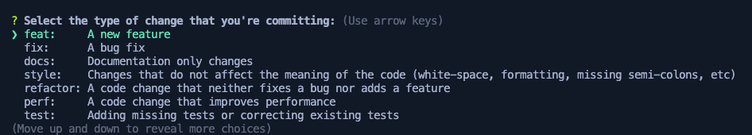

# Kyber CLI Handbook

The Kyber CLI is designed to be a secure, versatile CLI tool that automates the creation & management of demos, democratize demo assets, accelerate development cycles, and ensure consistency across all demos.

This solution will not only empower SAs to confidently build demos but also serve as a scalable mechanism that can be adopted across AWS teams, fostering broader collaboration and innovation.

[TOC]

## General Guidelines

> ✏️ The CLI prints command output logs to the terminal & the menu list might be lost or become invisible. Simply press the up/down arrow to view the menu again. You do not need to run the CLI with new CMD/Terminal windows.

* Most of the CLI commands are supposed to be run from the project root.
* Project root directory is where you cloned your demo repo and you `cd` into the folder where you cloned your repo with the folder name will be your Git repo name
* CLI commands are run as standard `npm` scripts so we always append `npm run <command>`
* Ensure to install `node_modules` before executing any CLI commands
* The entire project is a mono repository and the CLI itself is within the `infra` project under `tools` directory
* Most of the CLI errors can be fixed by simply exiting and restarting the CLI
* Sometimes it is beneficial to refresh credentials for the stage (mostly your sandbox) that your are working on
* press `ESC` button to cancel an action or go back to the main menu from any sub menu
* To exit you must select `Exit` option
* Feel free to change/alter tool behavior for project specific needs :)

## Configure Command

> npm run configure

This command configures your project based on the [Config](../packages/infra/config/project-config.json) file.

> ✏️ **NOTE** - you must run this command each time the [Config](../packages/infra/config/project-config.json) file is updated!

The configuration command performs the following operations in this sequence

1. Validates the [Config](../packages/infra/config/project-config.json) file through schema validation and ensures the project name is less than or equal to 15 characters
2. Verifies if at least the `dev` account configuration is present. `Prod` and `sandboxes` are optional
3. Re-arranges accounts config to always have `dev` as the first and primary account
4. Sets the region in AWS CLI and gets Isengard credentials for the `dev` account
5. Asks for user confirmation to  continue
6. Creates `ada` profiles for all accounts configured
7. Bootstraps each account for the target region configured & `us-east-1` region with trust relationships with `dev` & termination protection for `prod` account
8. Waits for user to enter the Midway client secret for `dev` and `prod` (if configured)
   1. If a Midway client secret is already available in Secrets Manager of the target account, then updates the  the config file with the last 6 digit secret identifier from Secret Manager ARN for Secret retrieval
   2. For Sandbox accounts, the `dev` account's Midway client secret is used and added to the sandbox account's Secrets Manager
9. Setup Amazon CodePipeline in `dev` account with `dev` and `prod` stages if configured

> ⚠️  Please note we do not support usage of `CodeArtifact` until the beta release. So please ensure to keep the configuration tuned off. Read more [here](./new-project.md#codeartifact).

## Kyber CLI

> npm run cli

This command brings up the Kyber CLI menu options for day to day demo building. This CLI utility will speed up development by deploying your CDK infra & webapp changes to any configured accounts from your developer machine, sets up a local web server to develop & test UI web components and much more.

Let's explore its features one by one.

### Refresh Credentials 🔑

This option will use [`ada` CLI](https://w.amazon.com/bin/view/DevAccount/Docs/) to fetch AWS credentials for the target account configured in the [Config](../packages/infra/config/project-config.json) file.

The received credentials are always stored under the `default` profile under the [AWS config files](https://docs.aws.amazon.com/cli/v1/userguide/cli-configure-files.html).

This feature comes in very handy to quickly and effortlessly switch account credentials and region settings without having to manually configure them via AWS CLI.

> ✏️ **NOTE** You DO NOT have to refresh credentials for deploying CDK infra or webapp components as the CLI automates this.

### Synthesize CDK Infra 🧪

This option is used to synthesize your stacks and generate CloudFormation templates. This is a great way to verify & validate your CDK infra code and find [CDK NAG](https://github.com/cdklabs/cdk-nag) errors/warnings to mitigate or suppress.

This command auto refreshes the credentials for the target account using `ada` profiles. The CLI will transparently print and announce the CDK stack building process, Docker invocations and keep your informed of all warnings & errors.

The CLI menu list items may get lost or buried in logs and becomes invisible. Simply, press the up/down arrow to bring the menu list back on the CLI.

### Deploy Infra 🚂

This option will deploy only the CDK infra stacks as configured in the [infra.ts](../packages/infra/lib/infra-stack.ts) to the target account of choice.

The CLI will

* auto rotate credentials
* map correct region
* synthesize your CDK code as per the [infra.ts](../packages/infra/lib/infra-stack.ts) file
* checks for CDK infra errors and CDK NAG errors/warnings
* starts a deployment process to deploy the CloudFormation templates to the target account and region and informs you of the progress.

You can monitor/track CDK deployment from the AWS CloudFormation service page in your management console of the target account & region.

Simply, press the up/down arrow to bring the menu list back on the CLI.

### Deploy Webapp 🌐

This option will build and deploy your `webapp` project to the target account of choice.

* auto rotate credentials
* map correct region
* list all CDK exports to get key AWS resource names, ARNs and ID and generates a `.env` located in the [`src`](../packages/webapp/src/) folder.
* runs AppSync CodeGen automation if GraphQL usage is detected and generates GraphQL queries, mutations & subscriptions with a fully typed API
* builds the webapp, compresses JavaScript and optimizes the deployment package. The CLI will exit gracefully if webapp build fails.
* uploads all the files to the Website Bucket and invalidates Amazon CloudFront distribution

Once deployed, please head to the Amazon CloudFront Service page and access the app URL as shown [here](./new-project.md#verify-deployment).

Simply, press the up/down arrow to bring the menu list back on the CLI.

### Deploy Infra + Webapp 💯

As the name indicates, this will perform Deploy Infra 🚂 and Deploy Webapp 🌐 steps in sequence and will exit as soon as one the operation fails or both operations succeed.

Simply, press the up/down arrow to bring the menu list back on the CLI.

### Serve Local Webapp 🖥️

This option will setup a local web server that runs locally on your machine and also exposes the app to other machines on your network to access the demo website.

This will help you to build & test UI web components. Once you have a stable version, you may deploy the webapp (along with the CDK infra app) to your sandbox to verify the demo being served via CloudFront & then commit your changes back to GitLab under you personal feature branch `feat/alias` to be merged to `main` after a review process from your pod members.

You will see a message like this to indicate a local server is serving your webapp

```text
 VITE v6.0.7  ready in 88 ms


  ➜  Local:   http://localhost:3000/

  ➜  Network: http://10.0.0.221:3000/

  ➜  Network: http://11.113.168.130:3000/
```

Simply, press the up/down arrow to bring the menu list back on the CLI.

### Hydrate 🧼

Being a demo team we use a lot of canned synthetic data, app configurations as flat files (text/JSON/XML), images, videos that needs to be served through your web application. For example check this React app page designed with CloudScape.


All the images and campaign information are referred from the AWS S3 data bucket. This bucket is setup via the [bucket-stack](../packages/infra/stacks/bucket-stack.ts) from the `infra` project. The campaign name & description is coming from a JSON file along with the images; both stored & referenced from the data bucket.

The CLI offers this option to simplify hydration or dumping data files from your local machine to the AWS S3 data bucket. When you hit `hydrate` for the first time, a `hydration` folder is created for you under `/packages/webapp/src`.

```text
✔ Select an option using arrow keys or type option number and hit enter to execute - · 7. Hydrate 🧼 
✔ Select an account - · tamjay

 🤔 Hydration folder not found. We have created one for you at - 
 /root/packages/webapp/src/hydration 
 place your files there & try again.
```

Then you can put files, synthetic data, JSON files, images, videos, fonts etc. with nested folder structure that gets pushed to AWS S3 data bucket where the folders become prefixes when you select the `hydrate` option again from the menu list

Now after signin (Midway/Cognito User), these bucket prefixes can be directly referred within your React components and you can list, get, upload and remove files from AWS S3 data bucket via react components directly without an intermediate Lambda function and RESt API interface. Refer to the [Webapp](../packages/webapp/README.md) documentation to learn more.

This hydration folder is not tracked by Git so that your Git repo is not bloated and will not slow down your CI/CD runs.

> 📈 In the subsequent release we plan on introducing hydration to your AWS OpenSearch indexes as well to fast track Gen-AI based demos that needs a knowledge base.

#### Static Files vs Hydration

Sometimes, we just need static file serving through which files (images, icons, simple HTML/JS scripts etc.) can be accessed globally with just a simple URL.

If you notice, there is a `static` folder under `/packages/webapp/src` for this purpose.

The static files are checked in to Git and files/folders here will also be auto uploaded along with your web app deployment to the `website` bucket set up in [`website-waf-stack`](../packages/infra/stacks/website-waf-stack.ts) and no action is needed from your side apart from placing the files/folders and accessing them with the correct URL paths in your React components.

These files can be accessed with your CloudFront url such as <https://d1ohf10999rv0h.cloudfront.net/assets/arch-DS8hMkeH.png> note the `assets` prefix. If you have nested folders then they must be mentioned in the URL path as well such as `cloudfront.net/assets/folder/filename.png`.

If you notice, the data stack is protected by Cognito and you either need to login via Midway or as a Cognito user to get security tokens to access files stored there.

However, the `static` files/folders can simply be accessed without any tokens by directly referencing their URL path. This is great way to serve your simple click through HTML web apps, StoryLane Demos or any other static assets. Ensure to only place files that are lesser in size and that can be accessed without any protections such as icons/fonts/brand logos etc.

### Refresh Webapp Env 📦

This option is provided to regenerate only the `.env` file located in the [`src`](..packages/webapp/src/) folder. This can come in handy especially when you add/remove cloud resources via CDK and just want to update the `.env` file to integrate with the front end.

This will auto restart the webserver if one is running and will also auto run the Amplify CodeGen automation if the CLI detected GraphQL usage.

### Delete CDK stack 🗑️

> ⚠️ Experimental Feature

This feature is to delete/destroy CDK stacks from your desired environment. This can be very helpful in cleaning up an existing account and restart a fresh deployment.

Please use this with **extreme caution** as the CDK stacks once destroyed with this feature cannot be recovered and may sometimes leave your application broken which can be quite hard to recover esp. when using dependent stacks.

> 🚨 - **WARNING** Please do not use this feature to destroy stacks from `prod`. **This action is irreversible**.

When you have CodePipeline option as `true` in your [Config](../packages/infra/config/project-config.json) file the CDK stacks are deployed as nested stacks which are grouped under the [Pipeline Stack](../packages/infra/lib/pipeline-stack.ts). This gives us the opportunity to selectively destroy the stacks by listing all available stacks.

> 🚨 - **WARNING** For Sandbox accounts and for demos without CI/CD this will destroy **ALL** CDK stacks as soon as you select `Y` without listing all the stacks in the target account. **This action is irreversible**.  

There are certain limitations with this feature due to how CDK is designed -

* stacks that are destroyed are still listed because AWS CDK, unlike [Terraform](https://www.hashicorp.com/products/terraform)/[Pulumi](https://github.com/pulumi/pulumi) does not retain a cloud referenced stack list. AWS CDK will always list stacks based on the `cdk.out` manifest based on your local state which inevitably will list all available stacks in your local machine as opposed to a list of stacks available in the cloud.
* We recommend that you delete the stacks in this particular order due to dependencies between each stack for `dev` and `prod` esp. when CodePipeline option is set as `true` in the [Config](../packages/infra/config/project-config.json) file -

  * project-name/stage-root
  * project-name/stage-infra
  * project-name/stage-api-gateway-stack
  * project-name/stage-graphql-api-stack
  * project-name/stage-api-gateway-stack
  * project-name/stage-auth-stack
  * project-name/stage-data-bucket-stack
  * project-name/stage-website-waf-stack
  * project-name/stage-waf-stack
  * project-name/stage-vpc-stack

> ⚠️ - If you try to destroy stacks in wrong order, the operation may fail by transparently informing you the reason behind the failure and will gracefully exit.
  
We still recommend to use the AWS CloudFormation service page to delete/manage your CDK stacks as there are many options available to monitor stack drifts, identify errors and offers better stability.

> 🚨 WARNING - The CDK destroy step does not destroy certain cloud resource such as AWS WAF (Global & regional), some AWS Buckets, VPC configurations, Secrets Manager  and a few other configurations and they must be deleted manually via the AWS Management Console.

### Exit 👋

This option will gracefully stop any local web server running, frees up port `3000` and exits the CLI.

Any ongoing operation that was triggered will also be cancelled and may fail/succeed based on its nature.

## Prepare Command

> npm run commit

This command will setup [Husky](https://typicode.github.io/husky/get-started.html), an automated pre-commit hook that helps you run specific commands before you code gets committed to Git.

We have two hooks located under `.husky` folder under your code base.

* **commit-msg Hook** - We validate the commit message and ensure it follows the [Git Conventional Commits Standard](https://www.conventionalcommits.org/en/v1.0.0/).
* **pre-commit Hook** - This hook will perform the following operations before your files are committed to Git.
  * fetch all Git commits, files, and refs from a remote repository into your local repository
  * pull the main and fast forward your personal `feat/ALIAS` branch so that your branch can forward itself to the latest changes in `main`. If this setup fails, then there are some changes/updates you have missed to pull from Git and you are behind your pod's commits. Husky will exit and not add your changes
  * print Git status which lets you see which changes have been staged, which haven't, and which files aren't being tracked by Git
  * synthesize your AWS CDK `infra` project and exit if there are any efforts or CDK NAG errors
  * build webapp and exit if there are any build errors

## Commit Command

This feature helps you commit your changes back to Git and it automates [Conventional Commits Standard](<https://www.conventionalcommits.org/en/v1.0.0/>) and ensures you do not accidentally override your fellow developers code changes while working on a pod.

After you have built, tested your demo features locally & deployed to your sandbox accounts, you are now ready to push your changes to your branch in Git.

Open a new terminal/CMD window, and enter

```bash
git run commit
```

This command will first add all your changes & stages your filed to be committed to your feature alias branch `feat/ALIAS`. Then the Kyber CLI tool will present you with a series of options to choose from



* `Select a type of commit` : choose from various option such as feature/fix/docs etc using your up & down arrow keys
* `scope` : enter a short scope such as `cdk` or `webapp` or `CLI` or `app` or `docs` etc. keep this short.  
* `short description` : enter a short description, like a title for your commit,. Ex. `Initial Commit`
* `long description` : A long descriptive explanation on what you are trying committing.
* `breaking changes` : enter `Y/N`. For now just hit 'N' or just enter.
* `issue number` : Here you can enter Asana Task ID. For now just hit 'N' or just enter.
* After this the Husky pre-commit hooks are executed as mentioned above.

Once these Husky hooks succeed, all your changes are automatically added to your commit and you **MUST then manually push** the changes to Git by command

```bash
git push feat/ALIAS
```

## Clean NodeJS Packages

> npm run clean-node-modules

This command when run from your project root in a terminal/CMD window will delete all `node_modules` across the project along with the `package-lock.json` file.

This is very helpful when you have older package files and some library dependencies are not resolved properly and fix package errors.

After running this command you can install the next command to install all NPM dependencies.

## NodeJs Package Installation

> npm run install-packages

This command when run from your project root in a terminal/CMD window will install all your NPM libraries defined project wide and within the `infra` and `webapp` folder.

As of now we force set the NPM registry as `https://registry.npmjs.com/` and install the NPM packages. Refer to this [issue](./faq.md#issue-with-codeartifact-onboarding) for more details.

## Headless Mode

The Kyber CLI can be also used in headless mode by directly providing the operation as command line arguments.

This is very instrumental to deploy the website to tha target accounts via CI/CD as a CodeBuild step.

Refer the [kyber.ts](../packages/infra/tools/kyber-cli/kyber.ts) for more details on this

```ts
// kyber can also run in standalone mode by taking in CLI args
    // we check for args & stage name first
    // if no CLI args are provided we show the list
    if (args && argStage) {
        console.log(`🚀 Received args: ${args} - switching to execution mode`)
        if (args === "deploy-website") {
            console.log(`🚀 Deploying web app to: ${argStage} `)
            await handleDeployWebApp(argStage)
        }
    } 
```

You can expand this feature to build you won methods and functionalities and extend the abilities of Kyber CLI to suit your demo specific requirements.

## Next Steps

* 📚 [CDK Infra](../packages/infra/README.md)
* 📚 [Webapp](../packages/webapp/README.md)
