# New Demo Setup

> ℹ️ Please follow the instructions carefully & sequentially

Let's start setting up your exciting new demo. Please read the instructions carefully, even for the steps that you are quite familiar with.

The starter kit comes built in with a CLI that automates several steps such as bootstrapping your Isengard accounts, linking Midway profiles to the right account and much more. We will use this CLI tool; extensively throughout and you will learn more about it & its features as you go along this setup guide.

[TOC]

## Starter Kit Overview

Here is [handbook](./kyber-cli-handbook.md) that helps you understand how the starter kit is designed and all its features in-depth.

Some key features are -

* simple to use CLI for setting up & managing the entire demo
* auto credential rotations for your Isengard accounts
* centralized project configuration file
* fully customizable CI/CD setup
* simplified & seamless Midway authentication setup
* static code analysis & pre commit hooks
* Built in Isengard account management such as account bootstrapping, CDK deployments & teardown

## Isengard Accounts

First steps is to create Isengard account(s). Your demo project must have at least one Isengard account to begin with.

> ❔ [Can I use an existing Isengard Account?](./faq.md#can-i-use-an-existing-isengard-account)

### Dev Account Creation

1. Visit this site <https://iad.merlon.amazon.dev/create-account/aws>
    * Ensure the `AWS (Isengard)` option is selected

      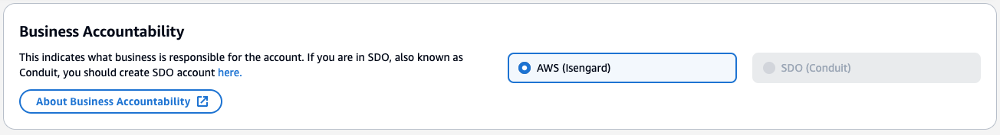

2. Provide an account name as per the recommended template `SEGMENT-DEMO-NAME-STAGE`.
    * An example account name can be  `retail-marketing-email-generator-dev`
  
      | SEGMENT    | DEMO-NAME | STAGE |
      | -------- | ------- | ------- |
      | retail  | marketing-email-generator | dev |

3. Provide an email as per the recommended template `aws-genai-labs+DEMO-NAME-STAGE@amazon.com`
    * An example account name can be `aws-genai-labs+marketing-email-generator-dev@amazon.com`
    * <aws-genai-labs@amazon.com> is the GenAI Labs group email address
    * Adding a `+` qualifier will create a unique email address for every new demo.

4. Provide a short account description that best describes the demo you are about to build and click the `Next` button.
5. In the `Bindle For Account` section, select the [GenAI Lab's team](https://bindles.amazon.com/software_app/AWS-GenAI-Labs-Demo) name as `AWS-GenAI-Labs-Demo`, which will automatically refer to the bindle ID `amzn1.bindle.resource.hs5yvj2a2rcp3cph4zqq` as shown in this image below. Hit `Next`.

    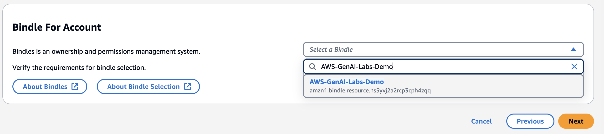

> ❔ [I Cant see this Bindle?](./faq.md#i-cant-see-this-bindle)

6. Leave the `Account Classification` as non-production and account type as `individual`
    * Choose the following CTI and hit `Next`
    * Category - `AWS`
    * Type - `Generative AI`
    * Item - `aws-genai-labs-demo`

      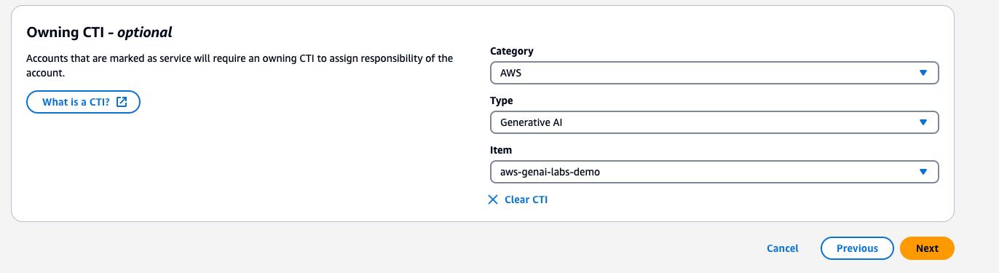

7. In the `Optional Details` page, leave all the boxes to their default **unchecked** states and hit `Next`

8. Verify the final review page looks like below & click `Submit`

    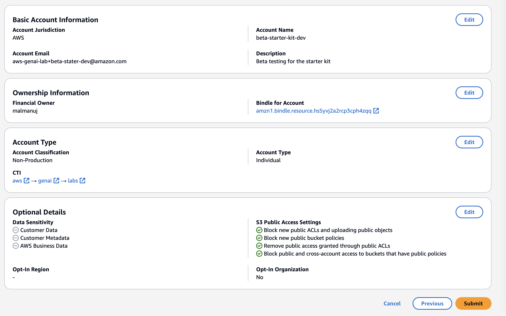

9. Account creation may take up-to 3 to 5 minutes. You will be able to check for your accounts from [Isengard manage access page](https://isengard.amazon.com/manage-accounts) by searching for your account name/email address
10. Once your accounts are created, and you have found them from the Isengard management console page, click on the account name. This will bring you to the account dashboard
11. From the dashboard, click the `Manage` drop down button then choose `Console Roles`

    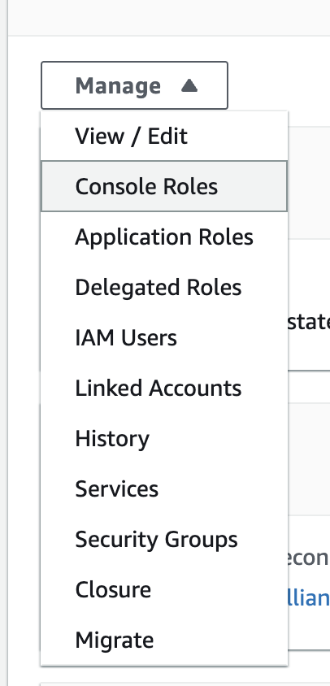

12. Click on `One Click Roles` drop down and select `Admin`. This creates an Admin role for this account.
13. Now lets provide access to this role for your fellow GenAI Labs Team members. Select the radio button on the Admin role card on the top right corner and hit the `Edit` button

    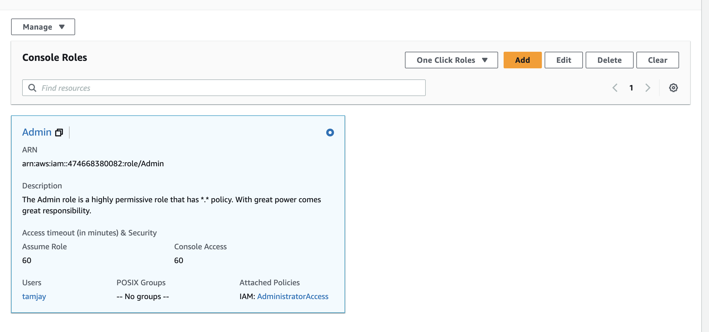

14. Edit the following parameters
    * `Assume Role` - 720
    * `Console Access` - 720
    * `POSIX Groups` - `aws-genai-labs-demo` and make sure to click `Save` button before proceeding

      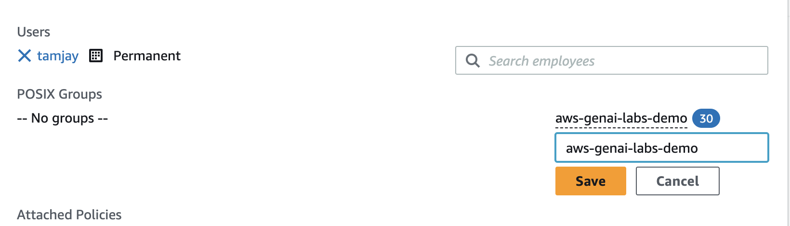

    * You can also add non GenAI Labs team members to this `Admin` role by searching for their AWS alias.
    * Finally click the `Save X Changes` button


15. Optionally, you may also create a `Read only Role` from the `One Click Roles` drop down with the same options as above.

⛳ - You have now successfully created your Isengard account.

### Production Account Creation

> ℹ️ - You may skip the creation of a production account for a video only or a Storylane demo.

> ❔ [Why do I need two accounts for one demo?](./faq.md#why-do-i-need-two-accounts-for-one-demo)

Please follow the same instructions as above to create a production account as well. Keep in mind the following customizations while creating accounts

1. Visit this site <https://iad.merlon.amazon.dev/create-account/aws>
    * Ensure the `AWS (Isengard)` option is selected

      
2. Provide an account name as per the recommended template `SEGMENT-DEMO-NAME-STAGE` such as `retail-marketing-email-generator-prod`.

    | SEGMENT    | DEMO-NAME | STAGE |
    | -------- | ------- | ------- |
    | retail  | marketing-email-generator | prod |

3. Provide a group name as per the recommended template `aws-genai-labs+DEMO-NAME-STAGE@amazon.com`
    * An example account name can be `aws-genai-labs+marketing-email-generator-prod@amazon.com`

4. In the `Bindle For Account` section, select our [GenAI Lab's team](https://bindles.amazon.com/software_app/AWS-GenAI-Labs-Demo) name as `AWS-GenAI-Labs-Demo`, which will automatically refer to the bindle ID `amzn1.bindle.resource.hs5yvj2a2rcp3cph4zqq`
5. Choose the following CTI and hit `Next`
    * Category - `AWS`
    * Type - `Generative AI`
    * Item - `aws-genai-labs-demo`
6. Then follow the same instructions above to create the `Admin` console access role & optionally a `Read only Role`

> ℹ️ Although we call this a production account **DONOT** mark this account as Production in Isengard as this will add additional overheads like implementing a break glass feature via MCM etc.

#### Sandbox Account Creation

If your demo pod has more than one builder, then we highly recommend you create a personal sandbox account for yourself to setup a local version of the demo where you build features or address PRs/fixes before merging the changes back to GitLab that will be deployed to the Dev account via CI/CD. Once all stakeholders have acceptance the changes can then be promoted to production through the CI/CD pipeline via manual approval.

Ensure to keep this in mind while creating sandbox accounts

1. Provide an account name as per the recommended template `SEGMENT-DEMO-NAME-ALIAS` such as `retail-marketing-email-generator-tamjay`.

    | SEGMENT    | DEMO-NAME | STAGE |
    | -------- | ------- | ------- |
    | retail  | marketing-email-generator | ALIAS |

2. You may use your own personal email, such as `ALIAS+DEMO-NAME@amazon.com`
3. You will need to create a personal bindle, if you do not have one already. Follow this [guidance](./setup-personal-bindle.md) on how to create your own personal team bindle.
4. All the other instructions for `Isengard Account Creation` remains [same as above](#dev-account-creation) except when using **your own bindle and CTI you have** for your team.

### Isengard Account grouping

Now that we have several Isengard account for the same demo, some housekeeping can help us stay organized. Please perform the following steps for all the dev, prod & sandboxes accounts

1. Search for the the account name/email address from [Isengard manage access page](https://isengard.amazon.com/manage-accounts).
2. In the account dashboard page, under `General` tab, click `Edit`.
3. Under the `Folder` text box, enter your demo name without the stage name such as `retail-marketing-email-generator`.
4. Do the same for all Isengard accounts for your demo.
5. This will organize all your relevant accounts into a group folder for easier management.

## Initialize a Git repo

The next step is to initialize a GitLab repository. Please perform the following steps in the correct sequence

1. Start from GenAI Lab's team demo assets [GitLab project page](https://gitlab.aws.dev/genai-labs/demo-assets).
2. Click on `New Project` from the top right corner.
3. Provide a project name that you gave for your Isengard account creation without its stage name such as `retail-marketing-email-generator`.
4. Select the `Group` as `genai-labs/demo-assets`. This is a **very important step & non reversible.**
5. Uncheck the `private` option under Visibility level. This is a **very important step** so other AWS employees not part of GenAI Labs team can access projects once launched in the [Demo Portal](https://demos.genai.aws.dev/).
6. Leave the `Project Configuration` section checked for initializing a `README.MD`

   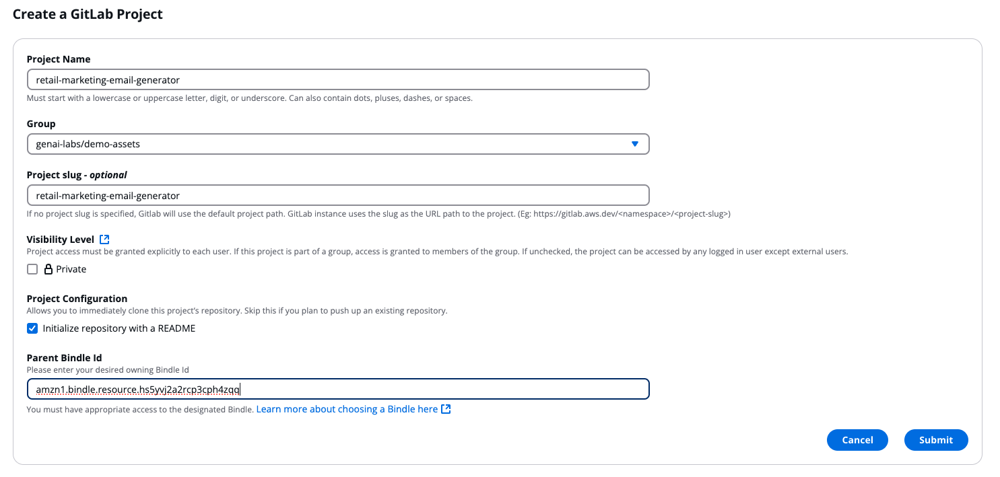

7. Set the Parent Bindle ID as : `amzn1.bindle.resource.hs5yvj2a2rcp3cph4zqq`
8. Click `Submit`. This will create a Git repo in our Gen-AI labs group and will initialize a blank repo with a sample `Readme.md`.

### Repo Cloning and Initialization

1. From your demo's GitLab page, click on the `Code` dropdown from the top right and copy the SSH URL

   

2. On your developer machine, create a new directory where you want the code base to be. This folder path is your project's `root`
3. In a new terminal or a CMD window, navigate to the new folder you created using the `cd` command
   * Windows users - open a CMD terminal window by typing `cmd` on the address bar of the folder you just created using file explorer
   * Mac users - open a new Terminal Window and simply drag and drop the folder you created to get the folder path, then add a `cd` at the beginning and hit enter
   * Cloud Desktop users - may the force be with you!
4. Use this command to clone the repo to your local machine's folder (Mac/Windows/Cloud Desktop)

    ```cmd
    git clone <paste-the-SSH-url-you-just-copied>
    ```

5. Hit enter and open the folder in your IDE of choice. We prefer using VSCODE for building demos. Going forward  this folder will be referred to as project `root`.
6. Once cloned, you will see a default `README.MD` file.
7. Download the [Starter Kit Utility](/release/starter-kit-package.zip) to your developer machine by clicking on the `Download` link on the page.
8. Please follow the unzipping instructions as below -

> ❔ [Why are we not cloning the Starter kit repo & downloading a ZIP file?](./faq.md#why-are-we-not-cloning-the-starter-kit-repo--downloading-a-zip-file)

* **Mac Users** :
  * open the folder where you downloaded the `starter-kit-package.zip` package
  * double click the zip file to extract the zip archive
  * press `Command + Shift + . (period)` this will reveal all the hidden folder & files.
  * select all files by pressing `CMD + a` and hit `CTRL +c` and copy all the selected files
  * now paste these files in the project `root` and replace the existing `README.md` file.

* **Windows Users** :
  * open the folder where you downloaded the `starter-kit-package.zip` package
  * right click on the zip file and select `Extract All` and extract the files to `starter-kit-package` folder. Double click and open the extracted `starter-kit-package` folder.
  * Click View-> Show/hide group-> check hidden files to view the hidden files
  * copy all files and paste them in the project `root` and replace the existing `README.md`

Open the project root in VSCODE & your project folder setup with all the hidden files such as `.husky`, `.gitallowed`, `.gitlab-ci.yml` and should look like this
   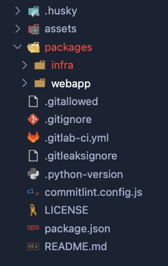

Feel free to explore various folders. We used a mono-repo technique to bundle the CDK Infra and the React Webapp into a single project for efficient dependency library management, exchange configurations, and effective CI/CD processes.

Please refer to the [Infra documentation](../packages/infra/README.md) for more details.

#### Code Defender

[Code Defender](https://w.amazon.com/bin/view/AWS/Teams/GlobalServicesSecurity/Engineering/CodeDefender/UserHelp/#5) is a AWS Sales, Marketing, & Global Services (SMGS) security service that leadership has invested in and mandated to protect and safeguard our customers.

This service validates Git activity and adds an additional layer of protection to users and our customers by ensuring users are not releasing AWS Secrets (Keys, Tokens, Account ARNs) or AWS and our customer's code to incorrect or publicly accessible repositories. Please take a look at our [wiki](https://w.amazon.com/bin/view/AWS/Teams/GlobalServicesSecurity/Engineering/CodeDefender/) if you'd like more details.

1. Install git defender from [here](https://codedefender.proserve.aws.dev/).

2. After installation from the git repo cloned root path run

   ```bash
   git defender --setup
   ```

   Followed by

   ```bash
   git-defender --mw-register
   ```

   You will then see a message saying `Successfully registered.`

## Project Configuration

> This is an **important step**. Please read all the instructions carefully for a seamless setup experience, especially for Midway integration.

The starter kit manages the demo using a single configuration file called the [project-config.json](../packages/infra/config/project-config.json) located in `demo-root/packages/infra/config/project-config.json`.

> ❔ [What is Kyber CLI?](./faq.md#what-is-kyber-cli)

We have designed the `Kyber CLI tool` tooling utility in such a way that it uses this [Config](../packages/infra/config/project-config.json) file to manage project specific settings.

This is the only file you & your fellow builders will need to update to manage your entire demo. This file gets checked into Git so anyone working in the pod can pull changes to their local dev machine from any other environment then build, test & push changes.

Open the project in your favorite IDE of choice (we prefer VSCODE) and open the [Config](../packages/infra/config/project-config.json) file and get ready to edit this file. Please  ensure to save the file after you have completed the configurations.

This config file has the following configuration options available -

```json
{
    "projectName": "PROJECT-IDENTIFIER",
    "gitlabGroup": "genai-labs/demo-assets",
    "gitlabProject": "GITLAB-PROJECT-NAME",
    "codeArtifact": false,
    "codePipeline": true,
    "midway": true,
    "account": {
        "dev": {
            "number": "AWS_ACCOUNT_ID",
            "region": "AWS_REGION"
        },
        "prod": {
            "number": "AWS_ACCOUNT_ID",
            "region": "AWS_REGION"
        },
         "ALIAS_1": {
          "number": "AWS_ACCOUNT_ID",
            "region": "AWS_REGION"
        },
         "ALIAS_2": {
          "number": "AWS_ACCOUNT_ID",
            "region": "AWS_REGION"
        },
        // more aliases if needed
    }
}
```

### Project Name

The first and the most important configuration is the `projectName` selection.

The `projectName` must be an unique name which best describes your project **within 15 characters**. Otherwise the CLI will throw an error.

We require this unique project name identifier to:

* Tag all AWS CDK assets
* Create predictable resource names such as IAM roles, AWS S3 Buckets etc.
* Help differentiate CDK stack names created via this starter kit if multiple demos get deployed to the same accounts
* Auto link midway profiles with your Amazon Cognito hosted UI domain setup as part of the CDK infra deployment

Some examples of the project names are `email-generator` or `trainium-demo`, `prod-descr-gen` etc. Get creative or ask [Cedric](https://console.harmony.a2z.com/internal-ai-assistant) to generate one for your project name within **within 15 characters** and remember to:

* Use shorthand names separated by a `-`
* do not use any other special characters such as `! , & * @ # < > ?` etc.

### GitLab Group

> Do not change this unless you initialized your GitLab project under a different group.

This setting is used by the starter kit to automate the GitLab CI for CI/CD purposes and must not be changed unless you initialized your GitLab project under a different group or under your personal project group.

You can find your GitLab group from your project Git URL usually in this format `https://gitlab.aws.dev/GROUP-NAME/project name`.  

For example, <https://gitlab.aws.dev/genai-labs/demo-assets/retail-marketing-email-generator> where

* `genai-labs/demo-assets` - is the group name of your Gitlab repo
* `retail-marketing-email-generator` is the project name  you chose in the repo name under this [step](#initialize-a-git-repo)

### GitLab Project Name

> Must match your GitLab project name

This is different from your unique project name in the config file identifier & is usually the project name you chose while creating the Git project.

This setting is used by the starter kit to automate the GitLab CI for CI/CD purposes and must match your GitLab project name exactly.

You can find your GitLab project name from your project Git URL or from the settings page of your GitLab project. The last part of the URL is always the project name you chose for your GitLab project.

For example, <https://gitlab.aws.dev/genai-labs/demo-assets/retail-marketing-email-generator> where

* `genai-labs/demo-assets` - is the group name of your Gitlab repo
* `retail-marketing-email-generator` is the project name you chose in the repo name under this [step](#initialize-a-git-repo)

### CodeArtifact

> **WARNING** 🚨 - goshawk-onboard is facing [an issue](./faq.md#issue-with-codeartifact-onboarding).
> Please mark the `codeArtifact` usage to `false` & skip to the next step.  

CodeArtifact (formerly Goshawk) is a secure, highly scalable, managed artifact repository service that makes it easy for organizations to store and share software packages used for application development. Read more on [CodeArtifact](https://docs.hub.amazon.dev/codeartifact/user-guide/getting-started/).

We are currently facing [an issue](./faq.md#issue-with-codeartifact-onboarding) with the onboarding of new accounts and are actively working to resolve this.

We are not recommending to use this settings at this point. Please mark the `codeArtifact` usage to `false` until [the issue](./faq.md#issue-with-codeartifact-onboarding) is resolved.

### Code Pipeline

Since there are multiple accounts involved, it is imperative for us to configure a CI/CD pipeline setup to automatically build and deploy the demo to target accounts after a commit to GitLab.

We **strongly recommend** keeping this setting turned on by marking the option as `true` even if there is no production account configured. If you turn this option to `false` you must use the `Kyber CLI tool` to manually deploy the entire app (CDK & Webapp) to any configured account of choice.

This setting can be toggled later even after setting up the demo.

### Midway Configuration

This options enables your demo to use [Federate Midway authentication](https://integ.ep.federate.a2z.com/help) so any AWS/Amazon employees, or a particular group/user can be allowed/denied access to you demo project.

Even though your demo may not need a Midway authentication at the beginning, we **strongly recommend** to leave this flag as `true`.

This setting can be toggled later even after setting up the demo.

### Accounts

This section contains the demo target account names, target region with the stage as their key name.

While a prod account is optional,**a dev account is mandatory** for any project using the starter kit and the CLI will throw an error if this configuration is not found.

The accounts with user aliases are automatically considered as sandbox accounts for respective pod builders and can be added or removed anytime.

Enter the account number and region of choice in the config file under `dev`, `prod` amd your `ALIAS`.

Please remember to save the configuration file.

## Package Installations

Let's begin by installing the NPM packages needed for the starter kit.

In a new terminal or a CMD window **from the project root** enter the following commands to install all [NPM packages](https://nodejs.org/en/learn/getting-started/an-introduction-to-the-npm-package-manager)

`cd /project_root_path`. Please replace `project_root_path` with actual path where you are setting up the kit.

Refer to the [Config](../packages/infra/config/project-config.json) file for your demo account number.

```bash
ada credentials update --provider=isengard --role Admin --once --account=DEV_ACCOUNT_NUMBER
```

You will see a message that says `Refreshing aws credentials for default` and `Successfully refreshed aws credentials for default`.

Now from the root of the demo folder run

```bash
npm run install-packages
```

This will install `npm` dependencies and will take at-least 2-5 mins to complete for first time.

Great time for a ☕ and you deserve one!

## Project initialization

In this step we will take care of a few initialization steps such as

1. Creation of ADA profiles for the accounts being used
2. CDK bootstrapping
3. Configuring Midway
4. Setting up A CI/CD pipelines using Amazon CodePipelines in the dev account

Don't worry the CLI tool will automate all of the above ;)

> Ensure you run this command from your project root

Now type the following command to prep the project and initialize the precommit hooks powered by [Husky](https://typicode.github.io/husky/).

```bash
npm run prepare
```

> 💻 Mac/Cloud Desktop users only

Run this command to make the Husky pre-commit hooks executable.

```bash
chmod ug+x .husky/* && chmod ug+x .git/hooks/*
```

We can execute the first starter kit automation process by entering the following command to start the configuration process as per the config file.

> ✏️ You **must** run this command each time you update or change the [Config](../packages/infra/config/project-config.json) file

```bash
npm run configure
```

This will start the `Kyber CLI tool` which will perform several automatons -


1. Validates the config JSON and points out any errors with line number and reason
2. Validates the project name (must be less than or equal to 15 characters) and points out any errors with reason
3. Sets up account profiles using ADA CLI for all accounts configured
4. Authenticates with CodeArtifact (if turned on) and saves the refreshed tokens to `~/.npmrc` file
5. Prompts for user to proceed or not.
6. Please use your right arrow key to choose `yes` and hit enter.

The `Kyber CLI tool` will now proceed to perform the following operations -

1. Bootstraps the accounts configured (dev/prod/sandbox) with the region configured along with `us-east-1`
2. Checks if Midway is already configured, if not, asks for you to enter the Midway token mentioning the account stage & account number if the config file has `true` for the `midway` flag. If this option was marked `false` (although we advise against this), please feel free to skip the [next section](#continue-the-configuration)
    * The CLI will wait for you to enter the Midway secret as shown below. We will now see how to acquire the Midway tokens for dev and prod accounts. Let the CLI wait until we get the Midway secret tokens
    * The [next section](#continue-the-configuration) will help guide you in the creation of Midway profiles & get the tokens

      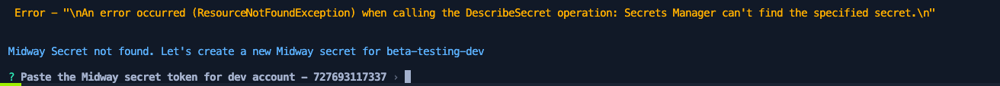

### Federate Midway Profiles

> We highly recommend creation of a Midway Profile even if your demo is a video only or a Storylane demo

Federate is Amazon's Identity Provider (IDP) and supports industry standard authentication protocols (SAML 2.0 and OpenID Connect).

Federate does not directly authenticate users, it leverages Amazon-trusted authentication providers (such as Midway, IdPrism, Passport V1) to authenticate the user. Federate receives an authentication token from an authentication provider and then generates a service-specific claim or assertion and presents it to the user.

Federate has a [Integration](https://integ.ep.federate.a2z.com/profiles) & [Production](https://ep.federate.a2z.com/profiles) environment where service profiles are managed separately. If your demo has both Dev & Prod stages, you must create two separate profiles in the respective environments. Sandbox accounts will use the Integration profile for providing access to the demo.

Let's start by creating a service profile in the [Integration](https://integ.ep.federate.a2z.com/profiles). We have simplified profile creation by creating a dummy profile for you to clone and edit out the changes as described. Please follow these steps carefully for a seamless stepup experience.

1. Proceed to the [Integration](https://integ.ep.federate.a2z.com/profiles) environment.
2. Search for the profile with name as as `demo-starter-tester` and select the profile shown below -

   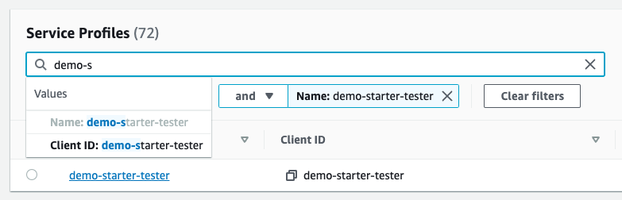

3. Click on the radio button on the far left and click the `Actions` drop down button. select `Clone Service Profile`. This will retain all  the settings from the original template.
4. The `Service Name` must follow the template `genai-labs-<PROJECT-NAME>`. The `PROJECT-NAME` should exactly match the `projectName` used in your project [Config File](../packages/infra/config/project-config.json) in the previous section.
5. Check the box that says `Unfabric guidelines`
6. Check the box that says `Integ Environment restrictions`
7. Leave all the options as default and hit `Next`
8. Client ID must be same as your `PROJECT-NAME` that you selected in the previous step. This is **extremely important** as the Client ID **CANNOT BE EDITED** after the profile has been created.
9. The redirect URL must match the following pattern so edit carefully and ensure this before proceeding (you can change this later)

    `https://PROJECT-NAME-ACCOUNT.auth.REGION.amazoncognito.com/oauth2/idpresponse`

10. If you are configuring a sandbox account(s), then you need additional entries in the redirect URL by pressing the enter key after the first line to add another. Change the account number & region accordingly as per your sandbox configurations
11. Here is an example configuration that you may copy & edit as needed. Note the `ACCOUNT` is replaced with Dev & sandbox account IDs and regions respectively as per the [Config File](../packages/infra/config/project-config.json)

We recommend you copy paste the following URIs to a code editor, add your entry in a separate new line and paste the entries back.
You **MUST** leave a newline after each entry. The URIs will resemble this format

    ```text
    https://email-generator-DEVACCOUNT.auth.DEVREGION.amazoncognito.com/oauth2/idpresponse
    https://email-generator-SANBOXACCOUNT.auth.SANBOXREGION.amazoncognito.com/oauth2/idpresponse
    https://email-generator-SANBOX2ACCOUNT.auth.SANBOX2REGION.amazoncognito.com/oauth2/idpresponse
    ```

12. Turn the `Client Secret` switch on.

The final settings must look similar to this, but please match the data as per your project config file that you chose in the previous step.

> 🚨 Note how the `client-id` is matching with the `project-name` in the redirect URLs. This is a **hard requirement** for Midway automation and we request you please double check this setting before proceeding.


12. Hit the `Next` button
13. Leave all options as it is in the `Discovery and Permissions Configuration` and `Claim Configuration` pages & hit `Next`
14. Finally hit `Submit` in the Overview page.

This will generate a Midway client secret key. **Copy the key and keep it safe**.

> ❔ [I forgot to copy the Midway client secret key. Now what?](./faq.md#i-forgot-to-copy-the-midway-client-secret-key-now-what)

You wont be able to get the key again.We will be needing this in the next step.

> 🚨 The INTEG profile expires after 30 days. Ensure to renew it by setting a recurring calendar invite!

### Midway Production Profile

If you have a Production account in the Project Config JSON, please continue otherwise you may skip.

1. Proceed to the [Production](https://ep.federate.a2z.com/drafts) drafts.
2. Click `Import from Integ`
3. Enter the client ID as same as the `projectName` in your `project-config.json` [Config file](../packages/infra/config/project-config.json).
4. enter the same `Service Name` you entered in the [previous step](#federate-midway-profiles)
5. Check the `Unfabric guidelines` box & hit `Next`
6. please verify the `Client ID` and the `Redirect URI's` are correctly configured with only the production account configurations as shown below

```text
https://email-generator-PRODACCOUNT.auth.PRODREGION.amazoncognito.com/oauth2/idpresponse
```

7. turn on the `Client Secret` switch & hit `Next`
8. Hit `next` on the Discovery and Permissions Configuration & Claim Configuration pages
9. After a quick review hit `Submit`

> ❔ [I forgot to copy the Midway client secret key. Now what?](./faq.md#i-forgot-to-copy-the-midway-client-secret-key-now-what)

This will generate a Midway client secret key. **Copy the key and keep it safe**. You wont be able to get the key again.

We will be needing this in the next step.

### Continue the configuration

After the profiles have been created ensure to enter the Midway auth token back to the CLI. If you have configured production account please ensure to enter the production profile's key as well.

Don't worry about Sandboxes configuration as they will be added automatically from Dev account's configuration.

The tool will automatically exit after it has finished all the configurations.


Once, the configuration step succeeds, head to the Dev account's AWS Management Console and head to the Amazon CodePipeline service landing page and you will see a pipeline setup ready to go with multi-account deployments (if configured with a Prod account) and in failed state.

Now, let's get the CI/CD steps covered next to get this pipeline going!

## CI/CD Setup

Due to GitLab limitations with lack of [Docker in Docker support](https://gitlab.pages.aws.dev/docs/Platform/gitlab-cicd.html#shared-runner-fleet) & native [code replication limitations](https://gitlab.pages.aws.dev/docs/Using%20GitLab/pushing-gitlab-repo-to-codecommit.html), we are using the [AWS Credential Vendor](https://gitlab.pages.aws.dev/docs/Platform/aws-credential-vendor.html) to cross authenticate into a dev account using an IAM role with minimal privileges and use AWS Pipeline in the dev account to perform CI/CD for dev & prod account code deployments.

> ? [I want to use GitLab CI. Show me how.](./faq.md#i-want-to-use-gitlab-ci-show-me-how)

To enable this cross authentication, we have setup an IAM role as part of the CLI automatic configuration step. Let's create some environment variables in GitLab so GitLab CI runner can find the dev account & region details to trigger the code pipeline in the dev account.

From your GitLab repository page, head to settings -> CI/CD and expand variables. You can access this page directly from this link <https://gitlab.aws.dev/genai-labs/demo-assets/DEMO-NAME/-/settings/ci_cd#js-cicd-variables-settings>

Remember to replace the `DEMO-NAME` with your demo name.

Click on `Add variable` add the following keys with appropriate details

> 🚨 Please make sure to enter the Key & Value in the respective input fields. GitLab collects the description then key & then value 🤦‍♂️.

> ℹ️ Please ensure to click `protect variable` as GitLab will auto uncheck this for the second time you add a variable 🤦‍♂️. This step is optional!

| KEY    | VALUE |  
| -------- | ------- |  
| AWS_ACCOUNT  | DEV Account number |  
| AWS_REGION  | DEV account region |  
| PROJECT_NAME  | project name from `project-config.json` |  

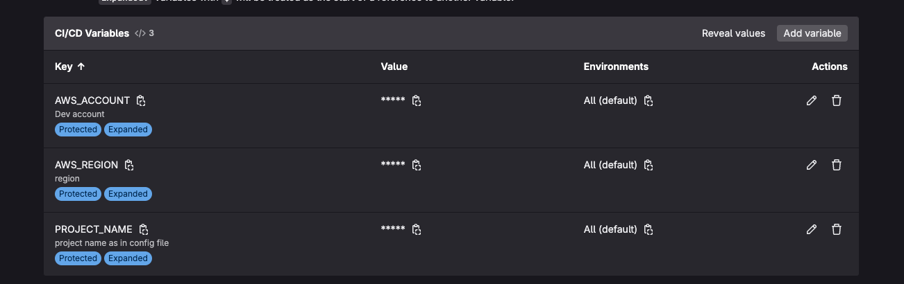

## Initial Code Check In

Lets make some changes in the code package before we commit our code. Open the `package.json` and edit the following

* `name` : must be the project name you chose in your config file `project-config.json`
* `description` : provide an apt description for your project that you gave while creating your Isengard accounts.

Now we are all set to make our first code check in. This will now setup our base CDK Infra stack in the dev account and also will deploy the webapp to an Amazon CloudFront distribution.  This step will allow us to validate the following -

1. GitLab CI execution
2. Amazon CodePipeline CI/CD execution trigger
3. CDK build using Amazon CodeBuild
4. Webapp build & deploy
5. Manual Approval to Production
6. Production deployment

The `Kyber CLI Tool` comes pre-built with a commit tool to standardize Git commit across our team using the starter kit. We use the Git [Conventional Commit standards](https://www.conventionalcommits.org/en/v1.0.0/) for this purpose.

In a terminal or a CMD window and from your root of the project `cd/project-root` execute and follow the onscreen instructions

```bash
npm run commit
```

* `Select a type of commit` : choose from various option such as feature/fix/docs etc using your up & down arrow keys
* `scope` : enter a short scope such as `cdk` or `webapp` or `CLI` or `app` or `docs` etc. keep this short. Enter `app` for now.
* `short description` : enter a short description, like a title for your commit,. Ex. `Initial Commit`
* `long description` : A long descriptive explanation on what you are trying committing. Enter `Initial commit with the starter kit to setup the infra & webapp.`
* `breaking changes` : enter Y/N. For now just hit 'N' or just enter.
* `issue number` : Here you can enter Asana Task ID. For now just hit 'N' or just enter.

This step will auto run pre commit hooks powered by Husky and catch any errors with your demo code (CDk & Webapp) and stop you from committing the code This saves plenty of time as unchecked errors will clog the pipeline and blocks others from using it!

After you have fixed your error(s), run the same `npm run commit` again and you can copy paste the heading, short & long descriptions from your previous execution.

You will then see a list of files being staged & getting committed to the branch. Now lets push the code changes to your demo Git repository -

```bash
git push origin main
```

This will now trigger the GitCI pipeline execution which you can verify from your Git repo by clicking Build -> pipelines from the side menu. This will have two stages -

1. SAST scanning - this step will publish your code's SAST scan reports to the [Probe dashboard](https://probe.aws.dev/). Find your project here and notice how the static code analysis has been automate using Git CI runner.  
2. Deploy Step - which will compress the code base into a `zip` format, gets cross account credentials via AWS Credential Vendor and upload the ZIP file.

> ❔ [zip-deploy Fails?](./faq.md#zip-deploy-fails)

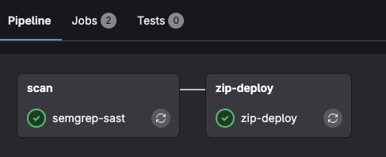

## Verify Deployment

Once, the `zip-deploy` step succeeds, head to the Dev account's AWS Management Console and head to the Amazon CodePipeline service landing page and you will see the pipeline is in-progress.

The pipeline will take anywhere between 5 to 10 minutes to complete due to Amazon CloudFront setup as it takes time to propagate.

Once completed, head to Amazon CloudFront service page and look for the distribution with `Origins` with your project name in it. Thats our CloudFront distribution where teb front end has been hosted.

Copy the Domain Name which looks like this `dXXXXXXX.cloudfront.net` and paste it in a browser of choice (Chrome/Firefox preferred). This should load the Login page as shown below.


Hit the `Login with Midway` button and you will see a dialog box with option `Sign in with your corporate ID` click the `Amazon Federate` button and follow the onscreen instructions.

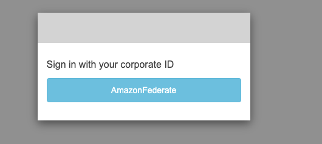

After login, you will be redirected to the demo webapp

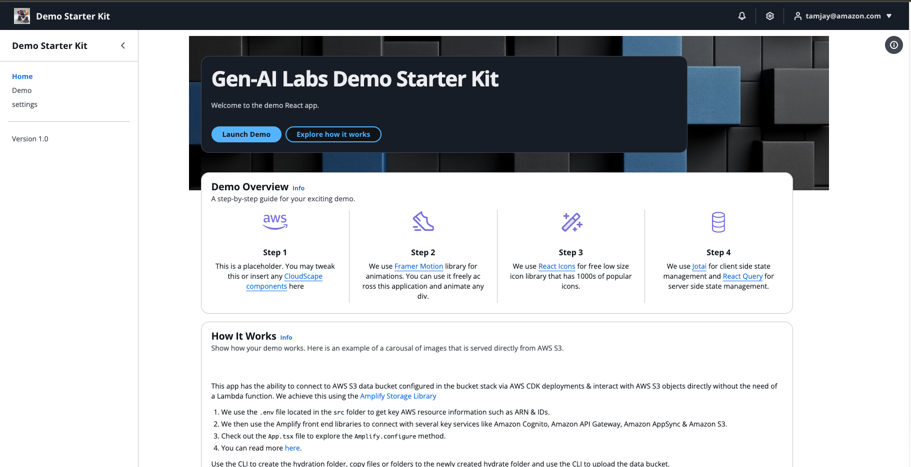

🎉 Congratulations! you have now successfully configured & set up the your brand new project!

Now let's [setup your local development environment](./setup-local-development.md) so we can deploy the app to your personal sandbox account, setup a local host server to quickly build/debug your web application components & start contributing to the project!
