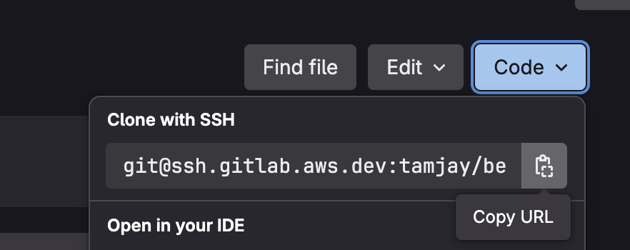
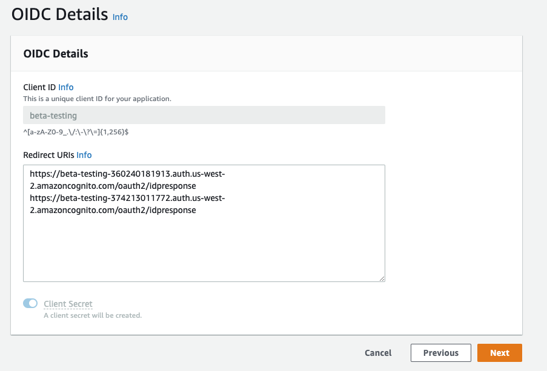
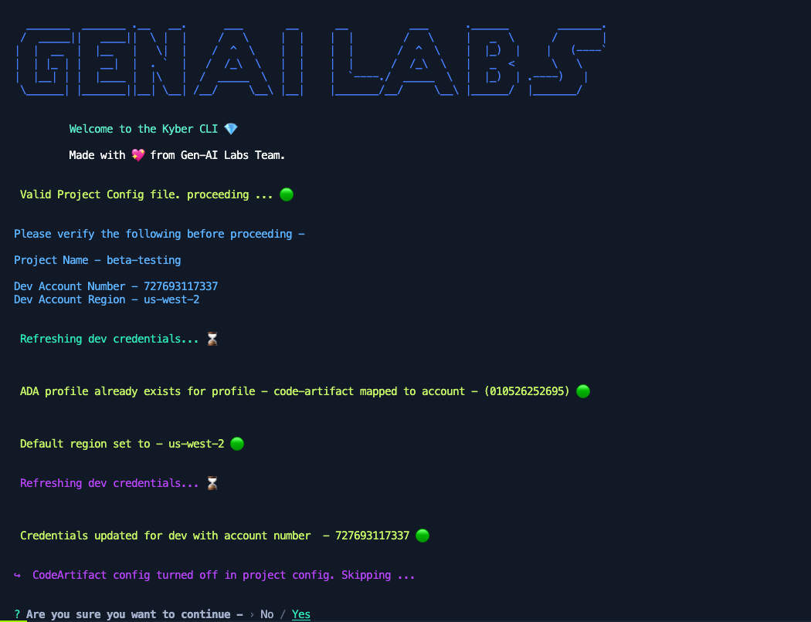
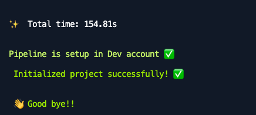
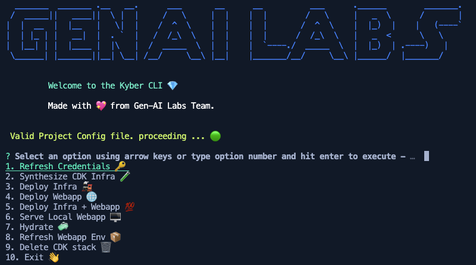
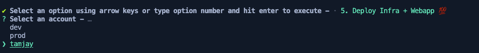
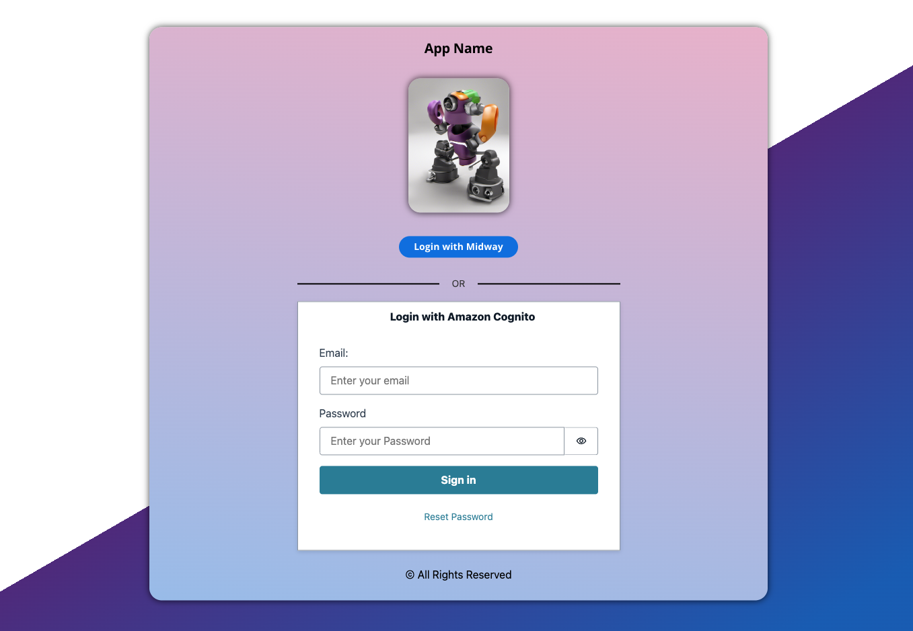

# Setup Local Development

Once the base demo app has been setup and initialized you may want to setup the demo in your personal sandbox Isengard account to start adding backend & front end features.

In this guide, we assume you haven't yet created a personal sandbox account & will cover step by step instructions for creating one & allowing the sandbox account to use dev account's Midway profile for Federate Midway Cognito integration.  

If you are the pod member/builder who created the new project, then your sandbox account creation & Midway setup was already completed in the previous step. Feel free to skip to [Project Configuration Section](#project-configuration).

[TOC]

## Clone Demo repository & setup

Since, the demo was already setup, search for your demo name from our Gen-AI Labs [demo group in GitLab](https://gitlab.aws.dev/genai-labs/demo-assets) or ask your pod members for the GitLab repository URL.

1. From your demo's GitLab page, click on the `Code` dropdown from the top right and copy the SSH URL

   

2. On your developer machine, create a new directory where you want the code base to be, this folder path is project's `root`
3. In a new terminal or a CMD window, navigate to the new folder you created using the `cd` command
   * Windows users - open a CMD terminal window by typing `cmd` on the address bar of the folder you just created using file explorer
   * Mac users - open a new Terminal Window and simply drag and drop the folder you created to get the folder path, then add a `cd` at the beginning and hit enter
   * Cloud Desktop users - may the force be with you!
4. Use this command to clone the repo to your local machine's folder (Mac/Windows/Cloud Desktop)

    ```cmd
    git clone <paste-the-SSH-url-you-just-copied>
    ```

5. Hit enter and open the folder in your IDE of choice. We prefer using VSCODE for building demos. Going forward  this folder will be referred to as project `root`.
6. Setup code defender for your newly cloned repo from [this instructions](./new-project.md#code-defender) and return back here.
7. Follow [these instructions](./new-project.md#package-installations) to install NPM packages and return back here.

## Sandbox Account creation

Let's start by creating a personal Sandbox Isengard account which acts as a personal/sandbox account to setup the demo application and build demo features safely without disturbing the common dev environment.

1. Follow the [instructions here](./new-project.md#sandbox-account-creation) and return after creating a personal sandbox account.
2. Add the newly created Sandbox account to the common demo folder by following [instructions here](./new-project.md#isengard-account-grouping).

## Midway Profile Setup

After the account has been created, we need to allowlist this account to access the demo's dev environment's Midway Federate profile for Midway integration automation facilitated by the demo starter kit CLI tooling.

1. Proceed to the [Integration](https://integ.ep.federate.a2z.com/profiles) environment.
2. Search for the profile with name as your project name found in the [Config file](../packages/infra/config/project-config.json) and click on the profile name link
3. Click the `Edit` button on top right corner and click `Ok` on the Note dialog after reading the content.
4. On the `Service Profile Configuration` page leave all options as default, scroll to bottom & click `Next`  
5. Under the `Redirect URIs` dialog box create a new entry with personal Sandbox Account number & target region where you want to deploy the demo at.

> 🚨 **WARNING** - Please be careful not to edit exisiting URIs as this will cause Midway login to malfunction for all associated accounts.

We recommend you copy paste the existing URIs to a code editor, add your entry in a separate new line and paste the entries back. you MUST leave a newline after each entry. The URIs will resemble this format

```text
https://email-generator-DEVACCOUNT.auth.DEVREGION.amazoncognito.com/oauth2/idpresponse
https://email-generator-SANBOXACCOUNT.auth.SANBOXREGION.amazoncognito.com/oauth2/idpresponse
https://email-generator-SANBOX2ACCOUNT.auth.SANBOX2REGION.amazoncognito.com/oauth2/idpresponse
```



6. Hit `Next` once you have verified your Redirect URIs
7. Click `Next` on all subsequent pages without making any edits and hit `Submit` on the final review page

Now you have successfully whitelisted your Isengard account to use Midway login for your local version of the demo.

## Project Configuration

Now it's time to add your personal sandbox account to the  [project-config.json](../packages/infra/config/project-config.json) file located in `demo-root/packages/infra/config/project-config.json`.

1. Open the cloned repo in your favorite IDE of choice. We prefer VSCODE.
2. In a new terminal window, from your project root, enter this command to create a new dev branch for yourself with your alias.

> 🚨 **WARNING** DO NOT work and push changes on `main` branch. Always work on your feature branch with format `feat/<ALIAS>` and then submit a merge request via GitLab to merge changes to `main`

```bash
git checkout -B feat/ALIAS
```

3. open the [project-config.json](../packages/infra/config/project-config.json) file located in `demo-root/packages/infra/config/project-config.json`

4. Add your Sandbox account & region under your alias key. Do not worry about the `midwaySecretID` which will be setup by the CLI for you :)

The config file may look like this -

```json
{
    "projectName": "PROJECT-IDENTIFIER",
    "gitlabGroup": "genai-labs/demo-assets",
    "gitlabProject": "GITLAB-PROJECT-NAME",
    "codeArtifact": false,
    "codePipeline": true,
    "midway": true,
    "account": {
        "dev": {
            "number": "AWS_ACCOUNT_ID",
            "region": "AWS_REGION"
            "midwaySecretID": "UfrbZC"
        },
        "prod": {
            "number": "AWS_ACCOUNT_ID",
            "region": "AWS_REGION"
            "midwaySecretID": "Gw2K6L"
        },
        "tamjay": {
          "number": "AWS_ACCOUNT_ID",
          "region": "AWS_REGION"
        }
    }
}
```

5. Ensure you are not altering any other sandbox account of your fellow pod members in this file and save the file

Open a new terminal or CMD window from your project root and enter the following command

```bash
npm run prepare
```

```bash
npm run configure
```

> ❔ [What is Kyber CLI?](./faq.md#what-is-kyber-cli)

This will start the `Kyber CLI` tool which will perform several automatons to configure your newly added sandbox account -



Once the configuration step succeeds successfully you will see this message and the tool will automatically exit.



## Deploy App

The CI/CD pipelines in not configured (you could though ;)) to deploy the app to your personal sandboxes as it may take longer time and is not frugal!

Rather an easier, faster & direct route is to simply deploy the app to a sandbox account of choice using the `Kyber CLI` tool.

Open a new terminal or CMD window from your project root and enter the following command

```bash
npm run cli
```

This will bring the CLI utility which you will use everyday while building your demo

> ℹ️ if you don't see the menu options just press the down arrow key



To deploy the app to your sandbox, select the option `Deploy Infra + Webapp` using the up/down arrow keys or typing the respective menu number and hit enter.

Select your alias in the next page and hit enter. This will deploy both your CDK infra & web application to your individual sandbox account.



The deployment will take anywhere between 5 to 10 minutes to complete due to Amazon CloudFront setup as it takes time to propagate.

Once completed, head to Amazon CloudFront service page and look for the distribution with `Origins` with your project name in it. Thats our CloudFront distribution where teb front end has been hosted.

Copy the Domain Name which looks like this `dXXXXXXX.cloudfront.net` and paste it in a browser of choice (Chrome/Firefox preferred). This should load the Login page as shown below.



## Setup LocalHost

Let's now setup a local server to host the webapp locally so you can quickly test the UI upgrades.

Use the up/down arrow on the CLI terminal/CMD window from previous step to show the options menu and select the option `Serve Local Webapp` using the up/down arrow keys or typing the respective menu number and hit enter.

You can either choose to point to `dev` or your personal sandbox to serve the app locally. You don't have to worry about rotating credentials, configuring AWS CLI etc as the Kyber CLI does all that heavy lifting. 🦾

Once the CLI finishes setting up the environment & runs GraphQL automation you will see the local webapp is running on

```text
VITE v6.0.7  ready in 116 ms


  ➜  Local:   http://localhost:3000/

  ➜  Network: http://10.0.0.221:3000/

  ➜  Network: http://11.113.134.7:3000/
```

You can now access the webapp locally at <http://localhost:3000/> from your dev machine or any other machine connected to the same network with the network addresses. The webapp will work with Midway login as it did with the CloudFront URL and you are all set to work on building/modifying your webapp.

Use the up/down arrow on the CLI terminal/CMD window to show the options menu oce more to select various options.

## Git Commit Automation

Now that we have made changes to the code base esp with the  [project-config.json](../packages/infra/config/project-config.json) by adding our sandboxes we must check in the code.

Open a new terminal or CMD window from your project root and enter the following command and

```bash
npm run commit
```

* `Select a type of commit` : choose from various option such as feature/fix/docs etc using your up & down arrow keys
* `scope` : enter a short scope such as `cdk` or `webapp` or `CLI` or `app` or `docs` etc. keep this short. Enter `app` for now.
* `short description` : enter a short description, like a title for your commit,. Ex. `Initial Commit`
* `long description` : A long descriptive explanation on what you are trying committing. Enter `Initial commit with the starter kit to setup the infra & webapp.`
* `breaking changes` : enter Y/N. For now just hit 'N' or just enter.
* `issue number` : Here you can enter Asana Task ID. For now just hit 'N' or just enter.

Once your changes are added and all commit checks (CDK Synth & Webapp build) succeeds you must push the changes to your branch.

```bash
git push feat/ALIAS
```

Then from GitLab project page create a merge request and assign to relevant stakeholders for a review hen merge the changes to `main` branch.

This will trigger the Amazon CodePipelines in the dev account.

## Next Steps

There are several features offered by the starter kit and you may follow these guides listed here to learn them specifically

* 📚 [Kyber CLI Handbook](../assets/kyber-cli-handbook.md)
* 📚 [CDK Infra](../packages/infra/README.md)
* 📚 [Webapp](../packages/webapp/README.md)
