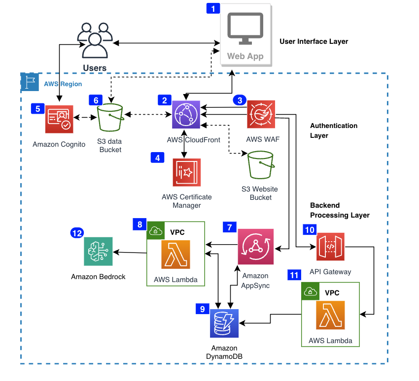
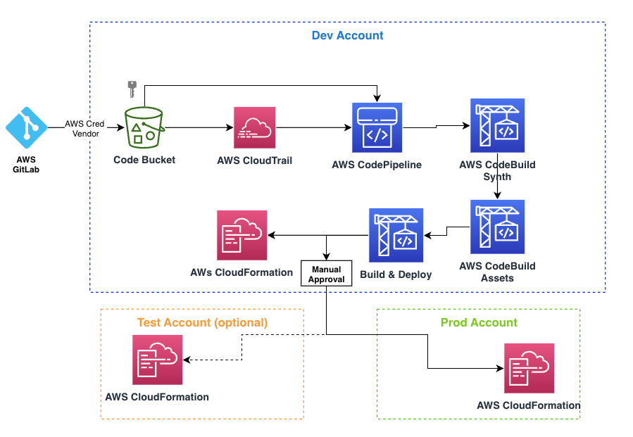

# AWS CDK Infra

This documentation will walkthrough AWS CDK app setup, configurations and provides detailed descriptions on each CDK stack used and how to customize, configure & add you own CDK stacks to this project.

[TOC]

## App Architecture



1. Demo webapp is rendered on a browser such as Chrome/Firefox
2. The webapp in the `packages/webapp` is served via Amazon CloudFront CDN backed by Amazon S3 bucket
3. The entire app infra is protected using AWS Web Application Firewall that covers Amazon CloudFront, Amazon API Gateway, Amazon AppSync & Amazon Cognito
4. AWS Certificate manager is used to provide HTTPS support for all Amazon CloudFront calls for superior encryption at transit
5. Amazon Cognito is used to authorize & authenticate users and integrates with Amazon Federate with Midway OIDC authentication
6. AWS S3 bucket is used to store website assets (HTM/CSS/JavaScript/static files) and another AWS S3 Bucket (Data bucket) to store configurations, synthetic data, models and other large sized files.
7. Amazon AppSync GraphQL support with integration with Amazon DynamoDB and resolver Lambda (within VPC) integration
8. A lambda within a VPC that is triggered via Amazon AppSync resolvers
9. An Amazon Dynamo DB as a persistence data source for Amazon AppSync GraphQL
10. An HTTP & REST API Gateway for enabling regular REST APIs
11. A lambda within a VPC that is triggered via API Gateway resolvers
12. Amazon Bedrock integrations for calling LLMs and FMs via APIs wither triggered via Amazon AppSync GraphQl resolvers or via Amazon API Gateway REST API calls.

## Pipeline Stack

> packages/infra/lib/pipeline-stack.ts
>
> ⚠️ This stack will only be deployed when the `codePipeline` flag is set to `true` in the [Config File](./config/project-config.json)



This stack is deployed only to the `dev` account via the Kyber CLI's [configure command](../../assets/kyber-cli-handbook.md#configure-command).

This stack will also ensure to setup all the necessary assets to trigger the pipeline run from GitCI when a new commit/merge is applied to the `main` branch.

These are the following assets that are setup in the `dev` account under the [pipeline-stack.ts](./lib/pipeline-stack.ts) .

1. Amazon KMS key in the dev account
2. A KMS encrypted S3 Bucket with secure transport enabled to store the demo code as zip file. The zip file will arrive from GitCI.  
   1. A KMS encrypted S3 log Bucket with secure transport enabled to store logs on zip file uploads
3. An IAM role that will be assumed by the [GitCI Credential vendor](https://gitlab.pages.aws.dev/docs/Platform/aws-credential-vendor.html) to zip and upload the code base from GitLab to AWs S3
4. A Amazon CloudTrail to trigger the Amazon CodePipeline to start the synth process
5. A deploy step pointing to `Dev` that deploys the [Infra Stage](./lib/deploy-stage.ts) which then deploys the [Infra Stack](./lib/infra-stack.ts) to the dev account
6. If configured, deploy step pointing to `Prod` that deploys the [Infra Stage](./lib/deploy-stage.ts) which then deploys the [Infra Stack](./lib/infra-stack.ts) to the dev account.

## Infra (Root) Stack

> packages/infra/bin/infra.ts
>
> ✏️ This stack is the root stack from where all other stacks are deployed from.

This is the main CDK entry file as configured in the [cdk.json](./cdk.json) file. The entire CDK initialization is controlled based on the [Config File](./config/project-config.json).

This stack is the root stack which links all other stacks, hence this is the parent/main stack. You can add more stacks here, link existing stacks and establish dependencies and remove any unwanted stacks from here based on your demo.

The account stage name arrives through [custom context variable](https://docs.aws.amazon.com/cdk/v2/guide/context.html) while running CDK deploy command from the config file. If no context variable is supplied then we supply the `dev` account credentials from the config file.

We also ensure to set the [CDK stack environment](https://docs.aws.amazon.com/cdk/v2/guide/environments.html) with a definite account number & region so that we can control `dev` and `prod` account credentials as defined in the config file.

We have two modes of deploying the CDK stacks -

### CI/CD Turned ON

In this mode the `codePipeline` flag is set to `true` in the [Config File](./config/project-config.json)

We include the [PipelineStack](./lib/pipeline-stack.ts) where we setup essential resources to orchestrate Amazon Pipeline CI/CD from GitLab CI.

Link the Dev Stage through the [Infra Stack](./lib/infra-stack.ts) with dev account as found in the [Config File](./config/project-config.json)

If a prod account is configured in the [Config File](./config/project-config.json), we then deploy the same [Infra Stack](./lib/infra-stack.ts) stack with production account

The stack list will be as follows with CI/CD turned on with both `dev` and `prod` accounts configured. We use [nested stacks](https://docs.aws.amazon.com/cdk/v2/guide/stacks.html#stacks-work) to overcome the AWS CloudFormation 500-resource limit.

```text
project-name

project-name/dev/infra (dev-infra)
project-name/dev/infra/vpc-stack (dev-infravpcstackD849456F)
project-name/dev/infra/waf-stack (dev-infrawafstackFCA56160)
project-name/dev/infra/website-waf-stack (dev-infrawebsitewafstack07AB5B78)
project-name/dev/infra/data-bucket-stack (dev-infradatabucketstack23BEA16D)
project-name/dev/infra/auth-stack (dev-infraauthstack1E616E36)
project-name/dev/infra/api-gateway-stack (dev-infraapigatewaystack51CB1FFD)
project-name/dev/infra/graphql-api-stack (dev-infragraphqlapistackA4CB7B99)
project-name/dev/infra/rest-api-gateway-stack (dev-infrarestapigatewaystack6BCB0782)
project-name/prod/infra (prod-infra)
project-name/prod/infra/vpc-stack (prod-infravpcstackD849456F)
project-name/prod/infra/waf-stack (prod-infrawafstackFCA56160)
project-name/prod/infra/website-waf-stack (prod-infrawebsitewafstack07AB5B78)
project-name/prod/infra/data-bucket-stack (prod-infradatabucketstack23BEA16D)
project-name/prod/infra/auth-stack (prod-infraauthstack1E616E36)
project-name/prod/infra/api-gateway-stack (prod-infraapigatewaystack51CB1FFD)
project-name/prod/infra/graphql-api-stack (prod-infragraphqlapistackA4CB7B99)
project-name/prod/infra/rest-api-gateway-stack (prod-infrarestapigatewaystack6BCB0782)
```

### CI/CD Turned OFF

In this mode we directly deploy the [Infra Stack](./lib/infra-stack.ts) to the target account of choice. The stack list will be as follows  

```text
project-name
project-name/vpc-stack
project-name/waf-stack
project-name/website-waf-stack
project-name/auth-stack
project-name/data-bucket-stack
project-name/api-gateway-stack
project-name/rest-api-gateway-stack
project-name/graphql-api-stack

```

## VPC Stack

> packages/infra/stacks/vpc-stack.ts

The first stack deployed under the [Infra Stack](./lib/infra-stack.ts) that sets up VPC in maximum 3 Availability Zones (AZ) with separate subnet configurations in `public-subnet`, `private-isolated`, `private-with-egress` and allows internet gateway endpoints to AWS S3 & DynamoDb.

You can make changes to this VPC to tighten security, establish other subnets and bring assets under each of these subnets down the line.

## WAF Stack

> packages/infra/stacks/waf-stack.ts

The Amazon WAF stack is configured to offers -

* includes Amazon managed common rule sets
* bot attack protection
* enables IP rate limits
* DDOS protections
* Bad inputs, wordpress and SQL injection protection

More limiting rules and configurations can be added as desired. The WAF is regional and is deployed to the desired target region and can be associated to any resource that can be WAFed such as Amazon AppSync, Amazon Cognito etc.

If WAF is being too aggressive with some of the gating rules you may change the rule action to `COUNT` rather than to `BLOCK`.

```json
ruleActionOverrides: [
   // to allow requests from POSTMAN/ CURL to APPSYNC
   // this may allow true positives and not recommended 
   {
         actionToUse: {
            count: {},
         },
         name: "CategoryHttpLibrary"
   },
   {
         actionToUse: {
            count: {},
         },
         name: "SignalNonBrowserUserAgent"
   },
],
```

## Website WAF Stack

> packages/infra/stacks/website-waf-stack.ts

This stack is responsible for setting up Amazon CloudFront distribution, a KMS encrypted secure transport enabled AWS S3 bucket to store website and static files such as HTML/CSS/JavaScript/images, icons etc.

A global WAF is specifically created to protect the Amazon CloudFront distribution in `us-east-1` as per the documentation. If you recall, we bootstrapped the target region and `us-east-1` while running [Kyber CLI configuration](../../assets/kyber-cli-handbook.md#configure-command) step.

This stack also sets up a website deploy IAM role that is assumed by the `dev` account during the CI/CD deploy Amazon CodeBuild step to upload website files to the website bucket & invalidates the Amazon CloudFront distribution.  

## Auth Stack

> packages/infra/stacks/auth-stack.ts

This sets up a Amazon Cognito user pool, an Identity pool and sets up auth role and unauth role with relevant permissions.

The User pool is also configured with the Midway OIDC integration suing the Kyber CLI Midway automation setup as follows.

* During the [Kyber CLI configuration](../../assets/kyber-cli-handbook.md#configure-command) step, we ask the user to enter the Midway client secret token
* The Kyber CLI then stores the secret in Amazon Secrets Manager in the relevant account `dev` or `prod` based on the account name from the Config file and stores the secret identifier as `midwaySecretID` in the config file.
* For sandbox accounts, we simply use the `dev` secret and allow dev account to use the same Midway profile to allow Cognito to pass claim tokens back to the app for login
* The Auth Stack will use this `midwaySecretID` and gets the secret key value to configure the secret key
* Then uses the project name as the `clientID` in the OIDC configuration with the Midway endpoint for `dev` and `prod`
* We then configure the IDP callback URLS as the Amazon CloudFront distribution setup from the previous Website WAF Stack and also add `http://localhost:3000` for enabling Midway for local development

The auth role allows access to AWS S3 data bucket to put and get objects and the unauth role will explicitly deny all access to all resources for a better security posture.

## Data Bucket

> packages/infra/stacks/bucket-stack.ts

This stack sets up a KMS encrypted, secure transport enabled AWS S3 bucket with logging enabled to store data files that are too big to be served as static file or is sensitive in nature such as synthetic data, AI/ML models, flat file configurations (JSON/XML/JSONL) etc that needs authentication before access.

This bucket can be directly accessed from front end after the user authenticates with Midway via Amazon Cognito or login as a user from Amazon Cognito User pools.

## HTTP API Stack

> packages/infra/stacks/http-api-gateway-stack.ts
>
> optional stack

Sets up a regional HTTP endpoint with a TypeScript lambda function. Amazon API Gateway is configured to get JWT token from a JWT authorizer CDK construct and writes access logs to Amazon CloudWatch.

The [TypeScript Lambda](./lambda/typescript/ts-lambda/index.ts) comes pre-built with webpack so that any NPM packages defined in its `package.json` is auto downloaded and linked to the JavaScript bundle. This lambda is placed in the VPC we configured earlier.

We then create a route `/test` path and link the TypeScript Lambda. HTTP API Gateway cannot have WAF integration. [Read more](https://docs.aws.amazon.com/apigateway/latest/developerguide/http-api-vs-rest.html) on when to use HTTP APIS.

## REST API Stack

> packages/infra/stacks/rest-api-gateway-stack.ts

Sets up a edge optimized REST API endpoint with Cognito authorizer backed up by a Python Lambda function that uses Docker to compress all library dependencies via `requirement.txt` file and associates a Lambda layer with common libraries, software packages to facilitate easy GraphQL & Amazon Bedrock integrations.

This REST API endpoint is WAF protected that was setup in the previous step.

## GraphQL Stack

> packages/infra/stacks/graphql-api-stack.ts

Sets up a fully automated Amazon AppSync GraphQL setup using the [Amplify GraphQl construct](https://constructs.dev/packages/@aws-amplify/graphql-api-construct/).

The GraphQl schema is created under `packages/infra/graphql/schema.graphql` in the format as prescribed in [Amplify Docs](https://docs.amplify.aws/gen1/react/build-a-backend/graphqlapi/data-modeling/).

We also configure a resolver Lambda (Python) with a layer that can be triggered from the front end using a simple GraphQL mutation query.

The GraphQl endpoint is secured via Cognito and WAF so that any logged in user (Midway/ Cognito user) can hit the GraphQL endpoint and perform queries, mutations & subscriptions.

Optionally, you can enable an API Key based access as well to allow other systems (Such as Gen-AI Agents) to access the AppSync GraphQL queries.

We also log all AppSync access to Amazon CloudWatch.

## Next Steps

* 📚 [Kyber CLI Handbook](../../assets/kyber-cli-handbook.md)
* 📚 [Webapp](../webapp/README.md)
