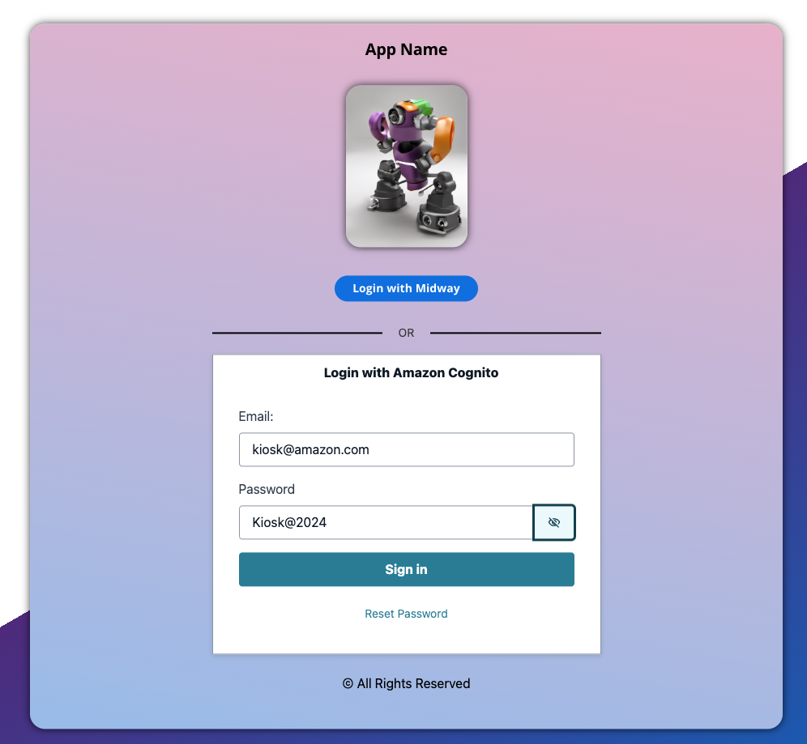
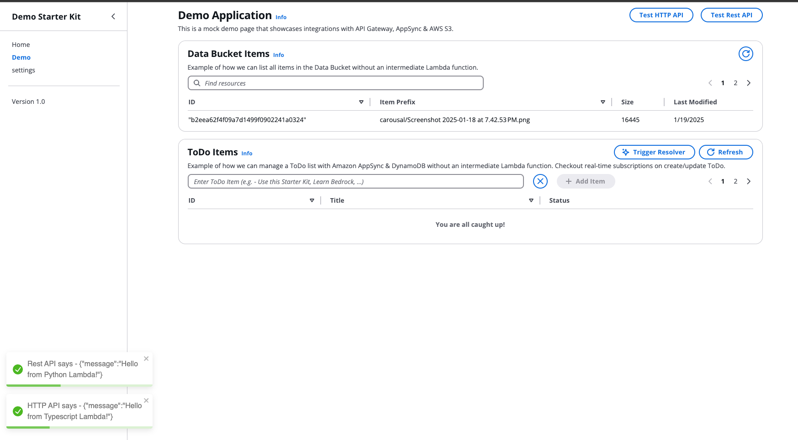

# Web Application

[TOC]

## Overview

The web application is designed using [Vite react](https://vite.dev/guide/) and buses [CloudScape design system](https://cloudscape.design/)  for the UI.

The AWS CDK created resources are linked to the UI front end using the Amplify Libraries (not the Amplify CLI!) as follows -

```ts
import { Amplify } from 'aws-amplify';

Amplify.configure({
  Auth: {
    Cognito: {
      //  Amazon Cognito User Pool ID
      userPoolId: 'XX-XXXX-X_abcd1234',
      // OPTIONAL - Amazon Cognito Web Client ID (26-char alphanumeric string)
      userPoolClientId: 'a1b2c3d4e5f6g7h8i9j0k1l2m3',
      // REQUIRED only for Federated Authentication - Amazon Cognito Identity Pool ID
      identityPoolId: 'XX-XXXX-X:XXXXXXXX-XXXX-1234-abcd-1234567890ab',
      // OPTIONAL - Set to true to use your identity pool's unauthenticated role when user is not logged in
      allowGuestAccess: true,
      // OPTIONAL - This is used when autoSignIn is enabled for Auth.signUp
      // 'code' is used for Auth.confirmSignUp, 'link' is used for email link verification
      signUpVerificationMethod: 'code', // 'code' | 'link'
      loginWith: {
        // OPTIONAL - Hosted UI configuration
        oauth: {
          domain: 'your_cognito_domain',
          scopes: [
            'phone',
            'email',
            'profile',
            'openid',
            'aws.cognito.signin.user.admin'
          ],
          redirectSignIn: ['http://localhost:3000/'],
          redirectSignOut: ['http://localhost:3000/'],
          responseType: 'code' // or 'token', note that REFRESH token will only be generated when the responseType is code
        }
      }
    }
  }
});

// You can get the current config object
const currentConfig = Amplify.getConfig();
```

### Environment File

The integration between the AWS CDK and the React front end is done via the `.env` file located in `packages/webapp/src/.env`. The `.env` file has to be generated when you configure the UI. Please refer to the [Kyber CLI Handbook](../../assets/kyber-cli-handbook.md#serve-local-webapp-️) for more details on this.

While we created the CDK stacks, we ensured to export important cloud resource details such as `userPoolId`, `userPoolClientId` etc as per the [Amplify documentation](https://docs.amplify.aws/gen1/react/build-a-backend/auth/set-up-auth/). Then the Kyber CLI uses a cross account authentication role defined in the [Website WAF Stack](../infra/README.md#website-waf-stack) to list all the stacks for this project and creates a `.env` file upon running the CLI and during CI/CD deploy website CodeBuild step.

Once we have the `.env` file, we can then refer to the values and use the Amplify.configure method in the [App.tsx](./src/App.tsx) file to link front end with AWS CDK infra backend.

## User Creation

Sometimes we may need to show the demo on non-AWS employee machines such as kiosk at re:Invent or other events. To accommodate this, we have enabled a login system that takes an user email & password to allow users to access the demo.

Follow the steps below to create an user at the Amazon Cognito user pools for `dev`, `prod` & `sandbox` accounts.

1. Access the management console of `dev` / `prod` / `sandbox` account and search for Amazon Cognito service in the region where you are setting up te demo
2. Find the user pool with the title as `project-name-user-pool`. The `project-name` comes from your [config file](../infra/config/project-config.json) and click on its name
3. As per the new console settings on the right side menu, head to `Users` menu
4. Click on `Create user` button
5. create a user as shown


6. note the password policy and ensure you adhere to the policy standard
7. Now in your login app enter the same email & password and follow the on-screen instructions



8. Change the password as instructed on screen and you have access to the app going forward without needing to login via Midway
9. You can also use the `Reset Password` option to set a new password for the user you created

## Web App Demos

The starter kit comes pre-built with several demos to help you understand several modern concepts with respect to state management ([Jotai](https://jotai.org/) & [React Query](https://tanstack.com/query/latest/docs/framework/react/overview)), integration with services like Amazon API Gateway, Amazon S3 & most importantly Amazon AppSync (GraphQL).

These demos are for educational purposes and can be easily replaced rom the `Home.tsx` and `Demo.tsx` files.

### Landing page carousal

When you load the webapp for the website the landing page carousal is empty. Thats because we haven't [hydrated](../../assets/kyber-cli-handbook.md#hydrate-) the data bucket with carousal images.

Follow the onscreen instruction son demo landing page to hydrate the carousal page. Take a moment to explore the demo `Overview` component & `Carousal` component on how we use the `useStorage.ts` hook to list all items from AWS S3 data bucket and get image URLs directly from the UI without an intermediate REST API/Lambda functions!  

### Data Bucket Items

Explore how we list all files recursively at a bucket level, get file data and list the as a table using React Query in `useStorage.ts`. You can learn several React Query features [here](https://www.youtube.com/watch?v=VtWkSCZX0Ec&list=PLC3y8-rFHvwjTELCrPrcZlo6blLBUspd2).

### HTTP & REST API Test

Now from the Home page please navigate to the `Demo` page using the nav bar on the right. on top right corner you will see the `Test HTTP API` and `Test Rest API` buttons. Each one will trigger the Amazon API Gateway endpoints created by the AWS CDK infra stacks as [mentioned here](../infra/README.md#http-api-stack).

* The HTTP API will trigger a TypeScript lambda function and displays a notification on screen. Please check the function logs from Amazon CloudWatch from the respective account from where you are serving the app from.
* The REST API will trigger a Python lambda function and displays a notification on screen. Please check the function logs from Amazon CloudWatch from the respective account from where you are serving the app from.



### To Do Demo

This demo was created to walkthrough the fundamentals of Amazon AppSync which uses GraphQL technology which connect the backend in a serverless fashion. It has always been quite challenging to create an end to end AWS CDK based GraphQL setup with React UI and achieve real-time subscription updates; but not anymore ;).

We start with the [GraphQl API Stack](../infra/stacks/graphql-api-stack.ts) which uses a [schema.graphql](../infra/graphql/schema.graphql) to define the table structure. Refer [here](../infra/README.md#graphql-stack) on more details.

Once the [GraphQl API Stack](../infra/stacks/graphql-api-stack.ts) has been deployed to a target account, we can use this [CodeGen automation](https://docs.amplify.aws/gen1/react/build-a-backend/graphqlapi/client-code-generation/) to generate [GraphQL queries](./src/graphql/queries.ts) and [GraphQL mutations](./src/graphql/mutations.ts) to directly query & update/upsert date into DynamoDB via AppSync without an intermediary REST API/Lambda integrations using this [Amplify Library](https://docs.amplify.aws/gen1/react/build-a-backend/graphqlapi/mutate-data/).

However, we need to generate the GraphQL query, mutation & subscription commands and a typed API to use with our Vite React TypeScript setup. Also, these GraphQl statements must evolve with the [schema.graphql](../infra/graphql/schema.graphql) as and when we add additional tables or entity mappings which can be a huge manual effort to kee pin sync.

The [CodeGen automation](https://docs.amplify.aws/gen1/react/build-a-backend/graphqlapi/client-code-generation/) tool was created to generate all possible combinations of GraphQL query, mutation & subscription commands automatically which is a CLI that generates the `.graphqlconfig.yml` file that has an API ID and the following configurations -

```yaml
projects:
  Codegen Project:
    schemaPath: schema.json
    includes:
      - src/graphql/**/*.ts
    excludes:
      - ./amplify/**
      - src/API.ts
    extensions:
      amplify:
        codeGenTarget: typescript
        generatedFileName: src/API.ts
        docsFilePath: src/graphql
        region: us-west-2
        apiId: XXXXXXXXXXXX
        frontend: javascript
        framework: react
        maxDepth: 2
extensions:
  amplify:
    version: 3

```

The main issue is that the Amplify AppSync Codegen tool's CLI requires human input to select the `codeGenTarget`, `frontend`, `framework` and `maxDepth` parameters. Also, the  `codeGenTarget` MUST be `typescript` and `framework` MUST be `react` to get a fully typed [`API.ts`](./src/API.ts) file which cannot be generated during CI/CD CodeBuild process.

To overcome this challenge and to enable an end to end automation, we use a mock file [gql_config_template.yml](./gql_config_template.yml) that has these values prefilled and we substitute the `region` from the [Config File](../infra/config/project-config.json) and the `apiId` from the `.env` to create the actual `.graphqlconfig.yml` file via the Kyber CLI tool.

Also, the Kyber CLI will now run the Amplify AppSync Codegen tool's CLI command from `package.json` file under `webapp` folder to then generate all possible [GraphQL queries](./src/graphql/queries.ts) and [GraphQL mutations](./src/graphql/mutations.ts) with fully typed [`API.ts`](./src/API.ts) file :) which is CI/Cd friendly.

```json
"codegen": "npx @aws-amplify/cli codegen"
```

The to-do app uses Appsync connector configured via the Amplify Configure method located in `App.tsx` file. It refers to the `VITE_CONFIG_APPSYNC_ENDPOINT` and the `VITE_CONFIG_APPSYNC_API_ID` to connect to an existing Appsync resource.

We have created a [useApi.ts](./src/hooks/useApi.ts) file that uses React Query to use several GraphQL commands located in the `/packages/webapp/src/graphql/`
folder to create, update, list to-do items which in essence is our CRUDL application system without an intermediary API/Lambda integration.

### Chat Demo

> 🚨 **WARNING** - Enable Claude Anthropic Haiku 3.5 model from Amazon Bedrock manually from the AWS management console.

This demo implements a chatbot that integrates Amazon Bedrock with the React UI and implements the AppSync subscriptions to deliver a robust and scalable front end chat application.

Follow the `Chat` folder and the `useApi.ts` files for implementation ideas ways how to integrate React Query & Appsync functions into your app.

#### Resolver Lambda

The Resolver lambda acts like a Lambda function that gest triggered as a mutation call just like how a REST API would trigger a normal Lambda function.

The resolver Lambda can be very beneficial in situations where DynamoDB needs to get updated as a result of some other compute/query/API activity such as getting a response from Amazon Bedrock.

Check the [`API.ts`](./src/API.ts) file for an example how we trigger a Resolver Lambda function when clicked a button from the front-end.

Amazon AppSync comes built with a real time subscription system that set up a full duplex WebSocket implementation that can connect several clients together to enable

You can check the resolver Lambda function logs to inspect the input payload Lambda receives through [PowerTools integrations](https://docs.powertools.aws.dev/lambda/python/latest/core/event_handler/appsync/).

```json
{    
    "message": {
        "opr": "chat",
        "id": "XXXXXXXXXXXXXXXXXXXXXXX",
        "userID": "XXXXXXXXXXXXXXXXXXXXXXX",
        "message": "Tell me a joke?",
        "host": "XXXXXXXXXXXXXXXXXXXXXXX.appsync-api.us-west-2.amazonaws.com",
        "auth_token": "LONG TOKEN HERE",
        "api_key": null
    }
}

```

The flow would be as follows for typical Amazon Bedrock integration-

* we collect User data say for example we can ask a Gen-AI system to tell a joke
* we create a mutation to create an entry in the table with the question
* this mutation transaction will enter te user submitted question and also create a unique `id` for the transaction
* we then trigger the resolver lambda with the chat ID and user Id
* form a message body as per the API docs for [Anthropic Claude docs](https://docs.aws.amazon.com/bedrock/latest/userguide/model-parameters-anthropic-claude-messages.html#model-parameters-anthropic-claude-messages-request-response)
* make a call to Amazon Bedrock with [streaming](https://docs.aws.amazon.com/bedrock/latest/userguide/model-parameters-anthropic-claude-messages.html#api-inference-examples-claude-multimodal-code-example-streaming)
* as and when the response comes from Amazon Bedrock we make an POST API call via GraphQL query to Amazon AppSync
* Since the chat UI is subscribed for any chat updates for the logged in user, we receive a callback in React UI after each update query
* we use this callback to update the UI in real-time.

## Miscellaneous

### Vite Configurations

This template provides a minimal setup to get React working in Vite with HMR and some ESLint rules.

Currently, two official plugins are available:

* [@vitejs/plugin-react](https://github.com/vitejs/vite-plugin-react/blob/main/packages/plugin-react/README.md) uses [Babel](https://babeljs.io/) for Fast Refresh
* [@vitejs/plugin-react-swc](https://github.com/vitejs/vite-plugin-react-swc) uses [SWC](https://swc.rs/) for Fast Refresh

### Expanding the ESLint configuration

If you are developing a production application, we recommend updating the configuration to enable type aware lint rules:

* Configure the top-level `parserOptions` property like this:

```js
export default tseslint.config({
  languageOptions: {
    // other options...
    parserOptions: {
      project: ['./tsconfig.node.json', './tsconfig.app.json'],
      tsconfigRootDir: import.meta.dirname,
    },
  },
})
```

* Replace `tseslint.configs.recommended` to `tseslint.configs.recommendedTypeChecked` or `tseslint.configs.strictTypeChecked`
* Optionally add `...tseslint.configs.stylisticTypeChecked`
* Install [eslint-plugin-react](https://github.com/jsx-eslint/eslint-plugin-react) and update the config:

```js
// eslint.config.js
import react from 'eslint-plugin-react'

export default tseslint.config({
  // Set the react version
  settings: { react: { version: '18.3' } },
  plugins: {
    // Add the react plugin
    react,
  },
  rules: {
    // other rules...
    // Enable its recommended rules
    ...react.configs.recommended.rules,
    ...react.configs['jsx-runtime'].rules,
  },
})
```
